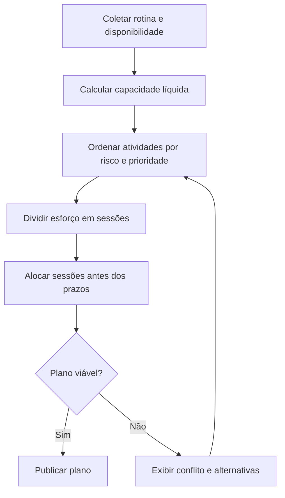
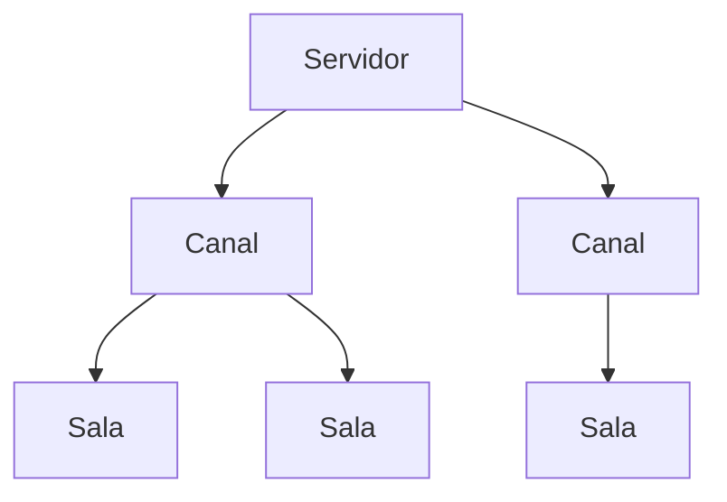

# SeekIn — Briefing de Produto

> Plataforma para planejar estudos com base na capacidade real do aluno, compartilhar conhecimento e conectar estudantes a comunidades e mentores.

**Status:** visão inicial do produto

**Versão:** 0.1

**Próximo documento:** PRD do MVP do planner

---

## 1. Origem do nome

**SeekIn** nasce da combinação de:

- **Seek:** buscar, investigar e procurar saber.
- **In:** “dentro” e também **Intelligence**.

O nome representa a ideia de **buscar a inteligência dentro de si ou em pessoas, comunidades e conteúdos que já a possuem**.

## 2. Resumo executivo

O SeekIn será uma plataforma de desenvolvimento acadêmico construída em três fases complementares:

1. **Planner inteligente de estudos:** organiza atividades conforme prazos, prioridades, esforço necessário, rotina e tempo realmente disponível.
2. **Rede social de conhecimento:** oferece perfil acadêmico, conexões, seguidores, feed e comunidades estruturadas para compartilhar estudos, dúvidas e conhecimento científico.
3. **Mentorias:** conecta estudantes a pessoas mais experientes, profissionais e especialistas por meio de mentorias gratuitas ou pagas.

O produto começa pelo planner. A rede social e as mentorias entram somente após a validação do núcleo de planejamento.

## 3. Visão do produto

### 3.1 Problema

Estudantes organizam a vida acadêmica em ferramentas desconectadas: calendários, listas de tarefas, grupos de mensagens, redes sociais, documentos e anotações. Essas ferramentas registram compromissos, mas normalmente não respondem à pergunta principal:

> **O que devo estudar agora para cumprir meus prazos sem sobrecarregar minha rotina?**

Os principais efeitos desse problema são:

- dificuldade para transformar atividades em um plano executável;
- estimativas de esforço incompatíveis com o tempo disponível;
- concentração do estudo próximo ao prazo de entrega;
- pouca visibilidade sobre atrasos e sobrecarga futura;
- excesso de decisões diárias;
- conhecimento acadêmico disperso em redes não projetadas para aprendizagem;
- dificuldade para encontrar colegas e mentores do mesmo contexto.

### 3.2 Proposta de valor

O SeekIn transforma demandas acadêmicas em um plano realista, apresenta a próxima ação com clareza e, no futuro, conecta o aluno a pessoas que podem ajudá-lo a avançar.

### 3.3 Promessa central

> **Saber o que estudar, quando estudar e onde encontrar ajuda.**

### 3.4 Objetivo estratégico

Atrair parte das pessoas que hoje utilizam redes sociais genéricas para estudar, pedir ajuda e compartilhar conhecimento, oferecendo um ambiente construído especificamente para aprendizagem e evolução acadêmica.

## 4. Públicos iniciais

### 4.1 Público primário

- estudantes de graduação presencial ou a distância;
- estudantes com trabalho, família e pouco tempo disponível;
- pessoas que precisam conciliar várias disciplinas e entregas;
- alunos que têm dificuldade para priorizar ou manter constância.

### 4.2 Públicos futuros

- estudantes de cursos técnicos e preparatórios;
- pós-graduandos e pesquisadores;
- profissionais em formação continuada;
- professores, tutores, especialistas e mentores;
- comunidades acadêmicas e grupos de estudo.

## 5. Princípios do produto

1. **Execução antes de configuração:** o sistema deve ajudar o aluno a começar, não apenas a cadastrar informações.
2. **Capacidade real antes de plano ideal:** nenhum plano pode ignorar a rotina e os limites do estudante.
3. **Prazo visível:** entregas e riscos devem permanecer claros sem gerar ansiedade desnecessária.
4. **Baixa carga cognitiva:** cada tela deve ter uma tarefa mental principal.
5. **Replanejamento sem culpa:** mudanças fazem parte da rotina; o sistema deve absorvê-las e recalcular o plano.
6. **Explicabilidade:** o aluno precisa entender por que uma atividade foi priorizada.
7. **Comunidade com propósito:** interação social deve favorecer aprendizagem, ajuda e produção de conhecimento.
8. **Segurança desde o início:** privacidade, moderação e proteção de dados são requisitos estruturais.

---

# Fase 1 — Planner inteligente de estudos

## 6. Conceito operacional

O planner adapta conceitos de **MRP** e **CRP** para o planejamento acadêmico:

| Conceito original | Adaptação no SeekIn |
|---|---|
| Demanda a produzir | Atividade, prova, trabalho, leitura ou meta de estudo |
| Quantidade necessária | Esforço estimado para concluir a atividade |
| Data de necessidade | Prazo final da atividade |
| Recurso produtivo | Tempo disponível para estudar |
| Operador | O próprio estudante |
| Ordem de produção | Sessão de estudo planejada |
| Capacidade | Minutos ou horas disponíveis por período |
| Carga | Soma das sessões alocadas no período |
| Sobrecarga | Esforço necessário maior que a capacidade disponível |
| Reprogramação | Redistribuição das sessões após mudanças ou atrasos |

O MRP responde **o que precisa ser feito e até quando**. O CRP verifica **se existe capacidade suficiente para executar esse plano**.

## 7. Entradas do planejamento

O aluno informa:

- dias e horários disponíveis;
- compromissos fixos e rotina recorrente;
- períodos em que não deseja estudar;
- limite diário ou semanal de estudo;
- atividades e disciplinas;
- prazo de cada atividade;
- esforço total estimado;
- prioridade informada pelo aluno;
- dependências entre atividades, quando existirem;
- notas, links e materiais de apoio;
- preferência por duração das sessões;
- progresso ou esforço já realizado.

## 8. Saídas do planejamento

O sistema entrega:

- sessões de estudo distribuídas no tempo;
- indicação clara da próxima atividade recomendada;
- calendário acadêmico consolidado;
- Gantt simplificado com esforço, progresso e prazo;
- alertas de risco e sobrecarga;
- justificativa de priorização;
- alternativas quando o plano não for viável;
- replanejamento após conclusão, atraso ou mudança de disponibilidade.

## 9. Modelo de capacidade

A capacidade líquida considera o tempo disponível depois da rotina, dos bloqueios pessoais e de uma reserva de segurança.

```text
capacidade líquida = disponibilidade bruta
                    - compromissos fixos
                    - bloqueios pessoais
                    - reserva de segurança
```

O planejador não deve ocupar automaticamente 100% do tempo livre. A reserva protege o plano contra imprevistos e reduz a sensação de sobrecarga.

## 10. Priorização

A priorização deve combinar:

- proximidade do prazo;
- esforço restante;
- importância informada pelo aluno;
- risco de atraso;
- dependências;
- progresso atual;
- disponibilidade futura;
- tamanho e flexibilidade das janelas de estudo;
- equilíbrio entre disciplinas;
- energia ou preferência do aluno, quando disponível.

A pontuação interna pode evoluir, mas sua explicação deve usar linguagem simples, por exemplo:

> “Recomendamos esta atividade porque o prazo está próximo, ainda faltam 3 horas e existem poucas janelas livres antes da entrega.”

### 10.1 Regras iniciais

1. Atividades vencidas ou inviáveis entram primeiro na análise de risco.
2. Dependências precisam ser programadas antes das atividades bloqueadas.
3. O esforço restante é dividido em sessões compatíveis com a duração preferida.
4. Atividades devem começar antes do último dia disponível.
5. A carga diária respeita o limite configurado.
6. Empates são resolvidos por prazo, importância e menor flexibilidade.
7. O estudante pode fixar, mover ou remover uma sessão sugerida.
8. Toda intervenção relevante dispara nova verificação de capacidade.

## 11. Motor de alocação

Fluxo esperado:



Quando não houver capacidade suficiente, o SeekIn não deve esconder o problema. Deve apresentar opções como:

- reduzir o escopo de uma atividade;
- aumentar temporariamente a disponibilidade;
- renegociar o prazo;
- alterar a prioridade;
- dividir uma sessão longa;
- adiar uma atividade de menor impacto.

## 12. Replanejamento

O sistema recalcula o plano quando:

- uma sessão é concluída antes ou depois do previsto;
- o aluno informa que não conseguiu estudar;
- uma atividade muda de prazo ou esforço;
- surge uma nova atividade;
- um compromisso ocupa uma janela antes disponível;
- o usuário move ou fixa uma sessão manualmente.

Sessões fixadas pelo aluno devem ser preservadas sempre que possível. Mudanças automáticas precisam ser resumidas antes da confirmação.

## 13. Estados principais

### Atividade

- não iniciada;
- planejada;
- em andamento;
- em risco;
- bloqueada;
- concluída;
- cancelada.

### Sessão de estudo

- sugerida;
- confirmada;
- em andamento;
- concluída;
- ignorada;
- replanejada.

## 14. Escopo inicial do MVP

### P0 — obrigatório

- criação de conta e perfil básico;
- onboarding de rotina e disponibilidade;
- cadastro de disciplinas e atividades;
- prazo, esforço, prioridade e notas;
- geração de sessões de estudo;
- tela “Hoje” com próxima ação;
- Gantt simplificado;
- calendário;
- conclusão e replanejamento de sessões;
- alertas de risco e conflito de capacidade;
- progresso por atividade;
- experiência responsiva para desktop, tablet e celular.

### P1 — após validar o núcleo

- recorrência avançada;
- dependências entre atividades;
- integração bidirecional com calendários externos;
- estimativa assistida de esforço;
- importação de compromissos;
- histórico e aprendizado sobre estimativas;
- notificações configuráveis.

### Fora do primeiro MVP

- feed social;
- servidores, canais e salas;
- chat em tempo real;
- marketplace e pagamentos;
- gamificação complexa;
- integrações acadêmicas específicas;
- aplicativos nativos separados.

---

# Experiência e interface

## 15. Direção aprovada

A direção escolhida é uma interface **clean e minimalista**, inspirada na capacidade de organização do ClickUp, mas sem sua densidade de módulos e configurações.

### 15.1 Navegação principal

- **Hoje:** o que fazer agora e o que vence em seguida.
- **Plano:** visão Gantt das atividades e sessões.
- **Calendário:** distribuição temporal e compromissos.
- **Atividades:** cadastro, filtros e acompanhamento.
- **Perfil:** identidade acadêmica e, futuramente, atividade social.

### 15.2 Visão Gantt

O Gantt é a visão principal de planejamento no desktop:

- lista de atividades à esquerda;
- linha do tempo à direita;
- barras simples por atividade;
- progresso dentro da barra;
- marcador de prazo;
- linha vertical para o dia atual;
- indicação discreta de risco;
- expansão opcional para visualizar sessões;
- filtros por disciplina, período, status e risco.

O objetivo não é reproduzir um software completo de projetos. O aluno deve compreender o plano sem conhecer gerenciamento de projetos.

### 15.3 Calendário

O calendário complementa o Gantt e apresenta:

- sessões sugeridas e confirmadas;
- prazos e provas;
- compromissos pessoais;
- conflitos de horário;
- capacidade livre;
- ações de mover, confirmar, concluir e replanejar.

### 15.4 Tela “Hoje”

A tela “Hoje” deve reduzir a tomada de decisão. Sua hierarquia recomendada é:

1. próxima sessão recomendada;
2. motivo da recomendação;
3. duração e material relacionado;
4. botão para iniciar;
5. entregas próximas;
6. capacidade restante do dia.

### 15.5 Adaptação para celular

O celular não deve exibir um Gantt desktop comprimido. A adaptação usa:

- agenda vertical;
- cartões de sessão;
- linha do tempo diária ou semanal;
- prazos destacados;
- ações rápidas na parte inferior;
- detalhes sob demanda.

### 15.6 Princípios visuais

- fundo claro e neutro;
- poucos níveis de elevação;
- uso controlado de cores;
- tipografia confortável para leitura longa;
- ícones acompanhados de rótulo quando houver ambiguidade;
- estados de foco e risco perceptíveis sem excesso de vermelho;
- densidade baixa por padrão e detalhes progressivos;
- animações discretas e funcionais.

---

# Fase 2 — Rede social de conhecimento

## 16. Perfil social

Toda conta nasce com um perfil social, mesmo que os recursos sociais sejam liberados em uma fase posterior.

O perfil poderá conter:

- nome e foto;
- apresentação;
- instituição e curso;
- período ou etapa de formação;
- áreas de interesse;
- habilidades e temas estudados;
- projetos, estudos e publicações;
- conexões e seguidores;
- comunidades das quais participa;
- disponibilidade futura para mentoria;
- controles de visibilidade.

O perfil se inspira no LinkedIn como identidade acadêmica e profissional, mas deve priorizar evolução, conhecimento e colaboração em vez de autopromoção.

## 17. Feed universal

O feed permitirá publicar:

- registros de estudo;
- dúvidas;
- pedidos de ajuda;
- explicações e resumos;
- conhecimento científico;
- referências e materiais;
- relatos de projetos ou casos de estudo;
- convites para comunidades e sessões coletivas.

O feed terá carregamento contínuo, comentários, reações, salvamento e compartilhamento interno. A ordenação não deve otimizar apenas tempo de tela: utilidade, contexto, qualidade e segurança precisam ter peso explícito.

## 18. Comunidades

As comunidades combinam a organização hierárquica do Discord com um propósito acadêmico claro.



### 18.1 Servidor

Agrupa uma grande área, curso ou tema.

Exemplo: **Engenharia de Software**.

- possui nome, identificador, descrição, imagem, regras e responsáveis;
- contém vários canais;
- não possui conversa direta.

### 18.2 Canal

Organiza um recorte dentro do servidor.

Exemplo: **Universidade Unicesumar**.

- possui nome, identificador, descrição e regras locais;
- contém várias salas;
- não possui conversa direta.

### 18.3 Sala

É o espaço onde as pessoas participam e publicam.

Exemplo: **2º período EAD — 2026**.

- possui membros, publicações, conversas e moderação;
- pode ser pública, restrita ou privada;
- pode ter responsáveis e regras próprias.

### 18.4 Cardinalidades

- um servidor possui muitos canais;
- um canal pertence a um servidor;
- um canal possui muitas salas;
- uma sala pertence a um canal;
- uma sala possui muitas pessoas;
- uma pessoa pode participar de muitas salas.

## 19. Criação e identificadores

A visão inicial permite que qualquer pessoa proponha um servidor, um canal ou uma sala. Para evitar fragmentação e espaços vazios, o fluxo deve:

1. pesquisar estruturas existentes antes da criação;
2. sugerir espaços semelhantes;
3. exigir descrição e contexto mínimos;
4. aplicar regras e moderação distribuída;
5. permitir arquivamento de espaços inativos;
6. limitar abuso e criação automatizada.

Regra recomendada para identificadores:

- identificador de servidor: único em toda a plataforma;
- identificador de canal: único dentro do servidor;
- identificador de sala: único dentro do canal.

Essa regra preserva endereços previsíveis sem consumir nomes comuns globalmente. A decisão final será validada no PRD da fase social.

## 20. Governança e moderação

Papéis recomendados:

- responsável pelo servidor;
- administrador do servidor;
- moderador de canal ou sala;
- membro;
- visitante, quando permitido.

Capacidades necessárias:

- regras visíveis;
- denúncia de conteúdo e usuários;
- bloqueio e silenciamento;
- moderação por contexto;
- trilha de auditoria;
- recurso contra decisões;
- proteção contra spam;
- controle de privacidade;
- combate à desinformação acadêmica.

## 21. Casos de estudo odontológicos e áreas reguladas

A publicação de casos odontológicos é uma oportunidade futura, mas exige proteção adicional:

- consentimento adequado;
- anonimização de pacientes;
- remoção de dados identificáveis;
- controle de acesso e visibilidade;
- regras para imagens clínicas;
- separação entre conteúdo educacional e diagnóstico;
- revisão jurídica, ética e de LGPD;
- qualificação de profissionais quando aplicável.

Esse recurso não faz parte do primeiro feed sem que os requisitos de segurança e conformidade estejam definidos.

---

# Fase 3 — Mentorias

## 22. Proposta

O SeekIn permitirá que pessoas formadas, profissionais e estudantes experientes ajudem quem está começando.

Formatos possíveis:

- sessão individual;
- pacote de acompanhamento;
- mentoria em grupo;
- revisão de projeto ou estudo;
- orientação de carreira;
- sessão gratuita de comunidade;
- conteúdo ou trilha vinculada a uma mentoria.

## 23. Fluxo básico

1. Mentor cria perfil e informa credenciais.
2. Mentor publica uma oferta com tema, formato, preço e disponibilidade.
3. Estudante encontra a oferta por busca, perfil ou comunidade.
4. Estudante solicita ou agenda uma sessão.
5. Pagamento é autorizado quando aplicável.
6. A sessão é realizada.
7. Participantes registram avaliação e resultado.
8. A plataforma trata suporte, cancelamento e disputa.

## 24. Monetização

Hipóteses iniciais:

- comissão sobre mentorias pagas;
- assinatura para mentores com recursos avançados;
- assinatura opcional para estudantes;
- programas de mentoria em grupo;
- parcerias educacionais;
- ferramentas premium de planejamento, sem prejudicar o valor do núcleo gratuito.

Antes da monetização, o produto precisa validar confiança, demanda recorrente, qualidade das sessões e segurança dos pagamentos.

---

# Jornada, domínio e evolução

## 25. Jornada principal

1. Criar uma conta e um perfil.
2. Informar rotina, disponibilidade e limites.
3. Cadastrar atividades com prazo, esforço, prioridade e notas.
4. Receber um plano com Gantt, calendário e próxima sessão recomendada.
5. Executar, concluir ou replanejar sessões conforme a realidade.
6. Compartilhar uma dúvida ou aprendizado no perfil, feed ou sala.
7. Encontrar servidor, canal e sala compatíveis com seu contexto.
8. Pedir ajuda à comunidade ou contratar uma mentoria.

## 26. Entidades principais

| Domínio | Entidades |
|---|---|
| Identidade | usuário, perfil, conexão, seguidor, privacidade |
| Planejamento | disponibilidade, rotina, disciplina, atividade, dependência, sessão, nota, esforço |
| Comunidade | servidor, canal, sala, membro, papel, regra, convite |
| Conteúdo | publicação, comentário, reação, fonte, anexo, denúncia, moderação |
| Mentoria | mentor, credencial, oferta, agenda, reserva, pagamento, avaliação, disputa |

## 27. Roadmap recomendado

| Marco | Objetivo | Condição para avançar |
|---|---|---|
| M0 — Descoberta | Validar prioridade, disponibilidade e esforço com estudantes | Modelo mental compreendido sem explicar MRP ou CRP |
| M1 — Planner básico | Conta, rotina, atividades, Hoje, Gantt e calendário | Fluxo completo funciona com dados manuais |
| M2 — Planejamento inteligente | Capacidade, risco, dependências e replanejamento | Planos continuam viáveis após mudanças |
| M3 — Beta fechado | Testar com grupo pequeno e medir execução | Retenção e confiança suficientes para ampliar |
| M4 — Identidade e feed | Perfis, conexões, seguidores e feed universal | Conteúdo útil e moderação operável |
| M5 — Comunidades | Servidores, canais, salas, descoberta e governança | Baixa duplicidade e salas com atividade real |
| M6 — Mentorias | Ofertas, agenda, pagamento, avaliação e suporte | Demanda recorrente e confiança entre participantes |

## 28. Métricas de sucesso

### Planner

- percentual de usuários que geram o primeiro plano;
- sessões planejadas e concluídas;
- atividades entregues no prazo;
- taxa de replanejamento aceito;
- diferença entre esforço estimado e realizado;
- retenção semanal;
- confiança declarada no plano.

### Rede

- perfis completos;
- tempo até a primeira resposta útil;
- respostas marcadas como úteis;
- membros ativos por sala;
- salas vazias, inativas ou duplicadas;
- denúncias e reincidência de abuso.

### Mentorias

- conversão de visualização para reserva;
- sessões concluídas;
- recorrência;
- avaliação após a sessão;
- cancelamentos, reembolsos e disputas.

### Métrica norte

> **Resultados de estudo concluídos com apoio do plano ou da comunidade.**

A definição operacional deve combinar sessões concluídas, atividades entregues no prazo e interações úteis. Tempo de tela, isoladamente, não representa sucesso.

## 29. Riscos e respostas

| Risco | Impacto | Resposta recomendada |
|---|---|---|
| Escopo excessivo | O planner perde qualidade antes de validar o núcleo | Separar o roadmap e bloquear recursos sociais no MVP |
| Plano irreal | O aluno deixa de confiar nas recomendações | Usar reserva de capacidade, limites e replanejamento explicável |
| Feed vira distração | O produto repete o problema das redes atuais | Separar execução e social; evitar notificações e métricas de vício |
| Comunidades vazias | Baixo valor e sensação de abandono | Sugerir espaços existentes, semear nichos e arquivar inatividade |
| Duplicidade e spam | Fragmentação da hierarquia | Busca preventiva, regras de criação e moderação distribuída |
| Conteúdo incorreto | Danos acadêmicos e perda de confiança | Fontes, correções, reputação e denúncia |
| Dados sensíveis | Risco de privacidade e conformidade | Minimização, consentimento, visibilidade e anonimização |
| Mentoria inadequada | Fraude, abuso ou promessa indevida | Verificação, escopo, pagamentos protegidos e disputa |

## 30. Decisões registradas

- o nome oficial do produto é **SeekIn**;
- o produto começa pelo planner de estudos;
- o planejamento usa conceitos de MRP e CRP adaptados ao tempo;
- a visão desktop principal é um Gantt minimalista com calendário complementar;
- a conta nasce com perfil social, mesmo que os recursos sociais sejam liberados depois;
- o feed permite compartilhar estudos, dúvidas, pedidos de ajuda e conhecimento científico;
- servidores e canais organizam; a conversa acontece nas salas;
- a monetização futura inclui mentorias;
- o próximo artefato será o PRD do MVP do planner.

## 31. Decisões em aberto

- domínio oficial, identidade visual e registro da marca;
- nicho inicial do beta;
- campos obrigatórios e visibilidade padrão do perfil;
- modelo de estimativa de esforço;
- fórmula e pesos da priorização;
- regras finais de capacidade e reserva;
- quem aprova canais em servidores existentes;
- formatos permitidos no primeiro feed;
- critérios de ordenação e de contribuição útil;
- qualificação necessária para mentores e áreas reguladas;
- prioridade entre web responsiva e aplicativos nativos.

## 32. Próximo documento

O próximo passo é criar o **PRD do MVP do planner**, detalhando:

- objetivos e indicadores;
- personas e casos de uso;
- histórias de usuário;
- requisitos funcionais e não funcionais;
- regras do motor MRP/CRP;
- fluxos e estados de interface;
- critérios de aceite;
- eventos analíticos;
- dependências, restrições e escopo fora do MVP.

---

Este documento é a referência inicial de visão do SeekIn. Mudanças de escopo ou decisões de produto devem ser registradas aqui ou no PRD correspondente.
