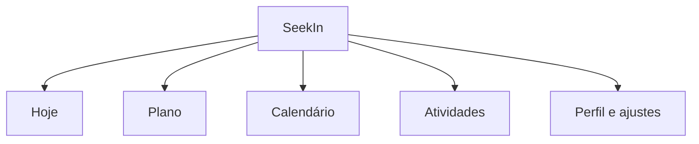
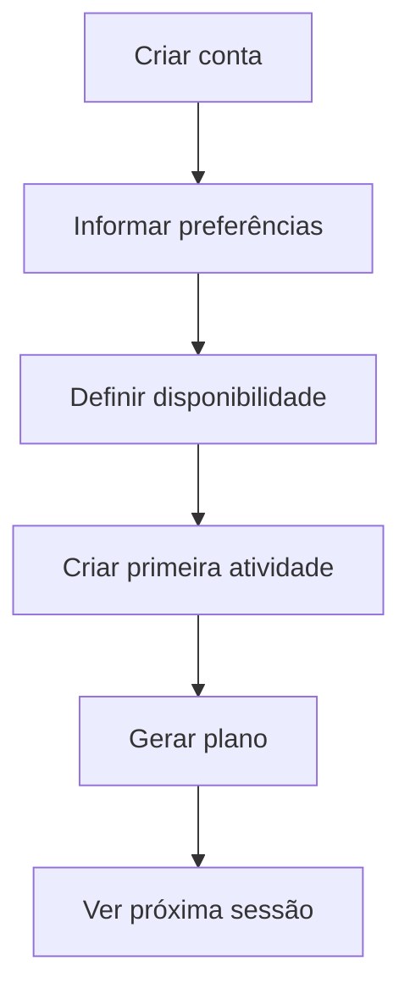
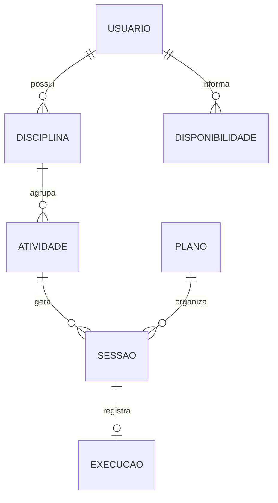

# PRD — MVP do Planner Inteligente do SeekIn

> Especificação do primeiro produto entregável do SeekIn: um planejador de estudos que transforma prazos, esforço e disponibilidade em sessões executáveis.

**Status:** pronto para revisão de produto<br>
**Versão:** 0.1<br>
**Data:** 12 de setembro de 2026<br>
**Fase:** M1 — Planner básico<br>
**Documento de origem:** [Briefing de Produto](../README.md)

---

## 1. Resumo

O MVP do SeekIn permitirá que um estudante informe sua rotina, disponibilidade e atividades acadêmicas para receber um plano de estudo viável. O sistema usará conceitos de MRP e CRP adaptados ao tempo para decompor o esforço de cada atividade em sessões, comparar a demanda com a capacidade disponível e indicar o que fazer agora.

O MVP será uma aplicação web responsiva, utilizável em celular, tablet e desktop. A experiência terá baixa densidade visual, com uma tela “Hoje” orientada à execução, Gantt simplificado no desktop e calendário como visão complementar.

O produto deve provar três hipóteses:

1. estudantes conseguem informar disponibilidade e esforço sem abandonar o onboarding;
2. um plano gerado automaticamente reduz a decisão diária sobre o que estudar;
3. o aluno confia no plano quando entende a prioridade e consegue replanejá-lo.

## 2. Problema

Listas de tarefas e calendários registram compromissos, mas não verificam se o aluno possui tempo suficiente para concluir tudo. Quando várias entregas competem pela mesma disponibilidade, o estudante precisa calcular mentalmente prioridades, duração, risco e distribuição do esforço.

O MVP deve responder:

> **Considerando meus prazos, minha rotina e o esforço restante, qual é a melhor atividade para estudar agora e como devo distribuir o restante?**

## 3. Objetivos

### 3.1 Objetivo principal

Transformar atividades acadêmicas em um plano de sessões compatível com a capacidade real do estudante.

### 3.2 Objetivos do MVP

- permitir o cadastro rápido de rotina, disponibilidade, disciplinas e atividades;
- calcular capacidade líquida diária e semanal;
- detectar sobrecarga antes do vencimento das atividades;
- distribuir esforço em sessões de estudo;
- priorizar atividades por risco e prazo de forma explicável;
- apresentar a próxima ação na tela “Hoje”;
- permitir concluir, ignorar, mover, fixar e replanejar sessões;
- oferecer Gantt e calendário coerentes com o mesmo plano;
- medir ativação, execução, confiança e entrega no prazo.

### 3.3 Não objetivos

O MVP não pretende:

- substituir uma plataforma acadêmica;
- oferecer rede social, feed ou comunidades;
- oferecer mentorias ou pagamentos;
- importar automaticamente dados de universidades;
- sincronizar calendários externos de forma bidirecional;
- usar inteligência artificial generativa para decidir o plano;
- oferecer chat, videochamada ou colaboração em tempo real;
- atender equipes ou planejamento multiusuário;
- reproduzir todas as funções de um software de projetos.

## 4. Público e necessidades

### 4.1 Público primário

Estudantes de graduação, presenciais ou a distância, que conciliam estudos com trabalho, família e compromissos pessoais.

### 4.2 Necessidades principais

- visualizar todas as entregas em um só lugar;
- saber se o tempo disponível é suficiente;
- decidir rapidamente o que estudar;
- evitar acumular esforço próximo do prazo;
- adaptar o plano quando a rotina muda;
- perceber progresso sem usar controles complexos.

### 4.3 Jobs to be done

| Situação | Necessidade | Resultado esperado |
|---|---|---|
| Recebo uma nova atividade | Registrar prazo e esforço rapidamente | O plano é atualizado sem refazer tudo |
| Tenho várias entregas | Entender a ordem correta de execução | Começo pela atividade de maior risco real |
| Minha semana mudou | Atualizar minha disponibilidade | As sessões são redistribuídas com clareza |
| Tenho pouco tempo agora | Encontrar uma sessão compatível | Aproveito a janela sem improvisar |
| Não consegui estudar | Informar o ocorrido sem culpa | O sistema recalcula o restante |
| Quero acompanhar o semestre | Visualizar carga, progresso e prazos | Identifico riscos com antecedência |

## 5. Hipóteses e premissas

### 5.1 Hipóteses de produto

- esforço em minutos ou horas é compreensível para o usuário;
- a maioria das atividades pode ser dividida em sessões;
- uma priorização baseada em regras gera mais confiança inicial que uma pontuação opaca;
- reservar parte do tempo livre produz planos mais realistas;
- a tela “Hoje” será usada com mais frequência que o Gantt;
- a edição manual é necessária para manter autonomia e confiança.

### 5.2 Premissas adotadas nesta versão

- o MVP será uma aplicação web responsiva;
- a semana começa na segunda-feira;
- datas e horários serão armazenados com fuso e exibidos no fuso do usuário;
- o usuário poderá alterar duração de sessão e reserva de capacidade;
- a duração padrão de sessão será de 50 minutos;
- a duração mínima sugerida será de 25 minutos;
- a reserva de capacidade padrão será de 20%;
- a folga desejada antes da entrega será de 24 horas quando houver capacidade;
- o planejamento automático considerará até 90 dias por execução;
- dependências entre atividades ficam fora do P0.

Essas premissas são configuráveis ou revisáveis após a validação do beta.

## 6. Escopo funcional

### 6.1 Incluído no P0

| Área | Capacidade |
|---|---|
| Conta | criar conta, entrar, sair e recuperar acesso |
| Preferências | fuso, início da semana, duração de sessão e reserva |
| Disponibilidade | cadastrar janelas semanais e exceções por data |
| Rotina | registrar compromissos que consomem disponibilidade |
| Disciplinas | criar, editar, arquivar e identificar por cor |
| Atividades | cadastrar prazo, esforço, prioridade, notas e progresso |
| Planejamento | gerar, explicar e versionar um plano |
| Capacidade | comparar demanda e tempo líquido disponível |
| Execução | iniciar, concluir, ignorar e registrar esforço real |
| Replanejamento | recalcular sessões afetadas e preservar sessões fixadas |
| Hoje | mostrar próxima sessão, entregas e capacidade do dia |
| Gantt | exibir atividades, progresso, risco e prazo |
| Calendário | exibir sessões, rotina e entregas |
| Alertas | informar conflito, risco e alteração relevante do plano |
| Responsividade | funcionar em celular, tablet e desktop |

### 6.2 Preparado no domínio, mas sem interface completa

- perfil social básico associado à conta;
- origem da sessão: automática ou manual;
- histórico de versões do plano;
- estrutura para futura integração com calendários.

### 6.3 Fora do P0

- recorrência acadêmica avançada;
- dependências entre atividades;
- importação de arquivos ou portais;
- integração com Google Calendar;
- notificações push, e-mail ou WhatsApp;
- estimativa de esforço assistida por IA;
- planejamento offline completo;
- rede social e mentorias.

## 7. Arquitetura de informação

### 7.1 Navegação principal

| Destino | Tarefa mental principal |
|---|---|
| Hoje | executar a próxima sessão |
| Plano | compreender a distribuição e os riscos |
| Calendário | localizar sessões e compromissos no tempo |
| Atividades | cadastrar e administrar demandas |
| Perfil e ajustes | manter conta e preferências |

### 7.2 Hierarquia recomendada



No celular, os quatro primeiros destinos ficam na navegação inferior. Perfil e ajustes ficam no menu da conta.

## 8. Jornadas principais

### 8.1 Primeira ativação



O usuário é considerado ativado quando conclui a disponibilidade mínima, cria ao menos uma atividade válida e gera o primeiro plano.

### 8.2 Execução diária

1. O aluno abre “Hoje”.
2. O sistema mostra a sessão mais importante e explica o motivo.
3. O aluno inicia a sessão ou seleciona outra disponível.
4. Ao finalizar, informa o tempo realizado e conclui ou mantém a atividade aberta.
5. O plano recalcula esforço e risco quando necessário.

### 8.3 Falha de execução

1. O aluno marca uma sessão como não realizada.
2. O sistema pergunta apenas se deseja replanejar agora.
3. O motor preserva sessões fixadas e redistribui o esforço restante.
4. O aluno recebe um resumo das mudanças e conflitos.

### 8.4 Nova atividade urgente

1. O aluno cadastra a nova atividade.
2. O sistema recalcula demanda acumulada e capacidade.
3. Se o plano continuar viável, sugere novas sessões.
4. Se ficar inviável, mostra o déficit e alternativas.

## 9. Requisitos funcionais

As prioridades usam:

- **P0:** obrigatório para lançamento;
- **P1:** importante após validação do núcleo;
- **P2:** evolução futura.

### 9.1 Conta e preferências

| ID | Prioridade | Requisito |
|---|---|---|
| RF-001 | P0 | O usuário deve criar uma conta, entrar, sair e recuperar acesso. |
| RF-002 | P0 | Cada conta deve possuir um perfil básico com nome e fuso horário. |
| RF-003 | P0 | O usuário deve configurar início da semana, duração padrão de sessão e reserva de capacidade. |
| RF-004 | P0 | O sistema deve salvar datas e horários de forma segura para diferentes fusos. |
| RF-005 | P1 | O usuário poderá excluir a conta e exportar seus dados. |

### 9.2 Disponibilidade e rotina

| ID | Prioridade | Requisito |
|---|---|---|
| RF-010 | P0 | O usuário deve cadastrar uma ou mais janelas de disponibilidade por dia da semana. |
| RF-011 | P0 | Janelas não podem ter fim anterior ou igual ao início. |
| RF-012 | P0 | O sistema deve detectar e consolidar janelas sobrepostas. |
| RF-013 | P0 | O usuário deve registrar bloqueios recorrentes ou excepcionais. |
| RF-014 | P0 | O usuário deve informar indisponibilidade em uma data específica. |
| RF-015 | P0 | Alterações de disponibilidade devem disparar análise de impacto no plano vigente. |
| RF-016 | P1 | O usuário poderá copiar a configuração de uma semana anterior. |

### 9.3 Disciplinas

| ID | Prioridade | Requisito |
|---|---|---|
| RF-020 | P0 | O usuário deve criar, editar e arquivar disciplinas. |
| RF-021 | P0 | A disciplina deve ter nome e pode ter cor e descrição. |
| RF-022 | P0 | Arquivar uma disciplina não deve excluir suas atividades. |
| RF-023 | P0 | Cores precisam manter contraste adequado na interface. |

### 9.4 Atividades

| ID | Prioridade | Requisito |
|---|---|---|
| RF-030 | P0 | O usuário deve criar uma atividade com título, prazo e esforço estimado. |
| RF-031 | P0 | O usuário pode associar disciplina, tipo, prioridade e notas. |
| RF-032 | P0 | O esforço deve ser registrado em minutos, ainda que exibido em horas e minutos. |
| RF-033 | P0 | O prazo deve conter data e, opcionalmente, hora. |
| RF-034 | P0 | Quando a hora não for informada, o prazo será 23:59 no fuso do usuário. |
| RF-035 | P0 | O usuário deve editar, concluir, cancelar ou arquivar uma atividade. |
| RF-036 | P0 | O sistema deve calcular esforço restante a partir do esforço realizado. |
| RF-037 | P0 | O sistema deve impedir esforço negativo e sinalizar realizado maior que estimado. |
| RF-038 | P0 | Alterações de prazo, esforço ou status devem gerar análise de impacto. |
| RF-039 | P1 | O usuário poderá duplicar uma atividade. |

### 9.5 Capacidade

| ID | Prioridade | Requisito |
|---|---|---|
| RF-040 | P0 | O sistema deve calcular capacidade bruta por dia e semana. |
| RF-041 | P0 | Compromissos e bloqueios devem ser subtraídos da capacidade bruta. |
| RF-042 | P0 | A reserva configurada deve ser descontada da capacidade restante. |
| RF-043 | P0 | Sessões fixadas e manuais devem consumir capacidade antes das sugestões automáticas. |
| RF-044 | P0 | O usuário deve visualizar capacidade, carga planejada e saldo. |
| RF-045 | P0 | O cálculo deve considerar apenas tempo anterior ao prazo de cada atividade. |

### 9.6 Geração do plano

| ID | Prioridade | Requisito |
|---|---|---|
| RF-050 | P0 | O sistema deve gerar sessões para atividades ativas com esforço restante. |
| RF-051 | P0 | Sessões automáticas devem respeitar disponibilidade, bloqueios, prazo e limite diário. |
| RF-052 | P0 | O esforço deve ser dividido pela duração preferida da sessão. |
| RF-053 | P0 | O último bloco pode ser menor que a duração mínima quando representar o restante. |
| RF-054 | P0 | O motor deve tentar manter 24 horas de folga antes do prazo. |
| RF-055 | P0 | O motor deve distribuir sessões e evitar concentrar todo o esforço no último dia. |
| RF-056 | P0 | O sistema deve criar uma nova versão imutável a cada plano publicado. |
| RF-057 | P0 | A mesma entrada deve produzir o mesmo resultado. |
| RF-058 | P0 | Se não houver capacidade, o sistema deve publicar o déficit e não prometer um plano viável. |
| RF-059 | P0 | O usuário deve confirmar a primeira geração e mudanças relevantes. |

### 9.7 Priorização e explicação

| ID | Prioridade | Requisito |
|---|---|---|
| RF-060 | P0 | O motor deve priorizar atividades vencidas, inviáveis ou com menor folga. |
| RF-061 | P0 | Prazo, prioridade manual e esforço restante devem participar do desempate. |
| RF-062 | P0 | A tela “Hoje” deve exibir uma justificativa para a recomendação principal. |
| RF-063 | P0 | O usuário deve visualizar o nível de risco de cada atividade. |
| RF-064 | P0 | O risco deve ser recalculado quando demanda ou capacidade mudar. |
| RF-065 | P1 | O usuário poderá informar preferência de período por disciplina. |

### 9.8 Tela “Hoje”

| ID | Prioridade | Requisito |
|---|---|---|
| RF-070 | P0 | A tela deve mostrar uma sessão principal recomendada. |
| RF-071 | P0 | A sessão deve apresentar atividade, disciplina, duração, horário e motivo. |
| RF-072 | P0 | O usuário deve iniciar, concluir, ignorar ou abrir detalhes. |
| RF-073 | P0 | A tela deve mostrar as demais sessões do dia em ordem cronológica. |
| RF-074 | P0 | Entregas próximas e riscos devem aparecer sem competir com a ação principal. |
| RF-075 | P0 | O usuário deve visualizar carga e saldo de capacidade do dia. |
| RF-076 | P0 | Sem sessão planejada, a tela deve oferecer criar atividade ou revisar disponibilidade. |

### 9.9 Gantt

| ID | Prioridade | Requisito |
|---|---|---|
| RF-080 | P0 | O desktop deve exibir atividades à esquerda e linha do tempo à direita. |
| RF-081 | P0 | Cada atividade deve mostrar início planejado, prazo, progresso e risco. |
| RF-082 | P0 | Uma linha deve identificar o dia atual. |
| RF-083 | P0 | O usuário deve filtrar por disciplina, status e risco. |
| RF-084 | P0 | O usuário deve abrir os detalhes da atividade a partir da linha. |
| RF-085 | P1 | O usuário poderá expandir uma atividade para visualizar suas sessões. |
| RF-086 | P1 | O usuário poderá mover uma sessão diretamente no Gantt. |

### 9.10 Calendário

| ID | Prioridade | Requisito |
|---|---|---|
| RF-090 | P0 | O calendário deve oferecer visualizações semanal e mensal. |
| RF-091 | P0 | Sessões, prazos e bloqueios devem ter distinção visual e textual. |
| RF-092 | P0 | O usuário deve abrir detalhes ao selecionar um item. |
| RF-093 | P0 | O usuário deve mover uma sessão para uma janela válida. |
| RF-094 | P0 | Movimentos inválidos devem ser impedidos e explicados. |
| RF-095 | P0 | No celular, a visualização padrão deve ser agenda ou semana compacta. |

### 9.11 Execução e replanejamento

| ID | Prioridade | Requisito |
|---|---|---|
| RF-100 | P0 | O usuário deve iniciar uma sessão e registrar início real. |
| RF-101 | P0 | Ao concluir, deve informar ou aceitar o tempo realizado. |
| RF-102 | P0 | O esforço realizado deve atualizar atividade, progresso e risco. |
| RF-103 | P0 | O usuário deve marcar uma sessão como não realizada. |
| RF-104 | P0 | O usuário deve fixar uma sessão para protegê-la do replanejamento. |
| RF-105 | P0 | O replanejamento deve preservar sessões concluídas e fixadas. |
| RF-106 | P0 | Antes de aplicar mudanças relevantes, o sistema deve resumir sessões criadas, movidas e removidas. |
| RF-107 | P0 | O usuário deve aceitar ou cancelar o novo plano. |
| RF-108 | P0 | Cancelar deve manter o plano anterior válido. |

### 9.12 Notas e materiais

| ID | Prioridade | Requisito |
|---|---|---|
| RF-110 | P0 | A atividade deve aceitar notas em texto simples ou Markdown seguro. |
| RF-111 | P0 | O usuário deve adicionar links a materiais. |
| RF-112 | P1 | O usuário poderá anexar arquivos. |
| RF-113 | P1 | Materiais poderão ser associados a uma sessão específica. |

### 9.13 Alertas

| ID | Prioridade | Requisito |
|---|---|---|
| RF-120 | P0 | Alertas de risco devem existir dentro do produto. |
| RF-121 | P0 | O alerta deve informar causa, impacto e ação possível. |
| RF-122 | P0 | Alertas iguais não devem se repetir sem mudança de contexto. |
| RF-123 | P1 | O usuário poderá receber notificações fora do produto. |

## 10. Modelo de dados conceitual

| Entidade | Campos essenciais |
|---|---|
| Usuário | id, nome, e-mail, fuso, status, criado_em |
| Preferência | duração_sessão, duração_mínima, reserva_percentual, início_semana |
| Disponibilidade | usuário, dia_semana, início, fim, vigência |
| Bloqueio | usuário, título, início, fim, recorrência, origem |
| Disciplina | usuário, nome, cor, status |
| Atividade | usuário, disciplina, título, tipo, prazo, esforço_estimado, esforço_realizado, prioridade, status, notas |
| Sessão | atividade, início_planejado, fim_planejado, duração, origem, fixada, status |
| Execução | sessão, início_real, fim_real, duração_real, resultado |
| Plano | usuário, versão, horizonte, criado_em, status, motivo |
| Item do plano | plano, sessão, mudança, justificativa |
| Alerta | usuário, tipo, severidade, entidade, mensagem, resolvido_em |

### 10.1 Relações principais



## 11. Regras do motor MRP/CRP

### 11.1 Definições

```text
esforço restante = máximo(0, esforço estimado - esforço realizado)

capacidade bruta = soma das janelas de disponibilidade

capacidade operacional = capacidade bruta
                       - bloqueios
                       - sessões manuais ou fixadas

capacidade líquida = capacidade operacional
                   × (1 - reserva percentual)

saldo de capacidade = capacidade líquida - carga automática planejada
```

Todos os cálculos internos usam minutos inteiros.

### 11.2 Horizonte de prazo

Para cada prazo `D`, o motor calcula:

```text
demanda acumulada até D = soma do esforço restante
                          de atividades com prazo até D

capacidade acumulada até D = soma da capacidade líquida
                             disponível até D

taxa de carga até D = demanda acumulada até D
                      ÷ capacidade acumulada até D

folga até D = capacidade acumulada até D
              - demanda acumulada até D
```

Quando a capacidade for zero e houver demanda, a taxa de carga é considerada infinita.

### 11.3 Níveis de risco

| Nível | Regra inicial |
|---|---|
| Vencida | prazo anterior ao momento atual e atividade não concluída |
| Inviável | taxa de carga maior que 1,00 em algum horizonte relevante |
| Crítica | taxa entre 0,80 e 1,00 ou folga menor que uma sessão padrão |
| Atenção | taxa entre 0,50 e 0,80 ou prazo nas próximas 72 horas |
| Controlada | taxa até 0,50 e sem outra condição de risco |

Os limiares são parâmetros de produto e devem ser avaliados no beta.

### 11.4 Ordem de prioridade v1

A primeira versão será determinística e baseada em regras, sem pesos ocultos. A ordenação usa, nesta sequência:

1. atividade vencida;
2. atividade afetada por horizonte inviável;
3. menor prazo;
4. menor folga de capacidade;
5. maior prioridade informada pelo usuário;
6. atividade já iniciada;
7. data de criação mais antiga.

Essa ordem pode ser apresentada ao aluno em linguagem natural. Uma fórmula ponderada ou modelo inteligente só deve substituir as regras após existirem dados suficientes para comparação.

### 11.5 Divisão em sessões

Exemplo para uma atividade com 170 minutos restantes e sessão padrão de 50 minutos:

```text
50 + 50 + 45 + 25 = 170 minutos
```

Regras:

- preferir blocos próximos da duração padrão;
- evitar bloco menor que 25 minutos, exceto quando todo o restante for menor;
- redistribuir pequenas sobras entre sessões;
- não criar sessão com duração zero;
- respeitar a capacidade contínua da janela;
- não atravessar bloqueios ou o prazo da atividade.

### 11.6 Seleção de horários

O motor aloca sessões considerando:

1. janelas válidas anteriores ao prazo;
2. sessões manuais e fixadas já existentes;
3. folga desejada de 24 horas;
4. limite diário e reserva;
5. distribuição do esforço entre dias;
6. menor concentração possível no último dia;
7. ordem de prioridade das atividades.

Quando dois horários forem equivalentes, o mais cedo é escolhido para reduzir risco.

### 11.7 Plano inviável

O plano é inviável quando a demanda acumulada ultrapassa a capacidade líquida antes de um prazo.

O sistema deve informar:

- primeiro prazo afetado;
- minutos de déficit;
- atividades envolvidas;
- maior janela de capacidade ainda disponível;
- opções para resolver o conflito.

O sistema pode alocar a parcela possível, mas deve rotulá-la como plano parcial. Nunca deve apresentar uma atividade como garantida quando falta capacidade.

### 11.8 Replanejamento

Ordem de preservação:

1. sessões concluídas;
2. sessões em andamento;
3. sessões fixadas pelo usuário;
4. sessões manuais;
5. sessões automáticas futuras.

Somente o quinto grupo pode ser alterado sem autorização específica. Se uma sessão protegida tornar o plano inviável, ela é preservada e apresentada como parte da causa do conflito.

### 11.9 Versionamento

Cada publicação de plano gera:

- número sequencial;
- data e hora;
- motivo da geração;
- conjunto de entradas utilizadas;
- sessões criadas, mantidas, movidas e removidas;
- conflitos encontrados;
- confirmação do usuário, quando necessária.

## 12. Especificação das telas

### 12.1 Onboarding

Objetivo: chegar ao primeiro plano com o mínimo de configuração.

Etapas:

1. boas-vindas e objetivo;
2. fuso e preferências básicas;
3. janelas de disponibilidade;
4. compromissos recorrentes;
5. primeira disciplina;
6. primeira atividade;
7. prévia e confirmação do plano.

Regras de experiência:

- indicar progresso;
- permitir voltar sem perder dados;
- explicar esforço com exemplos;
- permitir pular compromissos recorrentes;
- não pedir informações sociais além do perfil básico;
- concluir em até cinco minutos no teste de usabilidade.

### 12.2 Hoje

Ordem visual:

1. saudação e data;
2. sessão recomendada;
3. explicação da prioridade;
4. ação “Iniciar estudo”;
5. próximas sessões;
6. entregas próximas;
7. capacidade usada e restante.

Estados vazios:

- sem atividade: criar primeira atividade;
- sem disponibilidade: configurar horários;
- dia livre: mostrar próxima entrega sem induzir estudo;
- plano inviável: abrir resolução de conflito;
- tudo concluído: reforçar progresso e preservar descanso.

### 12.3 Plano/Gantt

No desktop:

- coluna de atividade fixa;
- linha do tempo rolável;
- cabeçalho por semana e dia;
- linha do dia atual;
- barra por período planejado da atividade;
- preenchimento de progresso;
- marcador de prazo;
- risco por texto, ícone e cor;
- filtros recolhíveis.

No celular, essa rota usa uma linha do tempo vertical de atividades. Não será exibido um Gantt horizontal comprimido.

### 12.4 Calendário

- mês para visão de prazos;
- semana para organização de sessões;
- agenda como padrão no celular;
- bloqueios com aparência neutra;
- sessões com disciplina e duração;
- prazos separados visualmente das sessões;
- arrastar e soltar somente onde o dispositivo oferecer precisão adequada;
- alternativa por toque e seleção de novo horário.

### 12.5 Atividades

- lista simples com busca e filtros;
- ordenação padrão por risco e prazo;
- criação rápida;
- formulário completo em painel lateral no desktop;
- tela dedicada no celular;
- ações destrutivas com confirmação;
- atividade arquivada fora da lista padrão.

### 12.6 Resolução de conflito

Deve mostrar primeiro o diagnóstico e depois as alternativas:

> “Faltam 90 minutos disponíveis antes de sexta-feira para concluir duas entregas.”

Ações possíveis:

- adicionar disponibilidade excepcional;
- reduzir esforço estimado;
- alterar prazo;
- mudar prioridade;
- manter plano parcial;
- cancelar e revisar depois.

## 13. Critérios de aceite principais

### CA-001 — Primeira geração

**Dado** um usuário com pelo menos uma janela disponível e uma atividade válida<br>
**Quando** solicitar a geração do plano<br>
**Então** o sistema deve criar sessões dentro das janelas e antes do prazo, ou informar claramente que o plano é inviável.

### CA-002 — Respeito à rotina

**Dado** um compromisso dentro de uma janela de disponibilidade<br>
**Quando** o plano for gerado<br>
**Então** nenhuma sessão automática pode sobrepor esse compromisso.

### CA-003 — Reserva de capacidade

**Dado** um usuário com 300 minutos operacionais e reserva de 20%<br>
**Quando** a capacidade líquida for calculada<br>
**Então** no máximo 240 minutos devem ser disponibilizados para alocação automática.

### CA-004 — Conflito de capacidade

**Dado** esforço restante maior que a capacidade anterior ao prazo<br>
**Quando** o planejamento for executado<br>
**Então** o sistema deve identificar o déficit em minutos e apresentar plano parcial ou alternativas.

### CA-005 — Prioridade explicável

**Dado** duas ou mais atividades concorrentes<br>
**Quando** uma sessão for recomendada em “Hoje”<br>
**Então** o usuário deve visualizar pelo menos um motivo baseado em prazo, risco, folga ou prioridade manual.

### CA-006 — Conclusão de sessão

**Dado** uma sessão planejada<br>
**Quando** o aluno informar o tempo realizado<br>
**Então** o esforço restante, o progresso e o risco devem ser atualizados.

### CA-007 — Replanejamento seguro

**Dado** um plano com sessões concluídas, fixadas e automáticas<br>
**Quando** o sistema replanejar<br>
**Então** sessões concluídas e fixadas devem ser preservadas, e mudanças futuras devem ser resumidas.

### CA-008 — Cancelamento do replanejamento

**Dado** uma proposta de novo plano ainda não aceita<br>
**Quando** o usuário cancelar<br>
**Então** a versão vigente deve permanecer inalterada.

### CA-009 — Consistência entre visões

**Dado** um plano publicado<br>
**Quando** o usuário alternar entre Hoje, Gantt e calendário<br>
**Então** horários, estados, progresso e riscos devem representar a mesma versão.

### CA-010 — Responsividade

**Dado** acesso por celular, tablet ou desktop suportado<br>
**Quando** o usuário realizar a jornada principal<br>
**Então** nenhuma ação obrigatória deve depender exclusivamente de hover, arrastar ou tela larga.

## 14. Requisitos não funcionais

| ID | Área | Requisito |
|---|---|---|
| RNF-001 | Desempenho | Gerar plano de até 200 atividades e horizonte de 90 dias em até 3 segundos no percentil 95. |
| RNF-002 | Interface | Ações locais devem responder visualmente em até 200 ms. |
| RNF-003 | Confiabilidade | O motor deve ser determinístico para a mesma versão de entradas e regras. |
| RNF-004 | Integridade | Publicar plano e sessões deve ocorrer de forma atômica. |
| RNF-005 | Segurança | Dados devem ser protegidos em trânsito e em repouso. |
| RNF-006 | Privacidade | Cada usuário só pode acessar seus dados no MVP. |
| RNF-007 | Auditoria | Mudanças relevantes em plano, atividade e sessão devem registrar autor e horário. |
| RNF-008 | Acessibilidade | A interface deve buscar conformidade WCAG 2.2 nível AA. |
| RNF-009 | Compatibilidade | Suportar as duas versões estáveis mais recentes dos principais navegadores. |
| RNF-010 | Localização | Textos não devem ser fixados na lógica de negócio; o lançamento será em português do Brasil. |
| RNF-011 | Observabilidade | Falhas do motor devem gerar logs correlacionáveis sem expor conteúdo sensível. |
| RNF-012 | Recuperação | Uma falha na geração não pode apagar o último plano válido. |

## 15. Acessibilidade e conteúdo

- risco nunca será comunicado apenas por cor;
- contraste mínimo seguirá o nível AA;
- navegação por teclado deve cobrir toda a jornada desktop;
- foco visível deve ser preservado;
- controles devem possuir nome acessível;
- duração sempre deve possuir unidade;
- mensagens devem explicar o que ocorreu e como resolver;
- evitar linguagem punitiva como “você falhou”; usar “sessão não realizada”;
- datas relativas devem permitir acesso à data absoluta;
- gráficos precisam de alternativa textual.

## 16. Eventos analíticos

| Evento | Quando ocorre | Propriedades mínimas |
|---|---|---|
| `account_created` | conta concluída | método, origem |
| `onboarding_started` | primeira etapa aberta | dispositivo |
| `availability_saved` | disponibilidade válida salva | minutos_semanais, número_janelas |
| `activity_created` | atividade criada | tipo, prioridade, esforço, dias_ate_prazo |
| `plan_generation_requested` | geração iniciada | atividades_ativas, horizonte |
| `plan_generated` | plano publicado | sessões, carga, capacidade, duração_processamento |
| `plan_conflict_detected` | capacidade insuficiente | déficit_minutos, primeiro_prazo |
| `plan_change_accepted` | usuário aceita replanejamento | criadas, movidas, removidas |
| `study_session_started` | sessão iniciada | origem, duração_planejada |
| `study_session_completed` | sessão concluída | duração_planejada, duração_real |
| `study_session_skipped` | sessão não realizada | antecedência, motivo_opcional |
| `activity_completed` | atividade concluída | no_prazo, esforço_estimado, esforço_real |
| `priority_explanation_opened` | explicação expandida | nível_risco, motivo_principal |

Não registrar notas, títulos ou dados pessoais em propriedades analíticas.

## 17. Métricas e metas de validação

As metas abaixo são hipóteses para o beta e devem ser revistas após a primeira coorte.

| Métrica | Definição | Sinal inicial desejado |
|---|---|---|
| Ativação | disponibilidade + primeira atividade + primeiro plano em 24 h | pelo menos 50% |
| Primeira execução | usuário inicia uma sessão em até 24 h após ativação | pelo menos 40% |
| Conclusão de sessões | sessões concluídas ÷ sessões iniciadas | pelo menos 70% |
| Adoção do plano | usuários ativados com sessão concluída na semana | pelo menos 50% |
| Retenção W4 | usuários ativos na quarta semana ÷ ativados | pelo menos 30% |
| Entrega no prazo | atividades concluídas até o prazo ÷ concluídas | estabelecer linha de base e melhorar |
| Confiança | nota para “o plano parece realizável” | média mínima 4 de 5 |
| Erro de esforço | diferença absoluta entre estimado e realizado | medir antes de definir meta |

### 17.1 Métrica norte do MVP

> **Atividades concluídas no prazo com apoio de sessões planejadas pelo SeekIn.**

## 18. Casos extremos obrigatórios

O desenvolvimento e os testes devem cobrir:

- conta sem disponibilidade;
- atividade sem hora de prazo;
- atividade com prazo no passado;
- esforço menor que a sessão mínima;
- esforço realizado maior que o estimado;
- janelas sobrepostas;
- bloqueio que ocupa toda a disponibilidade;
- mudança de fuso horário;
- transição de horário de verão quando aplicável;
- duas atividades com o mesmo prazo;
- atividade concluída com sessões futuras;
- replanejamento com todas as sessões fixadas;
- exclusão ou arquivamento de disciplina com atividades;
- falha durante a geração do plano;
- abertura simultânea em dois dispositivos;
- plano com capacidade exatamente igual à demanda.

## 19. Estratégia de entrega

### Etapa A — Protótipo validável

- onboarding;
- cadastro de atividade;
- Hoje;
- Gantt e calendário estáticos com dados realistas;
- teste moderado com 5 a 8 estudantes.

### Etapa B — Motor mínimo

- capacidade líquida;
- priorização determinística;
- divisão e alocação de sessões;
- conflitos;
- testes automatizados de regras.

### Etapa C — Fluxo completo

- execução;
- progresso;
- replanejamento;
- versionamento;
- consistência entre visões.

### Etapa D — Beta fechado

- observabilidade;
- analytics;
- acessibilidade;
- segurança;
- testes com 20 a 50 estudantes;
- revisão dos limiares de risco.

## 20. Critérios de liberação do MVP

O MVP pode ser liberado para o beta quando:

- todos os requisitos P0 estiverem implementados ou formalmente dispensados;
- os dez critérios de aceite principais passarem;
- o motor possuir testes para todos os casos extremos críticos;
- não houver perda do último plano válido após falha;
- a jornada principal funcionar em celular e desktop;
- eventos de ativação, plano e execução estiverem validados;
- a revisão básica de segurança e privacidade estiver concluída;
- pelo menos cinco estudantes concluírem a jornada em teste;
- a equipe conseguir explicar qualquer recomendação gerada pelo motor.

## 21. Dependências

- definição da identidade visual mínima;
- escolha de autenticação e infraestrutura;
- modelo persistente de datas, recorrência e fuso;
- biblioteca de calendário e Gantt com acessibilidade aceitável;
- instrumentação analítica;
- termos de uso e política de privacidade para o beta;
- grupo inicial de estudantes para validação.

## 22. Riscos específicos do MVP

| Risco | Mitigação |
|---|---|
| Onboarding longo | revelar apenas campos necessários e medir abandono por etapa |
| Estimativa ruim | exemplos, edição simples e comparação posterior com esforço real |
| Plano excessivamente cheio | reserva padrão, limite diário e folga antes do prazo |
| Falta de confiança | explicação, edição manual e histórico de mudanças |
| Replanejamento instável | determinismo, sessões fixadas e comparação antes de aplicar |
| Gantt complexo no celular | usar agenda vertical em vez de miniaturizar o desktop |
| Dados inconsistentes entre telas | uma versão vigente do plano como fonte única |
| Complexidade prematura | manter integrações, rede social e IA fora do P0 |

## 23. Decisões de produto registradas neste PRD

- o MVP será web responsivo;
- a tela “Hoje” é o ponto inicial após o onboarding;
- Gantt é principal para planejamento no desktop;
- calendário é uma visão complementar do mesmo plano;
- o celular usa agenda vertical em vez de Gantt comprimido;
- a priorização v1 será determinística e baseada em regras;
- a reserva inicial de capacidade será 20%;
- a sessão padrão será 50 minutos e a mínima 25 minutos;
- o motor buscará folga de 24 horas antes do prazo;
- mudanças relevantes exigem confirmação;
- sessões concluídas e fixadas nunca serão movidas automaticamente;
- Google Calendar, IA e recursos sociais ficam fora do P0.

## 24. Questões para revisão do Product Owner

Estas questões não bloqueiam a documentação, mas precisam ser confirmadas antes da implementação definitiva:

1. O beta inicial será focado em estudantes da Unicesumar ou terá público acadêmico geral?
2. A criação de conta será por e-mail, Google ou ambos?
3. A reserva padrão de 20% pode ser alterada livremente pelo aluno?
4. O limite de 50 minutos representa bem a sessão padrão desejada?
5. Atividades sem disciplina serão permitidas?
6. O usuário poderá criar sessões totalmente manuais no P0?
7. Qual será o período máximo permitido entre criação e prazo?
8. O plano deve ser confirmado a cada alteração ou apenas quando a mudança for relevante?
9. Quais motivos opcionais serão oferecidos ao ignorar uma sessão?
10. Qual ferramenta de analytics será permitida considerando privacidade e custo?

## 25. Próximos artefatos

Após a aprovação deste PRD:

1. especificação de UX com fluxos e estados;
2. especificação de UI e design system;
3. arquitetura técnica e modelo físico de dados;
4. backlog canônico com épicos, histórias e critérios de aceite;
5. plano de testes do motor de planejamento;
6. plano de instrumentação e beta.

---

Este PRD detalha somente o MVP do planner. Rede social, comunidades e mentorias terão PRDs próprios após a validação do núcleo de planejamento.
