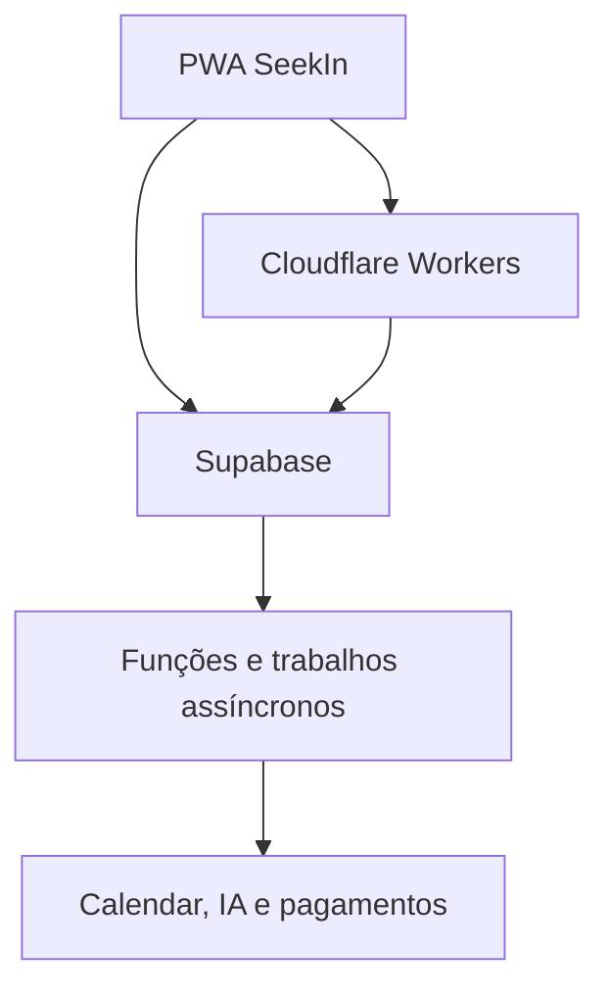
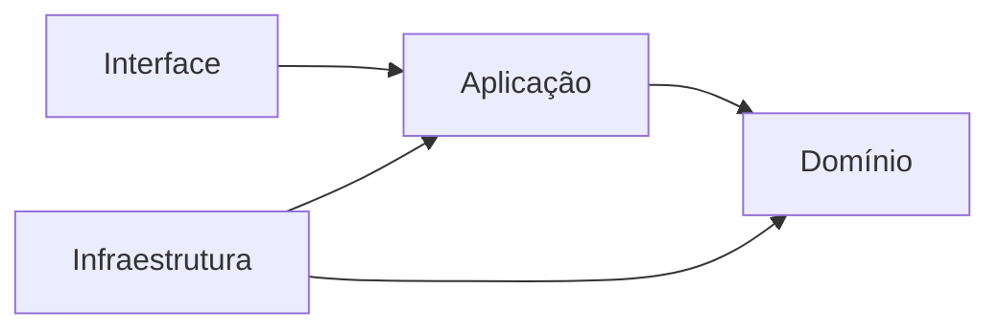
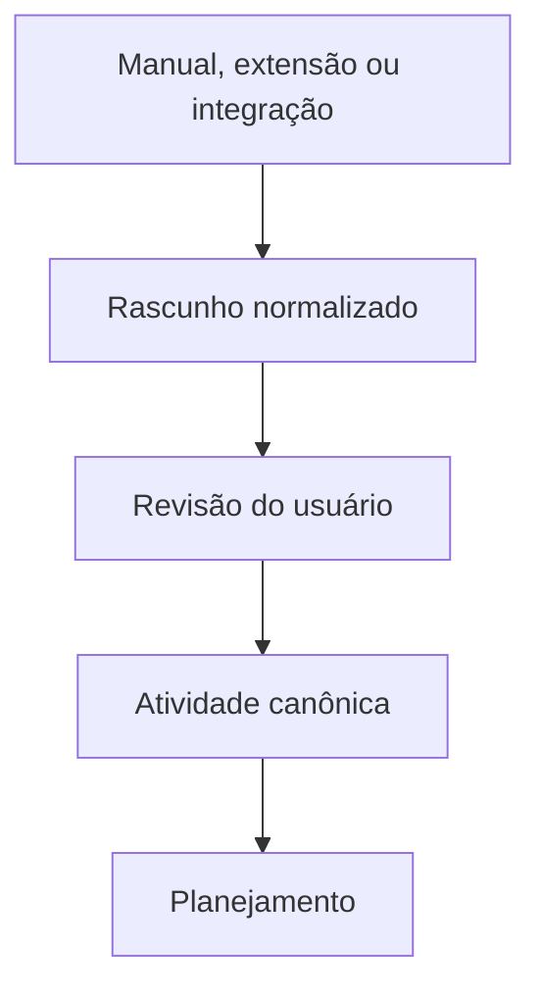

# Arquitetura técnica e infraestrutura

> Fundação técnica do SeekIn para iniciar com baixa complexidade e custo zero, preservando uma evolução segura para rede social, comunidades, mentorias e Google Cloud Run.

**Status:** decisão aprovada  
**Versão:** 0.1  
**Data:** 12 de setembro de 2026  
**Documentos relacionados:** [Briefing](../README.md) · [PRD do MVP](01-prd-mvp-planner.md) · [PWA e responsividade](02-requisitos-tecnicos-pwa-responsividade.md) · [Engenharia e qualidade](04-requisitos-de-engenharia-e-qualidade.md) · [Evolução para Cloud Run](05-estrategia-de-evolucao-cloud-run.md) · [Contrato canônico](06-contrato-canonico-entrega-rastreabilidade.md) · [Backlog](07-backlog-canonico.md)

---

## 1. Decisão executiva

O SeekIn adotará inicialmente:

- **arquitetura de monólito modular**;
- **React, React Router, TypeScript e Vite** para a aplicação web;
- **Progressive Web App** responsiva para celular, tablet e desktop;
- **Cloudflare Workers com Static Assets** para entrega da aplicação;
- **Supabase** para PostgreSQL, autenticação, autorização, arquivos, recursos em tempo real e funções de backend;
- **GitHub e integração contínua** para versionamento, validação e implantação;
- **Google Cloud Run** como destino planejado para computação pesada e, se necessário, para o servidor web em uma fase posterior.

Esta arquitetura deve suportar o MVP com baixo custo operacional sem transformar antecipadamente o produto em um conjunto de microserviços.

## 2. Objetivos arquiteturais

- sustentar o beta inicial sem custo obrigatório de infraestrutura;
- manter simples o desenvolvimento e a operação para uma equipe pequena;
- proteger o domínio de planejamento contra dependência de interface ou provedor;
- permitir substituir o motor de alocação sem reescrever o produto;
- permitir mover cargas para Cloud Run de forma incremental;
- manter a mesma fonte de dados para Hoje, Lista, Calendário e Gantt;
- preservar segurança, privacidade, acessibilidade e observabilidade desde o início;
- preparar o domínio para perfis, feed, comunidades e mentorias sem implementar esses módulos no P0.

## 3. Visão de contexto



### 3.1 Responsabilidades

| Camada | Responsabilidade |
|---|---|
| PWA | interface, interação, cache controlado e execução da jornada do aluno |
| Cloudflare | entrega global, HTTPS, ativos estáticos, SSR quando necessário e proteção de borda |
| Supabase | identidade, dados, RLS, Storage, Realtime, Edge Functions e persistência |
| Motor de planejamento | calcular capacidade, prioridade, sessões, risco e explicações |
| Cloud Run futuro | executar algoritmos, integrações ou trabalhos que excedam os limites serverless iniciais |

## 4. Estilo arquitetural

### 4.1 Monólito modular

O produto começa como uma aplicação implantável única, organizada em módulos de negócio. Um módulo não pode acessar estruturas internas de outro módulo; a comunicação ocorre por contratos explícitos.

Módulos previstos:

- identidade e perfil;
- rotina e disponibilidade;
- disciplinas e atividades;
- planejamento e sessões;
- entrada manual e importações;
- calendário e integrações;
- notificações;
- conteúdo social;
- comunidades;
- mentorias e pagamentos;
- moderação e auditoria.

No P0 serão implementados apenas identidade, rotina, atividades, planejamento, sessões e a infraestrutura mínima de importação.

### 4.2 Regra de dependência



- **Domínio:** regras puras, sem React, Supabase, Cloudflare ou acesso à rede.
- **Aplicação:** casos de uso, comandos, consultas e coordenação de transações.
- **Infraestrutura:** Supabase, cache, HTTP, arquivos e integrações externas.
- **Interface:** componentes, rotas, estados visuais e acessibilidade.

Dependências sempre apontam para o domínio. Código de negócio não importa SDKs de infraestrutura.

## 5. Stack aprovada

| Área | Tecnologia | Diretriz |
|---|---|---|
| Linguagem | TypeScript | modo estrito e sem `any` injustificado |
| Interface | React | componentes pequenos e acessíveis |
| Framework web | React Router em Framework Mode | rotas, carregamento, actions e SSR |
| Build | Vite | desenvolvimento e empacotamento |
| Hospedagem inicial | Cloudflare Workers + Static Assets | alvo oficial do primeiro deploy |
| Estilos | Tailwind CSS | tokens semânticos e composição controlada |
| Primitivos de UI | Radix Primitives ou shadcn/ui | acessibilidade e código sob controle do projeto |
| Dados remotos | TanStack Query | cache, invalidação e persistência seletiva |
| Formulários | React Hook Form | formulários performáticos e previsíveis |
| Validação | Zod | contratos nas fronteiras do sistema |
| Datas | date-fns | operações de data testáveis |
| Recorrência | rrule | representação de rotinas recorrentes |
| PWA | Workbox por `vite-plugin-pwa` | estratégia `injectManifest` para controle do service worker |
| Virtualização | TanStack Virtual | Lista e Gantt com grande volume |
| Arrastar e soltar | dnd-kit | melhoria progressiva; nunca caminho único |
| Banco e serviços | Supabase | Postgres, Auth, Storage, Realtime e Edge Functions |
| Testes unitários | Vitest | domínio e aplicação |
| Testes de componentes | Testing Library | comportamento observável |
| Testes ponta a ponta | Playwright | jornadas, navegadores e dispositivos |
| Testes de banco | pgTAP em projeto Supabase Cloud isolado | políticas, funções e invariantes SQL |

Versões exatas serão definidas no início da implementação, fixadas no gerenciador de pacotes e registradas no lockfile. Dependências beta não entram no caminho crítico sem uma decisão arquitetural específica.

### 5.1 Bibliotecas ainda não congeladas

A biblioteca de Gantt e a biblioteca de calendário exigem uma prova técnica antes da decisão final. A avaliação deve considerar:

- licença compatível com produto comercial;
- acessibilidade por teclado e leitor de tela;
- tamanho do pacote;
- virtualização;
- suporte a toque;
- adaptação visual ao SeekIn;
- alternativa a arrastar e soltar;
- desempenho com dados realistas.

O Gantt do SeekIn é simplificado. Se uma biblioteca trouxer densidade ou comportamento de software corporativo, uma linha do tempo própria e menor deve ser preferida.

## 6. Organização inicial do repositório

```text
apps/
  web/

packages/
  domain/
  contracts/
  planner-core/

supabase/
  migrations/
  functions/
  tests/

tests/
  e2e/
```

O repositório usará `pnpm workspaces`. Turborepo, Nx ou ferramenta equivalente só será adicionada quando houver mais de uma aplicação ou quando medições mostrarem necessidade de cache de build distribuído.

## 7. Supabase

### 7.1 Serviços utilizados

- PostgreSQL como fonte canônica;
- Supabase Auth para conta e sessão;
- Data API com acesso controlado;
- Storage para avatares e anexos;
- Edge Functions para comandos privilegiados, integrações e motor inicial;
- Realtime apenas onde atualização imediata produzir valor;
- Cron ou filas para trabalhos assíncronos quando necessários.

O projeto será criado na região mais adequada ao público brasileiro, preferencialmente São Paulo, após validação da disponibilidade no momento do provisionamento.

### 7.2 Acesso aos dados

Operações simples e pertencentes ao próprio usuário podem usar a Data API a partir da PWA, sempre protegidas por RLS. Operações privilegiadas, multiusuário, financeiras, administrativas ou que usem segredos passam por uma função de backend.

Componentes React não acessam `supabase-js` diretamente. Cada módulo usa uma interface de repositório, e o adaptador Supabase implementa essa interface. Essa regra reduz acoplamento e permite trocar a forma de acesso sem alterar as telas.

### 7.3 Schemas e exposição

- tabelas destinadas à Data API recebem privilégios explícitos por migration;
- todas as tabelas expostas devem possuir RLS e políticas por operação;
- dados internos ficam em schema não exposto, por exemplo `private`;
- tokens de integrações, segredos, auditoria sensível e dados de pagamento nunca ficam acessíveis ao cliente;
- views expostas devem usar `security_invoker = true` quando suportado;
- funções `security definer` são excepcionais, ficam fora do schema exposto e têm `EXECUTE` revogado de `PUBLIC` por padrão.

Desde 2026, novas tabelas podem não ser expostas automaticamente pela Data API. Por isso, `GRANT` e RLS serão decisões explícitas e revisáveis no mesmo arquivo de migration.

### 7.4 Autorização

- identidade vem de `auth.uid()`;
- autorização nunca depende de `user_metadata`, pois o próprio usuário pode alterá-lo;
- papéis administrativos usam `app_metadata` ou tabelas internas;
- `TO authenticated` deve ser acompanhado de condição de propriedade ou associação;
- políticas de `UPDATE` devem possuir `USING` e `WITH CHECK`;
- a chave secreta ou `service_role` nunca é enviada ao navegador.

### 7.5 Migrações

- toda alteração estrutural será criada e versionada pelo Supabase CLI;
- mudanças manuais no Dashboard não são a fonte de verdade;
- migrations devem funcionar em banco vazio e em atualização;
- tipos TypeScript do banco serão regenerados após mudanças aprovadas;
- Security Advisor e Performance Advisor serão revisados antes de releases relevantes.

## 8. Entrada manual e integrações

Todos os canais de entrada devem convergir para o mesmo caso de uso.



Regras:

- importação não dispara planejamento antes da confirmação quando houver ambiguidade;
- a origem fica registrada como metadado, sem alterar o comportamento da atividade;
- conectores externos não escrevem diretamente nas tabelas centrais;
- manual e importado usam a mesma validação, os mesmos comandos e os mesmos estados;
- eventos externos devem possuir identificador de idempotência;
- erros de integração não podem corromper a atividade canônica nem apagar o último plano válido.

## 9. Motor de planejamento

### 9.1 Isolamento

`planner-core` é um módulo determinístico e independente. Ele não conhece banco, HTTP, interface ou provedor de nuvem.

Entrada normalizada:

- fuso do usuário;
- disponibilidade e rotina;
- bloqueios;
- atividades e esforço restante;
- prazos e prioridade;
- dependências;
- sessões concluídas, fixadas ou em andamento;
- duração mínima e preferida;
- reserva de capacidade;
- versão das regras.

Saída normalizada:

- sessões sugeridas;
- riscos e déficit de capacidade;
- atividades não alocadas;
- justificativas de prioridade;
- resumo das mudanças;
- versão e assinatura do plano.

### 9.2 Execução inicial

O primeiro motor será escrito em TypeScript e executado por uma Edge Function do Supabase. A função autentica a solicitação, carrega ou recebe o conjunto normalizado, executa o motor, valida o resultado e persiste uma nova versão do plano em transação controlada.

O motor deve ser idempotente e possuir limite explícito de itens e horizonte. Se o cálculo não terminar, o último plano válido permanece publicado.

### 9.3 Evolução

Quando o algoritmo exceder os limites da Edge Function ou precisar de otimização matemática, a mesma entrada será enviada a um serviço no Cloud Run. A estratégia completa está em [Evolução para Cloud Run](05-estrategia-de-evolucao-cloud-run.md).

## 10. Datas, recorrência e fuso

- instantes são persistidos como `timestamptz` em UTC;
- cada usuário possui fuso IANA, como `America/Sao_Paulo`;
- rotinas recorrentes preservam regra e fuso de origem;
- ocorrências futuras não serão expandidas indefinidamente;
- datas sem horário e prazos com horário são tipos de domínio distintos;
- mudanças de horário de verão devem ser testadas;
- a semana civil começa na segunda-feira conforme o PRD.

## 11. PWA e cache

O service worker armazena o shell e ativos versionados. Respostas autenticadas do Supabase não devem ser colocadas indiscriminadamente no cache HTTP.

O último plano disponível será persistido seletivamente no IndexedDB, identificado pelo usuário e pela versão do plano. No logout:

- dados privados persistidos são removidos quando tecnicamente seguro;
- tokens não permanecem em caches públicos;
- outro usuário do mesmo dispositivo não recebe dados da sessão anterior.

No P0, mutações exigem rede. Uma outbox offline somente será introduzida após especificação própria de conflitos e idempotência.

## 12. Preparação para as fases futuras

### 12.1 Perfil social

O identificador estável do perfil deve nascer junto com a conta. Dados privados de estudo não se tornam publicações automaticamente: compartilhar algo cria uma entidade de conteúdo separada e exige ação explícita.

### 12.2 Feed

- paginação por cursor;
- índices orientados às consultas reais;
- contadores agregados sem recalcular toda a interação;
- Realtime não será aplicado ao feed universal inteiro;
- conteúdo removido e moderação preservam trilha de auditoria.

### 12.3 Comunidades

Servidor, canal e sala serão módulos próprios. Autorizações dependem de associação e papel no contexto, não de um campo global no perfil.

### 12.4 Mentorias

Reservas, ofertas, pagamentos e disputas formam um limite de domínio separado. O SeekIn não armazenará dados de cartão. Webhooks financeiros devem ser assinados, idempotentes e auditáveis.

## 13. Ambientes e implantação

### 13.1 Ambientes

| Ambiente | Finalidade | Infraestrutura inicial |
|---|---|---|
| Desenvolvimento | implementação e testes | runtime local da aplicação e projeto Supabase Cloud isolado |
| Preview | revisão de interface e código | deploy efêmero no Cloudflare; dados sintéticos |
| Beta | 1 a 5 usuários | Cloudflare Free e Supabase Free |
| Produção | usuários reais e compromisso de disponibilidade | planos pagos definidos por capacidade e risco |

O SeekIn não depende de Docker nem de Supabase local. A aplicação continua reproduzível a partir
do repositório, enquanto banco, Auth e Edge Functions executam no Supabase Cloud. Preview nunca
deve apontar automaticamente para dados reais do beta ou da produção. Enquanto o plano Free não
oferecer preview branches automáticas, mudanças de banco entram em `main` somente após revisão e
são aplicadas pela integração oficial do Supabase com o GitHub.

### 13.2 Pipeline

1. validar formatação e lint;
2. executar TypeScript;
3. executar testes unitários e de integração;
4. validar migrations em projeto cloud isolado ou pela verificação do Supabase GitHub Integration;
5. executar build de produção;
6. executar testes ponta a ponta essenciais;
7. gerar preview;
8. promover para beta ou produção após aprovação.

Migrations incompatíveis devem seguir expansão e contração: primeiro adicionar estruturas compatíveis, depois migrar uso e somente por último remover estruturas antigas.

## 14. Observabilidade

- logs estruturados em JSON;
- identificador de correlação por solicitação e por geração de plano;
- erros classificados por módulo, sem notas ou títulos acadêmicos nos logs;
- métricas de duração e resultado do motor;
- registro da versão de aplicação, schema e algoritmo;
- monitoramento de falhas de autenticação, RLS e integrações;
- alertas de custo antes de habilitar serviços pagos.

Ferramentas externas de erros e produto poderão ser adicionadas no beta, após revisão de privacidade.

## 15. Capacidade e custo inicial

A combinação Cloudflare Free e Supabase Free é adequada ao beta fechado de 1 a 5 usuários. Ela não oferece SLA formal e não elimina riscos próprios de planos gratuitos.

Pontos a monitorar:

- CPU por chamada dinâmica no Cloudflare Worker;
- tamanho do banco e do Storage;
- egress;
- invocações de Edge Functions;
- conexões e mensagens Realtime;
- pausa do projeto Supabase por baixa atividade;
- ausência de backup para download no plano gratuito.

O primeiro custo recomendado para uma produção pública tende a ser a elevação do Supabase para um plano sem pausa automática e com melhor recuperação. Cloudflare pago ou Cloud Run entram somente quando métricas ou requisitos justificarem.

## 16. Tecnologias deliberadamente evitadas no início

- microserviços;
- Kubernetes;
- API Gateway próprio;
- segundo banco de dados;
- Cloudflare D1 junto com Supabase;
- GraphQL sem necessidade comprovada;
- ORM obrigatório sobre a Data API;
- Redux para estado remoto;
- mensageria externa antes de existir carga assíncrona;
- inteligência artificial dentro das regras determinísticas do planner;
- uso amplo de Realtime em consultas que aceitam atualização normal.

## 17. Critérios para revisar esta arquitetura

Uma revisão arquitetural será obrigatória quando ocorrer um destes eventos:

- lançamento público;
- primeiro pagamento real;
- inclusão do feed ou chat;
- integração bidirecional com Google Calendar;
- introdução de edição offline;
- motor ultrapassando limites da Edge Function;
- necessidade de disponibilidade contratual;
- mudança material no custo ou status das plataformas;
- processamento de dados com nova exigência regulatória.

## 18. Referências

- [Cloudflare Workers — preços](https://developers.cloudflare.com/workers/platform/pricing/)
- [Cloudflare Workers — React Router](https://developers.cloudflare.com/workers/framework-guides/web-apps/react-router/)
- [Supabase — billing e quotas](https://supabase.com/docs/guides/platform/billing-on-supabase)
- [Supabase — segurança da Data API](https://supabase.com/docs/guides/api/securing-your-api)
- [Supabase — RLS](https://supabase.com/docs/guides/database/postgres/row-level-security)
- [Supabase — limites de Edge Functions](https://supabase.com/docs/guides/functions/limits)
- [Supabase — produção](https://supabase.com/docs/guides/deployment/going-into-prod)
- [Google Cloud Run — preços](https://cloud.google.com/run/pricing)
- [Google OR-Tools — scheduling](https://developers.google.com/optimization/scheduling)

---

Esta arquitetura é a base aprovada para iniciar a implementação. Qualquer alteração estrutural deve ser registrada por ADR e avaliar impacto no produto, custo, segurança e migração futura.
