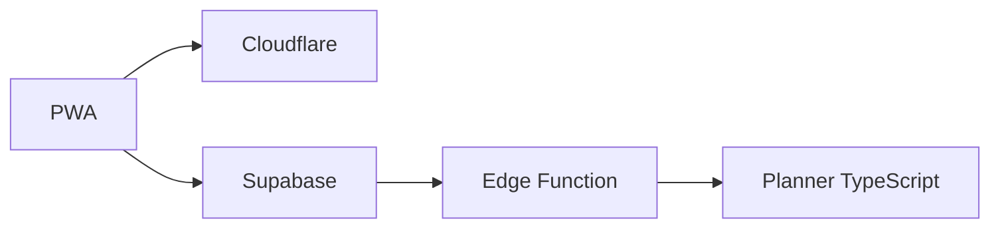
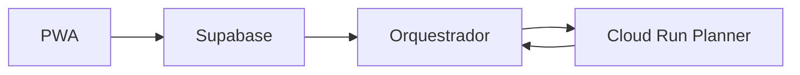
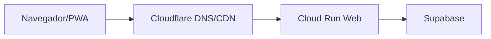

# Estratégia de evolução para Google Cloud Run

> Caminho incremental para o SeekIn migrar computação e, se necessário, o servidor web para Cloud Run sem reescrever domínio, interface ou banco.

**Status:** direção futura aprovada  
**Versão:** 0.1  
**Data:** 12 de setembro de 2026  
**Documentos relacionados:** [Arquitetura técnica](03-arquitetura-tecnica-e-infraestrutura.md) · [Engenharia e qualidade](04-requisitos-de-engenharia-e-qualidade.md) · [PRD](01-prd-mvp-planner.md) · [Contrato canônico](06-contrato-canonico-entrega-rastreabilidade.md) · [Backlog](07-backlog-canonico.md)

---

## 1. Decisão

O SeekIn será preparado desde o início para utilizar Google Cloud Run, mas não dependerá dele no beta de 1 a 5 usuários.

A evolução preferencial possui duas etapas independentes:

1. **migrar primeiro o motor de planejamento e trabalhos pesados** para Cloud Run;
2. **migrar o servidor web somente se houver benefício comprovado** de custo, compatibilidade, observabilidade ou operação.

O Supabase permanece como plataforma de dados, autenticação, Storage e Realtime. Uma eventual migração do banco é uma decisão separada e não faz parte deste plano.

## 2. Por que a migração será incremental

Mover aplicação, motor e banco ao mesmo tempo elevaria risco e dificultaria identificar falhas. A separação permite:

- manter a PWA disponível durante a mudança;
- comparar motores antigo e novo com o mesmo input;
- retornar rapidamente à implementação anterior;
- evitar transportar dados sem necessidade;
- pagar Cloud Run apenas quando existir carga que o justifique;
- escolher runtime adequado ao problema, inclusive Python para OR-Tools;
- não alterar contratos consumidos pela interface.

## 3. Estados arquiteturais

### 3.1 Estado inicial



- Cloudflare entrega a aplicação;
- Supabase autentica e persiste;
- Edge Function coordena o cálculo;
- `planner-core` executa o algoritmo TypeScript.

### 3.2 Primeiro destino no Cloud Run



- a Edge Function continua responsável por autenticação e persistência;
- o Cloud Run recebe somente input normalizado;
- o Cloud Run devolve um resultado normalizado;
- credenciais de banco não precisam existir no serviço do motor;
- a interface não conhece a mudança.

### 3.3 Migração opcional do servidor web



Nesta etapa, Cloudflare pode continuar como DNS, CDN e proteção de borda, enquanto o container no Cloud Run executa o servidor React Router. Essa migração não é obrigatória para mover o motor.

## 4. Gatilhos para iniciar a migração do motor

A migração deve ser avaliada quando pelo menos uma condição ocorrer:

- cálculo se aproxima ou ultrapassa o limite de CPU da Edge Function;
- horizonte ou quantidade de atividades aumenta materialmente;
- o algoritmo precisa de processamento contínuo ou bibliotecas nativas;
- entra otimização por restrições com OR-Tools/CP-SAT;
- trabalhos precisam de mais memória ou tempo;
- fila de replanejamento começa a afetar a resposta do usuário;
- importações, IA ou moderação competem com o motor por recursos;
- testes de carga mostram degradação não resolvida por otimização simples;
- exigências de observabilidade ou controle operacional justificam container próprio.

Não será usado apenas o número de usuários. A complexidade do plano e o custo por cálculo são sinais mais úteis.

## 5. Gatilhos para migrar o servidor web

A migração do servidor React Router para Cloud Run deve ocorrer somente se houver benefício mensurável:

- limites de runtime da Cloudflare bloqueiam funcionalidades necessárias;
- dependências Node incompatíveis com Workers tornam-se essenciais;
- renderização ou rotas dinâmicas ultrapassam o orçamento de CPU;
- a equipe precisa unificar servidor web e serviços em containers;
- requisitos de rede privada, região ou observabilidade exigem Google Cloud;
- custo total medido é melhor no Cloud Run;
- integração com outros serviços GCP reduz complexidade real.

Cloud Run não será adotado apenas por expectativa de escala futura.

## 6. Requisitos de portabilidade desde o início

### 6.1 Domínio independente

- `domain` e `planner-core` não importam APIs Cloudflare, Supabase ou Google;
- tempo, UUID, logs e variáveis de ambiente entram por interfaces;
- regras puras não leem arquivos, rede ou processo global;
- contratos são serializáveis em JSON;
- testes do motor rodam sem infraestrutura.

### 6.2 Servidor sem estado local

- requisições não dependem de memória de uma instância anterior;
- estado persistente permanece no Supabase;
- arquivos temporários não são considerados duráveis;
- trabalhos podem ser repetidos com idempotência;
- qualquer instância pode atender a próxima requisição.

### 6.3 Configuração

- configuração vem de variáveis de ambiente validadas ao iniciar;
- nomes de variáveis não dependem de um provedor;
- secrets não têm valor padrão inseguro;
- diferenças entre ambiente são configuração, não branches de código;
- adaptadores traduzem bindings Cloudflare e variáveis Cloud Run para um contrato interno.

### 6.4 Observabilidade

- logs estruturados em JSON para saída padrão;
- correlação preservada entre PWA, Edge Function e Cloud Run;
- endpoints de saúde e prontidão não acessam dados sensíveis;
- duração, resultado e versão do motor são métricas obrigatórias;
- traces distribuídos podem ser introduzidos sem alterar o domínio.

## 7. Contrato do motor

O contrato exato será versionado antes da implementação. A forma conceitual é:

```ts
type PlannerRequest = {
  contractVersion: string;
  algorithmVersion: string;
  requestId: string;
  userTimezone: string;
  horizon: { startsAt: string; endsAt: string };
  capacity: CapacityWindow[];
  blocks: CalendarBlock[];
  activities: PlanningActivity[];
  immutableSessions: StudySession[];
  preferences: PlanningPreferences;
};

type PlannerResult = {
  contractVersion: string;
  algorithmVersion: string;
  requestId: string;
  status: "feasible" | "infeasible" | "partial";
  sessions: ProposedSession[];
  risks: PlanningRisk[];
  unallocated: UnallocatedEffort[];
  explanations: PlanningExplanation[];
  diagnostics: SafePlannerDiagnostics;
};
```

Regras do contrato:

- tempos usam formato e fuso definidos;
- durações usam minutos inteiros;
- o input é imutável durante o cálculo;
- resultado referencia o mesmo `requestId`;
- campos novos são opcionais ou exigem nova versão;
- diagnóstico não contém notas ou títulos sensíveis quando for para logs;
- limites de tamanho são validados antes da execução;
- resultado sempre passa por validação antes de ser persistido.

## 8. Fluxo de persistência

1. aplicação registra uma solicitação de replanejamento;
2. orquestrador lê uma fotografia consistente dos dados;
3. input normalizado recebe versão e assinatura;
4. motor calcula sem gravar no banco;
5. resultado é validado;
6. aplicação verifica se a fotografia ainda é atual;
7. nova versão do plano é persistida;
8. plano anterior permanece disponível até a confirmação;
9. falha ou timeout mantém a última versão válida;
10. evento informa sucesso, inviabilidade ou necessidade de nova tentativa.

Esse fluxo é igual no motor local, Edge Function ou Cloud Run.

## 9. Motor inicial em TypeScript

O primeiro motor usará heurísticas determinísticas adequadas ao MVP:

- ordenar por risco, prazo, prioridade e flexibilidade;
- respeitar dependências;
- dividir esforço em sessões válidas;
- reservar margem e capacidade;
- preencher janelas sem sobreposição;
- produzir justificativas baseadas nos fatores realmente usados.

O motor será empacotado como biblioteca e poderá ser executado em Edge Function, Node ou teste local. A API HTTP é um adaptador, não a implementação do algoritmo.

## 10. Motor futuro com OR-Tools

Quando as restrições justificarem otimização matemática, poderá ser criado um serviço Python com OR-Tools/CP-SAT.

Possíveis variáveis:

- início de cada sessão;
- janela escolhida;
- quantidade de esforço alocada;
- prioridade de atividade;
- preferência de energia ou período;
- penalidade por fragmentação;
- folga antes do prazo;
- equilíbrio entre disciplinas.

Restrições rígidas:

- indisponibilidade e rotina;
- ausência de sobreposição;
- capacidade diária;
- precedência;
- sessões concluídas e fixadas;
- prazo quando o plano for viável.

Objetivos flexíveis:

- reduzir risco de atraso;
- aumentar folga;
- reduzir trocas de contexto;
- aproximar sessões das preferências;
- distribuir carga sem sacrificar descanso.

O solver deve ter limite de tempo e retornar a melhor solução viável encontrada. Um resultado matematicamente ótimo não é obrigatório para responder ao usuário.

## 11. Interface do serviço Cloud Run

O serviço do motor deve expor uma API mínima:

| Método | Rota | Finalidade |
|---|---|---|
| `POST` | `/v1/plans:generate` | gerar proposta de plano |
| `GET` | `/health/live` | confirmar processo vivo |
| `GET` | `/health/ready` | confirmar serviço pronto |

Diretrizes:

- autenticação de serviço para serviço;
- corpo validado e com tamanho limitado;
- timeout menor que o timeout do chamador;
- respostas idempotentes por `requestId`;
- nenhum endpoint administrativo público;
- nenhum token de usuário ou chave de banco em logs;
- CORS não é necessário quando o navegador não chama o motor diretamente.

O mecanismo de identidade será definido no ADR da migração. O padrão preferido é OIDC ou outro mecanismo de curta duração. Credenciais estáticas nunca serão entregues ao navegador.

## 12. Banco e rede

Na primeira migração, o Cloud Run não acessa diretamente o PostgreSQL. A Edge Function:

- autentica o usuário;
- carrega e normaliza os dados;
- chama o motor;
- valida e persiste o resultado.

Isso reduz exposição de credenciais e mantém o motor puro. Acesso direto ao banco somente será considerado se medições mostrarem que a orquestração gera gargalo. Nesse caso, deverá usar conexão apropriada ao ambiente serverless, princípio de menor privilégio e uma decisão arquitetural própria.

Cloud Run deve ser colocado na região que ofereça menor latência segura para o projeto Supabase, após medição. Região não será codificada na aplicação.

## 13. Container

O serviço deve:

- usar imagem mínima e versão de runtime suportada;
- executar como usuário sem privilégios quando possível;
- ouvir na porta informada pelo ambiente;
- encerrar corretamente ao receber sinal;
- não depender de shell em produção;
- possuir verificação de vulnerabilidades;
- fixar dependências;
- produzir build reproduzível;
- separar estágio de build e runtime;
- não incluir segredos na imagem;
- responder prontidão somente depois de carregar recursos essenciais.

## 14. Configuração inicial no Cloud Run

Para a primeira carga real:

- cobrança baseada em requisição;
- mínimo de instâncias igual a zero enquanto latência de inicialização for aceitável;
- máximo de instâncias baixo para limitar custo e proteger o Supabase;
- concorrência definida após teste, não copiada de exemplo;
- memória e CPU determinadas por benchmark;
- timeout explícito;
- conta de serviço com menor privilégio;
- logs e métricas habilitados;
- alertas de orçamento antes do tráfego;
- nenhuma GPU para o planner determinístico.

O plano gratuito do Cloud Run não deve ser tratado como garantia de custo zero. A conta requer faturamento e serviços auxiliares, como build, registro de imagens e tráfego, podem gerar cobrança.

## 15. Filas e reprocessamento

Quando o cálculo se tornar assíncrono:

- uma solicitação cria trabalho com ID único;
- consumidor bloqueia ou reivindica a mensagem;
- tentativas possuem atraso progressivo;
- erro permanente vai para quarentena ou dead letter;
- reprocessamento não cria planos duplicados;
- resultado obsoleto não substitui versão mais nova;
- o usuário vê estado real: aguardando, calculando, concluído ou falhou;
- a última versão válida continua disponível.

A tecnologia de fila será escolhida no momento da necessidade. Supabase Queues pode atender a primeira etapa; serviço gerenciado do Google poderá ser avaliado após a migração.

## 16. Plano de migração do motor

### Etapa 1 — Preparação

- estabilizar contrato e fixtures;
- registrar métricas do motor atual;
- criar suíte de cenários canônicos;
- garantir determinismo e idempotência;
- definir limiares de timeout e resultado aceitável.

### Etapa 2 — Container

- empacotar a mesma implementação TypeScript ou o novo solver;
- criar endpoints de saúde;
- validar localmente;
- executar testes de segurança e carga;
- provisionar ambiente Cloud Run sem tráfego produtivo.

### Etapa 3 — Shadow mode

- enviar cópia segura do input para os dois motores;
- manter o motor atual como resultado oficial;
- comparar status, sessões, risco, duração e estabilidade;
- não duplicar persistência nem notificação;
- investigar divergências antes da promoção.

### Etapa 4 — Liberação gradual

- habilitar por configuração para usuários internos;
- ampliar para pequena porcentagem do beta;
- monitorar erro, custo, latência e qualidade do plano;
- manter fallback para o motor anterior;
- promover somente após critérios objetivos.

### Etapa 5 — Consolidação

- tornar Cloud Run o motor principal;
- manter rollback durante janela definida;
- remover código antigo após estabilidade;
- atualizar ADRs, runbooks e orçamento;
- revisar capacidade e limites do Supabase.

## 17. Critérios de aceite da migração

- contratos continuam compatíveis;
- nenhum dado privado é exposto além do necessário;
- os cenários canônicos passam;
- sessões fixadas e concluídas são preservadas;
- resultado inviável continua explicável;
- latência fica dentro da meta definida;
- taxa de falha não supera o baseline aceito;
- custos possuem limite e alerta;
- rollback foi testado;
- o último plano válido permanece disponível durante falhas;
- não há alteração necessária nas telas para trocar o motor.

## 18. Rollback

O rollback deve ser uma mudança de configuração, não um deploy emergencial.

Ao detectar erro material:

1. interromper envio de novos trabalhos ao Cloud Run;
2. reativar o motor anterior;
3. manter resultados já confirmados;
4. marcar trabalhos incompletos para nova tentativa;
5. preservar logs e métricas;
6. corrigir sem alterar o contrato público;
7. repetir shadow mode antes de nova promoção.

## 19. Migração opcional da aplicação web

Se o servidor web também migrar:

- o React Router deve usar adaptador fino para runtime Node/container;
- bindings Cloudflare permanecem fora dos módulos de domínio e aplicação;
- ativos estáticos podem continuar na CDN;
- cookies, callbacks OAuth e cabeçalhos são testados em paralelo;
- service worker, manifest e URLs da PWA permanecem estáveis;
- o domínio público não muda durante o corte;
- preview e produção têm configurações separadas;
- o banco continua no Supabase;
- o corte usa canário e rollback por origem.

A migração web não deve ocorrer junto com uma grande mudança funcional.

## 20. Responsabilidades operacionais futuras

Antes de colocar Cloud Run em produção, devem existir:

- proprietário técnico do serviço;
- runbook de falha e rollback;
- dashboard de latência, erro, instâncias e custo;
- política de atualização da imagem;
- retenção de logs;
- alerta de orçamento;
- processo de rotação de credenciais;
- teste periódico de recuperação;
- capacidade máxima documentada.

## 21. Decisões fora deste plano

- migração do PostgreSQL para Google Cloud SQL ou AlloyDB;
- uso de Kubernetes ou GKE;
- adoção de GPU;
- substituição do Supabase Auth;
- escolha definitiva de fila Google;
- adoção de API Gateway;
- arquitetura multi-região ativa;
- uso de Cloud Run para todos os módulos sociais.

Essas decisões dependem de requisitos e métricas futuras.

## 22. Referências

- [Google Cloud Run — visão geral](https://cloud.google.com/run/docs/overview/what-is-cloud-run)
- [Google Cloud Run — preços](https://cloud.google.com/run/pricing)
- [Google Cloud Run — otimização de custos](https://cloud.google.com/run/docs/tips/services-cost-optimization)
- [Google Cloud Run — autenticação entre serviços](https://cloud.google.com/run/docs/authenticating/service-to-service)
- [Google OR-Tools — scheduling](https://developers.google.com/optimization/scheduling)
- [Google OR-Tools — CP-SAT](https://developers.google.com/optimization/cp)
- [Supabase — limites de Edge Functions](https://supabase.com/docs/guides/functions/limits)
- [Supabase — tarefas em background](https://supabase.com/docs/guides/functions/background-tasks)
- [Supabase — Queues](https://supabase.com/docs/guides/queues)

---

Este plano preserva Cloud Run como evolução intencional. A migração começa quando medições mostrarem necessidade e deve manter contratos, segurança, rollback e custo sob controle.
