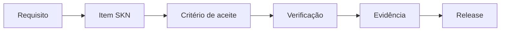
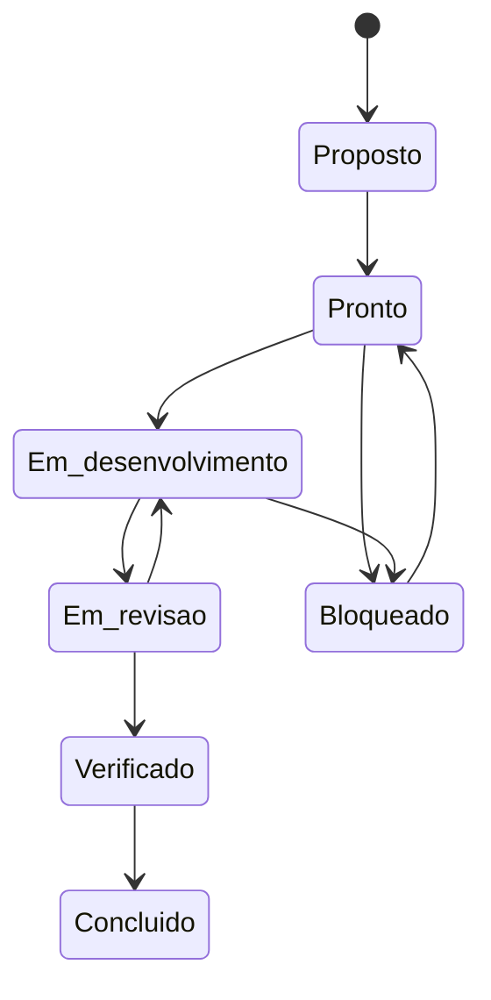

# Contrato canônico de entrega e rastreabilidade

> Regra única para transformar requisitos do SeekIn em trabalho verificável, impedir entregas sem evidência e manter produto, código, banco e operação sincronizados.

**Status:** obrigatório para implementação  
**Versão:** 0.1  
**Data:** 12 de setembro de 2026  
**Documentos relacionados:** [PRD](01-prd-mvp-planner.md) · [Arquitetura](03-arquitetura-tecnica-e-infraestrutura.md) · [Engenharia](04-requisitos-de-engenharia-e-qualidade.md) · [Backlog](07-backlog-canonico.md) · [Matriz de rastreabilidade](08-matriz-rastreabilidade.md)

---

## 1. Objetivo

Este contrato define quando uma entrega pode ser considerada pronta. Ele conecta, nos dois sentidos:



Uma funcionalidade visível, um deploy bem-sucedido ou um pipeline verde isoladamente não comprovam uma entrega. O resultado só está concluído quando todos os critérios aplicáveis possuem evidência reproduzível.

## 2. Fontes canônicas

| Fonte | Identificadores | Responsabilidade |
|---|---|---|
| Briefing | fases e decisões | visão e limites do produto |
| PRD | `RF-*`, `RNF-*`, `CA-*` | comportamento e qualidade do MVP |
| PWA e responsividade | `RT-PWA-*`, `CAT-*` | instalação, dispositivos e operação offline |
| Arquitetura | seções e ADRs | stack, fronteiras e infraestrutura |
| Engenharia | seções e definição de pronto | padrões de construção e revisão |
| Backlog canônico | `SKN-*` | ordem executável, dependências e resultado esperado |
| Evidências | `EV-SKN-*` | comprovação de aceite e operação |

Em caso de conflito:

1. requisito mais específico prevalece sobre orientação geral;
2. decisão mais recente e explicitamente aprovada prevalece;
3. alteração estrutural exige ADR;
4. o conflito deve ser resolvido nos documentos antes do merge funcional.

## 3. Identificadores

### 3.1 Item de backlog

Formato: `SKN-NNN`.

- o identificador nunca é reutilizado;
- título pode mudar, identificador não;
- item removido permanece registrado como cancelado, com justificativa;
- cada commit e pull request funcional referencia pelo menos um `SKN-*`;
- migrations, testes e documentação usam o mesmo identificador quando fizerem parte da entrega.

### 3.2 Critério de aceite

Formato: `AC-SKN-NNN-XX`.

Exemplo: `AC-SKN-040-01`.

Cada critério descreve um resultado observável e testável. Expressões como “funcionando”, “correto” ou “finalizado” sem condição mensurável não são aceitas.

### 3.3 Evidência

Formato: `EV-SKN-NNN` para o registro principal. Anexos podem acrescentar sufixo, por exemplo `EV-SKN-040-E2E`.

O registro fica em `docs/evidencias/SKN-NNN.md` e aponta para artefatos permanentes ou reproduzíveis.

### 3.4 Decisão arquitetural

Formato: `ADR-NNN`. É obrigatório para as situações definidas no documento de engenharia, incluindo troca de provedor, mudança do contrato do planner, escolha estrutural de calendário ou Gantt e início da migração para Cloud Run.

## 4. Tipos de item

| Tipo | Uso |
|---|---|
| Fundação | repositório, ambiente, banco, deploy, segurança e pipeline |
| Decisão | definição de produto, UX, arquitetura ou tecnologia |
| Funcionalidade | comportamento percebido pelo usuário |
| Domínio | regra de negócio sem interface |
| Dados | schema, migration, RLS, função ou consulta |
| Qualidade | testes, acessibilidade, desempenho ou segurança |
| Operação | observabilidade, release, recuperação ou custo |
| Pesquisa | prova técnica com pergunta e critério de decisão |

## 5. Campos obrigatórios de um item

Todo item `SKN-*` deve conter:

| Campo | Regra |
|---|---|
| ID e título | resultado curto e identificável |
| Épico e tipo | agrupamento e natureza da entrega |
| Prioridade | `P0`, `P1`, `P2` ou `Futuro` |
| Resultado | mudança observável após a conclusão |
| Fontes | requisitos ou seções canônicas atendidas |
| Dependências | itens que precisam estar verificados antes |
| Fora do escopo | limites que evitam expansão silenciosa |
| Critérios de aceite | condições binárias de aprovação |
| Verificação | teste, comando, inspeção ou pesquisa aplicável |
| Evidências | artefatos que precisam ser preservados |
| Risco e rollback | impacto de falha e caminho de retorno |
| Estado | situação atual segundo o fluxo canônico |

O [backlog](07-backlog-canonico.md) mantém uma visão compacta. Ao iniciar um item, sua issue ou PR deve expandir os campos acima sem alterar o resultado canônico.

## 6. Estados



| Estado | Condição |
|---|---|
| Proposto | existe, mas ainda possui decisão ou dependência desconhecida |
| Pronto | fontes, dependências, aceite e evidências estão definidos |
| Em desenvolvimento | implementação iniciada e responsável identificado |
| Em revisão | código e evidências iniciais disponíveis |
| Verificado | critérios passaram no ambiente exigido |
| Concluído | evidência registrada, documentação atualizada e merge realizado |
| Bloqueado | impedimento e responsável pela resolução estão registrados |
| Dispensado | Product Owner aprovou exceção com motivo, impacto e prazo |
| Cancelado | item não será executado; decisão permanece no histórico |

`Concluído` nunca é atribuído apenas porque o código foi escrito.

## 7. Classes de evidência

| Código | Evidência | Exemplos aceitos |
|---|---|---|
| `DOC` | decisão/documento | commit, ADR aprovado, fluxo ou contrato versionado |
| `CODE` | implementação | commit ou PR com arquivos e escopo identificáveis |
| `TEST` | teste automatizado | execução de CI, relatório Playwright, Vitest ou pgTAP |
| `DB` | banco e segurança | migration, tipos gerados, RLS/grants testados, advisors |
| `DEPLOY` | ambiente | URL, deploy ID, commit implantado e resposta de health check |
| `UX` | comportamento visual | screenshot sintético, vídeo curto ou trace, acompanhado de teste |
| `OBS` | operação | log correlacionado, métrica, alerta ou consulta de saúde |
| `USER` | validação humana | roteiro, participantes, achados e decisão sem dados pessoais |

Regras:

- screenshot não substitui teste de regra ou autorização;
- saída copiada manualmente deve incluir comando, ambiente, data e commit;
- evidência não pode conter token, e-mail real, nota acadêmica ou dado pessoal;
- links efêmeros devem ter um resumo persistente no registro;
- falha conhecida aparece como falha, não como evidência positiva;
- todo deploy é vinculado ao SHA do Git.

## 8. Registro obrigatório de evidência

Cada item concluído cria ou atualiza `docs/evidencias/SKN-NNN.md` segundo o [modelo](evidencias/README.md).

O registro deve responder:

1. qual requisito foi atendido;
2. qual versão foi verificada;
3. em qual ambiente;
4. quais critérios passaram ou falharam;
5. como reproduzir a verificação;
6. onde estão testes, migration, deploy e anexos;
7. quais riscos permaneceram;
8. como reverter.

O arquivo de evidência pode ser criado no mesmo PR. O status da [matriz](08-matriz-rastreabilidade.md) só muda para concluído após o merge desse registro.

## 9. Regras por tipo de mudança

### 9.1 Banco e Supabase

Uma mudança de banco só está pronta quando possui:

- migration criada pelo fluxo oficial e versionada;
- aplicação reproduzível em banco vazio;
- privilégios explícitos para a Data API quando necessários;
- RLS e políticas por operação nas tabelas expostas;
- teste positivo do proprietário e teste negativo entre usuários;
- política de `UPDATE` com `USING` e `WITH CHECK` quando aplicável;
- tipos TypeScript regenerados;
- Security Advisor e Performance Advisor revisados;
- rollback lógico ou migration corretiva planejada.

`service_role` não pode aparecer no cliente. `user_metadata` não pode autorizar operações.

### 9.2 Frontend

Uma tela só está pronta quando possui:

- estados de carregamento, vazio, erro e indisponibilidade aplicáveis;
- comportamento em celular, tablet e desktop aplicáveis;
- teclado, toque e foco verificados;
- nomes acessíveis e contraste adequados;
- teste de componente e jornada crítica;
- evidência visual com dados sintéticos;
- ausência de regra de negócio duplicada no componente.

### 9.3 Backend

Uma operação de backend só está pronta quando possui:

- contrato de entrada e saída versionado e validado;
- autenticação e autorização testadas;
- idempotência quando houver repetição possível;
- erros com códigos estáveis e sem vazamento de detalhes;
- log estruturado com correlação e sem conteúdo privado;
- timeout, limite e recuperação definidos;
- teste de integração.

### 9.4 Motor de planejamento

Uma regra do planner só está pronta quando possui:

- função de domínio independente de infraestrutura;
- exemplo determinístico;
- teste unitário e, quando aplicável, teste de propriedade;
- invariantes preservadas;
- explicação coerente com os fatores usados;
- benchmark dentro do limite do `RNF-001`;
- preservação do último plano válido em falha.

### 9.5 Infraestrutura e deploy

Um ambiente só está pronto quando possui:

- configuração documentada e sem segredo no Git;
- health checks de frontend, backend e banco;
- SHA da versão implantada;
- logs acessíveis e identificáveis;
- alerta ou limite de custo aplicável;
- teste de smoke após deploy;
- procedimento de rollback executável.

## 10. Portões de entrega

| Portão | Libera | Condição obrigatória |
|---|---|---|
| `G0 — Planejamento controlado` | setup técnico | contrato, backlog, matriz e decisões bloqueadoras aprovados |
| `G1 — Fundação local` | deploy remoto | workspace, web, backend, banco, migrations e testes funcionando localmente |
| `G2 — Fundação operacional` | funcionalidades do produto | CI, preview, beta, health checks, RLS e smoke test verificados |
| `G3 — Núcleo utilizável` | visões finais | auth, onboarding, rotina, atividade e primeira geração ponta a ponta |
| `G4 — MVP completo` | beta com usuários | execução, replanejamento, Hoje, Lista, Calendário, Gantt e PWA aceitos |
| `G5 — Beta liberado` | crescimento | segurança, observabilidade, analytics, acessibilidade e testes com usuários aprovados |

O início exploratório de UX e provas técnicas pode ocorrer antes de `G2`. Código funcional de produto não deve ser integrado à `main` antes de `G2`.

## 11. Contrato do portão G2 — Fundação operacional

O portão só passa quando uma única versão comprova:

1. instalação reproduzível a partir de clone limpo;
2. aplicação web responde em ambiente local e remoto;
3. função backend `/health` responde com versão e correlação;
4. banco aplica todas as migrations em instância vazia;
5. consulta autenticada de saúde do banco funciona;
6. usuário A não acessa registro do usuário B;
7. pipeline executa formato, lint, tipos, testes, migration limpa e build;
8. preview não usa dados de produção;
9. beta aponta para o projeto Supabase correto;
10. smoke test atravessa navegador, backend e banco;
11. deploy registra o SHA implantado;
12. rollback da aplicação foi documentado e testado ao menos uma vez.

As evidências são consolidadas no item `SKN-030`.

## 12. Pull request e commit

Título recomendado do PR:

```text
SKN-NNN: resultado da entrega
```

Corpo mínimo:

```markdown
## Resultado

## Requisitos
- RF-...
- RNF-...

## Critérios
- [ ] AC-SKN-NNN-01

## Evidências
- TEST:
- DB:
- DEPLOY:
- UX:

## Risco e rollback
```

Commits usam o identificador quando forem parte de uma entrega, por exemplo:

```text
feat(SKN-071): adiciona cadastro canônico de atividade
```

## 13. Alteração de escopo

Um requisito ou item não pode desaparecer silenciosamente. A mudança exige:

- motivo;
- decisão do Product Owner quando afetar produto;
- impacto nos itens dependentes;
- atualização do backlog e da matriz no mesmo commit;
- ADR quando afetar arquitetura;
- registro como dispensado ou cancelado, sem apagar o histórico.

## 14. Auditoria de rastreabilidade

Antes de cada portão:

- todo requisito P0 deve apontar para ao menos um item;
- todo item P0 deve apontar para uma fonte canônica;
- todo item concluído deve possuir `EV-SKN-*`;
- todos os critérios da evidência devem ter resultado;
- a versão verificada deve corresponder ao deploy ou commit;
- itens bloqueados devem ter impedimento e próxima ação;
- exceções devem ter aprovador, impacto e prazo.

Se qualquer verificação falhar, o portão permanece aberto.

---

Este contrato é parte da definição de pronto. Alterá-lo exige revisão conjunta do backlog, da matriz de rastreabilidade e do modelo de evidências.
