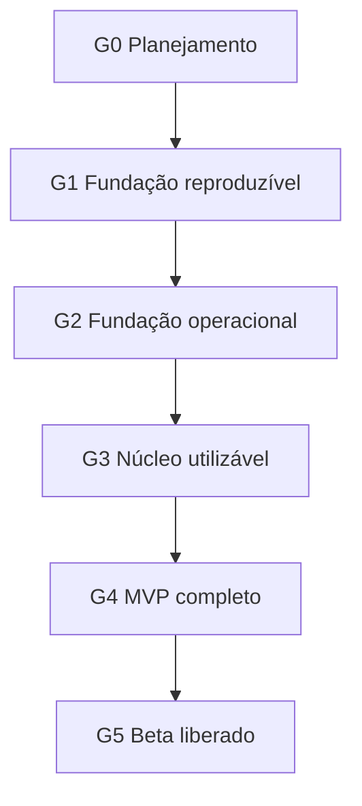

# Backlog canônico do SeekIn

> Sequência completa e rastreável para construir primeiro a fundação operacional e, somente depois, implementar o MVP do planner.

**Status:** pronto para priorização e execução  
**Versão:** 0.1  
**Data:** 12 de setembro de 2026  
**Contrato obrigatório:** [Contrato canônico](06-contrato-canonico-entrega-rastreabilidade.md)  
**Rastreabilidade reversa:** [Matriz de rastreabilidade](08-matriz-rastreabilidade.md)

---

## 1. Regra de execução

A sequência oficial é:

- itens podem ser desenvolvidos em paralelo somente quando suas dependências permitirem;
- nenhuma funcionalidade do produto entra na `main` antes de `SKN-030` aprovar o portão `G2`;
- UX, UI e provas técnicas podem avançar antes do portão, pois reduzem risco sem criar fundação paralela;
- todo item que cria ou altera uma família de telas deve aprovar antes do código sua decisão de
  composição: tarefa principal, padrão de interação, hierarquia, estados e referência responsiva; a
  conveniência de framework, biblioteca ou gerador não constitui decisão de UX;
- um item só muda para concluído conforme o [contrato canônico](06-contrato-canonico-entrega-rastreabilidade.md);
- o estado inicial dos itens deste documento é **Proposto**, exceto quando uma evidência publicada disser o contrário.

## 2. Prioridades

| Prioridade | Significado |
|---|---|
| P0 | necessário para o beta do planner |
| P1 | evolução após validar o núcleo |
| P2 | plataforma social ou monetização, dependente de PRD próprio |
| Futuro | migração ou escala ativada por gatilho mensurável |

## 3. Mapa de épicos

| Épico | Resultado | Portão |
|---|---|---|
| EP-00 — Controle de produto | decisões, UX, UI e contratos prontos | G0 |
| EP-01 — Repositório e ambiente cloud | projeto reproduzível sem Docker | G1 |
| EP-02 — Dados e backend base | banco e função protegidos e testados | G1 |
| EP-03 — Deploy e CI/CD | versão única funcionando de ponta a ponta | G2 |
| EP-04 — Autenticação e identidade | conta e sessão seguras | G3 |
| EP-05 — Onboarding | aluno chega ao primeiro plano | G3 |
| EP-06 — Rotina e capacidade | tempo real disponível representado | G3 |
| EP-07 — Disciplinas e atividades | demandas acadêmicas canônicas | G3 |
| EP-08 — Motor MRP/CRP | plano determinístico e explicável | G3 |
| EP-09 — Backend do planejamento | publicação transacional e recuperável | G3 |
| EP-10 — Execução e replanejamento | plano acompanha a realidade | G4 |
| EP-11 — Visões do plano | Hoje, Lista, Calendário e Gantt consistentes | G4 |
| EP-12 — PWA e responsividade | app instalável e seguro nos dispositivos | G4 |
| EP-13 — Qualidade operacional | segurança, observabilidade e analytics | G5 |
| EP-14 — Beta | validação com pessoas e decisão de lançamento | G5 |
| EP-20 — Evoluções P1 | integrações e conveniências pós-MVP | posterior |
| EP-30 — Plataforma social | rede, comunidades e mentoria | PRDs futuros |
| EP-40 — Cloud Run | escala incremental sem reescrita | por gatilho |

---

# G0 — Planejamento controlado

## EP-00 — Controle de produto

| ID | P | Resultado e aceite | Dependências | Fontes | Evidência mínima |
|---|---|---|---|---|---|
| SKN-001 | P0 | Resolver decisões que bloqueiam implementação: público do beta, login, atividade sem disciplina, sessão manual, confirmação de plano e analytics. Cada escolha fica explícita e aprovada. | — | PRD §24 | `DOC`: decisão e atualização do PRD |
| SKN-002 | P0 | Especificar fluxos e estados de UX de auth, onboarding, Hoje, Lista, Atividades, Calendário, Gantt e conflito. Devem existir erro, vazio, carregamento e offline aplicáveis. | SKN-001 | PRD §§7, 8 e 12; PWA §§4–6 | `DOC` + `UX`: fluxos revisados |
| SKN-003 | P0 | Definir UI mínima: tokens semânticos, tipografia, espaçamento, componentes, foco, risco, progresso e comportamento responsivo. O resultado atende WCAG 2.2 AA por projeto. | SKN-002 | Briefing §15; Engenharia §9 | `DOC` + `UX`: especificação visual |
| SKN-004 | P0 | Converter o modelo conceitual em modelo físico, contratos HTTP e convenções de datas/IDs. Todas as entidades P0 possuem ownership e invariantes. | SKN-001 | PRD §§10–11; Arquitetura §§7–10 | `DOC`: modelo, contratos e revisão de segurança |
| SKN-005 | P0 | Executar prova técnica de calendário e Gantt com dados realistas. A decisão registra licença, acessibilidade, toque, virtualização, bundle e alternativa textual. | SKN-002, SKN-003 | Arquitetura §5.1; PRD §§12.4–12.5 | `DOC` + `TEST` + `UX`; `ADR-*` |
| SKN-006 | P0 | Detalhar plano de testes do motor, banco, componentes, E2E e dispositivos. Cada caso extremo do PRD possui nível de teste e fixture sintética. | SKN-004 | PRD §§13, 18 e 20; Engenharia §8 | `DOC`: plano e matriz de casos |
| SKN-007 | P0 | Especificar eventos, propriedades permitidas, consentimento e métricas do beta sem conteúdo pessoal. | SKN-001 | PRD §§16–17; Engenharia §§11–12 | `DOC`: contrato de eventos e privacidade |

**Saída do G0:** `SKN-001` a `SKN-007` verificados. Provas técnicas podem manter a implementação final pendente, mas não podem deixar escolha estrutural sem decisão.

---

# G1 — Fundação cloud reproduzível

## EP-01 — Repositório e ambiente cloud

| ID | P | Resultado e aceite | Dependências | Fontes | Evidência mínima |
|---|---|---|---|---|---|
| SKN-010 | P0 | Criar workspace `pnpm` com `apps/web`, `packages/domain`, `packages/contracts`, `packages/planner-core`, `supabase` e `tests/e2e`. Clone limpo instala sem alteração manual. | SKN-004 | Arquitetura §6 | `CODE` + `TEST`: instalação limpa |
| SKN-011 | P0 | Fixar Node, pnpm e dependências; habilitar lockfile, TypeScript strict, formatação, lint e scripts canônicos. `pnpm validate` falha em erro real. | SKN-010 | Arquitetura §5; Engenharia §§4, 13 e 15 | `CODE` + `TEST`: versões e pipeline reproduzível |
| SKN-012 | P0 | Criar contrato de configuração por ambiente com `.env.example`, validação Zod e separação cliente/servidor. Nenhum segredo entra no bundle ou Git. | SKN-011 | Engenharia §§6 e 11; Cloud Run §6.3 | `CODE` + `TEST`: configuração válida/inválida |
| SKN-013 | P0 | Configurar Supabase CLI para projeto cloud explicitamente vinculado, sem Docker. `db push --dry-run`, migrations e pgTAP funcionam contra ambiente isolado, sem reset destrutivo do beta. | SKN-010 | Arquitetura §§7 e 13 | `CODE` + `DB`: vínculo, dry-run e testes remotos |
| SKN-014 | P0 | Criar aplicação React Router/Vite mínima com shell, rota pública e rota `/health`; build de produção executa localmente. | SKN-011, SKN-012 | Arquitetura §§3–6 | `CODE` + `TEST`: build e health web |
| SKN-015 | P0 | Implementar layout responsivo vazio, boundary de erro, carregamento e página não encontrada, sem ainda codificar funcionalidades do planner. | SKN-003, SKN-014 | PWA §§3–4 e 9; RNF-014 | `TEST` + `UX`: 360, 768, 1024 e 1280 px |
| SKN-016 | P0 | Criar dados sintéticos e comandos de seed determinísticos para desenvolvimento e E2E. Nenhum dado real é utilizado. | SKN-013, SKN-004 | Engenharia §§7 e 11.2 | `CODE` + `DB`: seed repetível |

## EP-02 — Dados e backend base

| ID | P | Resultado e aceite | Dependências | Fontes | Evidência mínima |
|---|---|---|---|---|---|
| SKN-017 | P0 | Criar migrations iniciais para perfil, preferência, disponibilidade, bloqueio, disciplina, atividade, plano, sessão, execução e alerta, com constraints e índices básicos. Banco vazio chega ao mesmo schema. | SKN-004, SKN-013 | PRD §10; Arquitetura §7.5 | `DB`: migrations, diff e lista |
| SKN-018 | P0 | Aplicar grants explícitos e RLS por operação em toda tabela exposta. Usuário A não lê nem altera dados do usuário B; `anon` só recebe o necessário. | SKN-017 | RNF-005/006; Arquitetura §§7.3–7.4 | `DB` + `TEST`: pgTAP positivo e negativo |
| SKN-019 | P0 | Gerar tipos TypeScript do banco e criar adaptadores de repositório sem importar Supabase no domínio ou nos componentes. | SKN-017, SKN-011 | Arquitetura §§4.2 e 7.2; Engenharia §6 | `CODE` + `TEST`: teste de fronteira |
| SKN-020 | P0 | Criar Edge Function `/health` com liveness público mínimo e readiness protegido, contrato Zod, versão, correlação e códigos estáveis; nenhuma resposta expõe segredo, dado de aluno ou stack trace. | SKN-012, SKN-013 | Arquitetura §§3 e 14; Engenharia §6 | `CODE` + `TEST`: chamada cloud válida, inválida e sem permissão |
| SKN-021 | P0 | Criar health check de banco usado pelo backend, sem consulta privilegiada a dados de aluno. Falha de banco retorna indisponibilidade explícita. | SKN-017, SKN-020 | Engenharia §§7 e 12 | `TEST` + `OBS`: sucesso, falha e correlação |
| SKN-022 | P0 | Validar schema com pgTAP, reset em banco limpo, Security Advisor e Performance Advisor. Bloquear grants excessivos, tabela exposta sem RLS e migration irreproduzível. | SKN-018, SKN-021 | Arquitetura §7; Engenharia §§7–8 | `DB` + `TEST`: relatório sem bloqueadores |

**Saída do G1:** web, backend e banco cloud funcionam de forma reproduzível, mas nenhuma tela funcional do produto é iniciada.

---

# G2 — Fundação operacional

## EP-03 — Deploy, ambientes e CI/CD

| ID | P | Resultado e aceite | Dependências | Fontes | Evidência mínima |
|---|---|---|---|---|---|
| SKN-023 | P0 | Configurar GitHub Actions para instalação, formato, lint, tipos, unidade e build; integrar o Supabase ao GitHub para validar e aplicar migrations. PR sem credencial de produção executa validação reproduzível e não altera o banco do beta. | SKN-011, SKN-022 | Arquitetura §13.2; Engenharia §15 | `TEST` + `DEPLOY`: workflow e integração verdes |
| SKN-024 | P0 | Confirmar ou criar o projeto Supabase do beta na organização correta, região aprovada e configurações de Auth/Data API revisadas. A vinculação é explícita e não altera outro ambiente. | SKN-001, SKN-022 | Arquitetura §§7 e 13.1 | `DEPLOY` + `DB`: project ref, migrations e advisors |
| SKN-025 | P0 | Configurar Cloudflare Workers + Static Assets e ambiente Preview com dados sintéticos ou backend isolado. Preview nunca aponta automaticamente para dados reais. | SKN-014, SKN-023 | Arquitetura §§3, 5 e 13 | `DEPLOY`: URL, SHA e health web |
| SKN-026 | P0 | Configurar ambiente Beta com variáveis separadas, HTTPS, cabeçalhos básicos e acesso ao Supabase correto. | SKN-024, SKN-025 | Arquitetura §13; Engenharia §11.1 | `DEPLOY` + `TEST`: headers, ref e health |
| SKN-027 | P0 | Executar smoke ponta a ponta da fundação: navegador → web → Edge Function → banco, com correlação única e SHA do deploy. | SKN-021, SKN-026 | Contrato §11; RNF-011 | `TEST` + `DEPLOY` + `OBS`: trace completo |
| SKN-028 | P0 | Configurar proteção de ambientes, responsáveis por promoção, inventário de segredos e limites/alertas de custo sem registrar valores secretos. | SKN-024, SKN-026 | Arquitetura §§13–15; Engenharia §11 | `DOC` + `DEPLOY`: checklist de configuração |
| SKN-029 | P0 | Testar rollback da aplicação e recuperação de falha de migration compatível. A versão anterior volta sem perda de dados. | SKN-026 | Arquitetura §13.2; Engenharia §16 | `TEST` + `DEPLOY`: ensaio de rollback |
| SKN-030 | P0 | Consolidar evidências de `G2` e aprovar formalmente a Fundação operacional. Todos os doze itens do contrato §11 precisam passar na mesma versão. | SKN-023–029 | Contrato §11 | `EV-SKN-030`: relatório do portão |

**Regra de bloqueio:** itens `SKN-040` em diante só podem entrar na `main` após `SKN-030` concluído.

## EP-03B — Marca e entrada pública

| ID | P | Resultado e aceite | Dependências | Fontes | Evidência mínima |
|---|---|---|---|---|---|
| SKN-031 | P0 | Consolidar brand guide, voz, paleta oficial, translucidez, símbolo, wordmark, mascote e regras de fixação visual sem substituir cores aprovadas. O `SKN-003` permanece coerente com a nova direção. | SKN-003 | [Brand Guide](nova-logo/ajustes-design-system.md); prancha aprovada | `DOC` + `UX`: guia e sistema visual consistentes |
| SKN-032 | P0 | Implementar landing pública responsiva em `/`, migrar tokens para a paleta aprovada e alinhar superfícies de autenticação sem alterar contratos. A página comunica tempo, plano e próximo passo sem prometer recursos futuros ou parecer um SaaS genérico. | SKN-015, SKN-031, SKN-040 | [Plano da landing](nova-logo/plano-landing-page.md); PRD §§3, 5 e 23 | `CODE` + `TEST` + `UX` + `DEPLOY`: viewports, acessibilidade, Preview/Beta e SHA |

**Intervenção aprovada:** o `SKN-032` interrompe temporariamente a sequência após o `SKN-040`. Seu
fechamento devolve a próxima ação ao `SKN-041`; não altera dependências de autenticação ou escopo do
planner.

---

# G3 — Núcleo utilizável

## EP-04 — Autenticação e identidade

| ID | P | Resultado e aceite | Dependências | Fontes | Evidência mínima |
|---|---|---|---|---|---|
| SKN-040 | P0 | Implementar conta por e-mail e senha, verificação obrigatória via Resend e mensagens sem enumeração indevida de usuários. O domínio transacional deve possuir SPF, DKIM e DMARC; rastreamento de abertura/clique fica desativado. | SKN-030, SKN-001 | RF-001; PRD §§12.1 e 24.1 | `TEST` + `UX` + `DEPLOY`: conta válida, erros e entrega autenticada |
| SKN-041 | P0 | Implementar entrada, renovação de sessão, guarda de rotas e retorno seguro à rota pretendida. Sessão inválida não acessa conteúdo protegido. | SKN-040 | RF-001; RNF-005/006 | `TEST`: E2E autenticado e não autenticado |
| SKN-042 | P0 | Implementar saída com limpeza do estado e dados privados locais. Outro usuário no mesmo dispositivo não vê o plano anterior. | SKN-041 | RF-001; PWA §11 | `TEST`: logout e troca de usuário |
| SKN-043 | P0 | Implementar recuperação de acesso com resposta segura para conta existente ou inexistente. | SKN-040 | RF-001 | `TEST` + `UX`: fluxo completo |
| SKN-044 | P0 | Criar perfil estável junto da conta e permitir nome/fuso. Falha parcial não deixa conta funcional sem estado recuperável. | SKN-040, SKN-017 | RF-002/004; Arquitetura §12.1 | `DB` + `TEST`: criação idempotente |
| SKN-045 | P0 | Provar isolamento multiusuário em Auth, Data API, Storage aplicável e funções. Teste tenta ler, inserir, alterar e excluir como outro usuário. | SKN-041, SKN-044 | RNF-005/006; Engenharia §7.2 | `TEST` + `DB`: matriz negativa |

## EP-05 — Onboarding

| ID | P | Resultado e aceite | Dependências | Fontes | Evidência mínima |
|---|---|---|---|---|---|
| SKN-050 | P0 | Implementar fluxo persistente de onboarding com progresso, voltar sem perder dados e retomada após nova sessão. | SKN-041, SKN-002 | PRD §§8.1 e 12.1 | `TEST` + `UX`: retomada e navegação |
| SKN-051 | P0 | Capturar fuso, início da semana, sessão padrão/mínima e reserva, com defaults documentados e unidades claras. | SKN-044, SKN-050 | RF-003/004 | `TEST`: valores válidos e limites |
| SKN-052 | P0 | Capturar janelas semanais de disponibilidade com validação e feedback de sobreposição. | SKN-051, SKN-060 | RF-010–012 | `TEST` + `UX`: semana válida e inválida |
| SKN-053 | P0 | Capturar compromissos recorrentes opcionais sem confundi-los com disponibilidade; academia 10h–11h bloqueia alocação nos dias escolhidos. | SKN-052, SKN-061 | RF-013 | `TEST`: recorrência e bloqueio |
| SKN-054 | P0 | Criar primeira disciplina no onboarding ou aceitar atividade sem disciplina conforme `SKN-001`. | SKN-053, SKN-070 | RF-020/021 | `TEST`: caminho aprovado |
| SKN-055 | P0 | Criar primeira atividade com prazo e esforço usando o mesmo comando canônico da criação posterior. | SKN-054, SKN-071 | RF-030–034 | `TEST`: atividade canônica |
| SKN-056 | P0 | Gerar prévia, mostrar conflito quando necessário e confirmar o primeiro plano antes de publicar. | SKN-055, SKN-096 | RF-059; CA-001/004 | `TEST`: viável e inviável |
| SKN-057 | P0 | Validar conclusão do onboarding em até cinco minutos com dados sintéticos e teste moderado; os pontos de instrumentação seguem o contrato de eventos, sem depender ainda da ferramenta de analytics. | SKN-050–056, SKN-007 | PRD §§12.1, 16 e 17 | `TEST` + `USER`: roteiro e achados |

## EP-06 — Rotina e capacidade

| ID | P | Resultado e aceite | Dependências | Fontes | Evidência mínima |
|---|---|---|---|---|---|
| SKN-060 | P0 | Implementar CRUD de janelas semanais, rejeitar intervalo inválido e consolidar sobreposições de modo determinístico. | SKN-030, SKN-017 | RF-010–012 | `TEST` + `DB`: unidade e integração |
| SKN-061 | P0 | Implementar compromissos recorrentes, bloqueios excepcionais e indisponibilidade por data, preservando fuso IANA. | SKN-060 | RF-013/014; PRD caso extremo | `TEST`: recorrência, exceção e DST |
| SKN-062 | P0 | Após mudar disponibilidade ou bloqueio, calcular impacto e solicitar replanejamento sem alterar o plano vigente automaticamente. | SKN-061, SKN-093 | RF-015 | `TEST`: plano permanece até aceite |
| SKN-063 | P0 | Exibir capacidade bruta, operacional, líquida, carga e saldo por dia/semana a partir de uma única consulta. | SKN-081, SKN-097 | RF-040–045 | `TEST` + `UX`: cálculos reconciliados |

## EP-07 — Disciplinas e atividades

| ID | P | Resultado e aceite | Dependências | Fontes | Evidência mínima |
|---|---|---|---|---|---|
| SKN-070 | P0 | Implementar criar, editar e arquivar disciplina; arquivamento não exclui atividade e cor mantém contraste. | SKN-030, SKN-003 | RF-020–023 | `TEST` + `DB` + `UX` |
| SKN-071 | P0 | Implementar comando canônico de criar/editar/concluir/cancelar/arquivar atividade com título, prazo e esforço. | SKN-030, SKN-017 | RF-030/031/035 | `TEST` + `DB`: estados permitidos |
| SKN-072 | P0 | Tratar prazo com/sem hora e fuso; ausência de hora resulta em 23:59 local sem deslocamento indevido. | SKN-071 | RF-004/033/034 | `TEST`: fusos e mudança de data |
| SKN-073 | P0 | Calcular esforço restante/progresso em minutos, rejeitar negativo e sinalizar realizado acima do estimado. | SKN-071 | RF-032/036/037 | `TEST`: limites e propriedade |
| SKN-074 | P0 | Permitir notas em texto/Markdown seguro e links validados, sem executar HTML ou URL perigosa. | SKN-071 | RF-110/111 | `TEST` + `SEC`: sanitização |
| SKN-075 | P0 | Implementar lista e formulário de Atividades, com busca, filtros, risco/prazo e comportamento responsivo. | SKN-070–074, SKN-003 | PRD §12.6; RF-138 | `TEST` + `UX`: dispositivos e estados |
| SKN-076 | P0 | Criar pipeline `origem → rascunho → revisão → atividade canônica`. Entrada manual usa exatamente a mesma validação e comando reservado a futuras importações. | SKN-071 | Arquitetura §8 | `TEST`: duas origens, mesma saída |
| SKN-077 | P0 | Mudança de prazo, esforço ou status calcula impacto e não publica novo plano antes da confirmação exigida. | SKN-071, SKN-093 | RF-038 | `TEST`: vigente preservado |

## EP-08 — Motor MRP/CRP

| ID | P | Resultado e aceite | Dependências | Fontes | Evidência mínima |
|---|---|---|---|---|---|
| SKN-080 | P0 | Versionar schemas Zod de entrada/saída do `planner-core`, assinatura do plano e versão das regras, sem SDK de nuvem. | SKN-004, SKN-011 | Arquitetura §9.1; Cloud Run §7 | `CODE` + `TEST`: contratos válidos/inválidos |
| SKN-081 | P0 | Calcular capacidade bruta, operacional e líquida, descontando bloqueios, sessões protegidas e reserva. | SKN-080 | RF-040–045; CA-002/003 | `TEST`: exemplos e propriedades |
| SKN-082 | P0 | Calcular horizontes, folga, taxa de carga, déficit e níveis de risco. | SKN-081 | RF-058/063/064; PRD §11.2–11.3 | `TEST`: zero, limite e inviável |
| SKN-083 | P0 | Ordenar atividades pela regra determinística v1 e produzir fatores de explicação coerentes. | SKN-082 | RF-057/060–062; CA-005 | `TEST`: desempates e explicação |
| SKN-084 | P0 | Dividir esforço em sessões, redistribuir sobras e impedir duração zero ou bloco inválido. | SKN-080 | RF-052/053; PRD §11.5 | `TEST`: tabela de partições |
| SKN-085 | P0 | Alocar sessões antes do prazo, sem sobreposição, respeitando limite diário, folga e distribuição entre dias. | SKN-081, SKN-083, SKN-084 | RF-050/051/054/055 | `TEST`: invariantes e fast-check |
| SKN-086 | P0 | Retornar plano parcial e diagnóstico quando demanda exceder capacidade; nunca rotular inviável como garantido. | SKN-082, SKN-085 | RF-058; CA-004 | `TEST`: déficit e primeiro prazo |
| SKN-087 | P0 | Produzir proposta de replanejamento que preserve concluídas, em andamento, fixadas e manuais na ordem canônica. | SKN-085 | RF-104–108; PRD §11.8 | `TEST`: todas as proteções |
| SKN-088 | P0 | Cobrir os casos extremos obrigatórios, determinismo, fusos e invariantes com Vitest e fast-check. | SKN-081–087, SKN-006 | RNF-003; PRD §18 | `TEST`: suíte nomeada por caso |
| SKN-089 | P0 | Medir até 200 atividades/90 dias e manter p95 abaixo de 3 s no ambiente de referência, registrando dataset e versão. | SKN-085, SKN-088 | RNF-001 | `TEST`: benchmark reproduzível |

## EP-09 — Backend do planejamento

| ID | P | Resultado e aceite | Dependências | Fontes | Evidência mínima |
|---|---|---|---|---|---|
| SKN-090 | P0 | Implementar Edge Function de geração autenticada que carrega entradas do proprietário, chama `planner-core` e valida a saída. | SKN-045, SKN-080–089 | Arquitetura §9.2 | `TEST`: integração e autorização |
| SKN-091 | P0 | Publicar plano, sessões, conflitos e auditoria atomicamente; cada versão é imutável e sequencial. | SKN-090, SKN-017 | RF-056; RNF-004/007 | `DB` + `TEST`: commit/rollback transacional |
| SKN-092 | P0 | Tornar a geração idempotente e segura contra duas abas, retry e resultado atrasado. | SKN-091 | RNF-003/004; Engenharia §6 | `TEST`: concorrência e mesma chave |
| SKN-093 | P0 | Criar caso de uso de análise de impacto sem publicar plano e produzir diff de criadas, mantidas, movidas e removidas. | SKN-087, SKN-091 | RF-015/038/106 | `TEST`: proposta sem mutação vigente |
| SKN-094 | P0 | Falha, timeout ou saída inválida preserva o último plano publicado e retorna erro correlacionável. | SKN-091 | RNF-011/012 | `TEST` + `OBS`: falha injetada |
| SKN-095 | P0 | Criar leitura canônica da versão vigente para Hoje, Lista, Calendário e Gantt, com horários, estados, progresso e risco iguais. | SKN-091 | CA-009; RF-044 | `TEST`: projeções reconciliadas |
| SKN-096 | P0 | Implementar confirmação da primeira geração e publicar somente após aceite; cancelamento mantém estado anterior. | SKN-091, SKN-093 | RF-059/107/108 | `TEST`: aceitar e cancelar |
| SKN-097 | P0 | Expor consultas de capacidade, atividade, sessão e alertas com paginação/índices adequados e RLS verificada. | SKN-018, SKN-081, SKN-095 | Engenharia §7.3 | `DB` + `TEST`: plano de consulta e autorização |

**Saída do G3:** `CA-001` a `CA-004` passam em uma jornada real; os fatores de `CA-005` estão provados no motor; conta, onboarding, rotina, atividade e primeiro plano funcionam de ponta a ponta.

---

# G4 — MVP completo

## EP-10 — Execução e replanejamento

| ID | P | Resultado e aceite | Dependências | Fontes | Evidência mínima |
|---|---|---|---|---|---|
| SKN-100 | P0 | Iniciar sessão e registrar início real sem criar duas execuções concorrentes. | SKN-095 | RF-100 | `TEST`: retry e duas abas |
| SKN-101 | P0 | Concluir sessão com tempo realizado e atualizar esforço, progresso e risco atomicamente. | SKN-100 | RF-101/102; CA-006 | `TEST` + `DB`: atualização reconciliada |
| SKN-102 | P0 | Marcar sessão como não realizada e oferecer replanejamento sem linguagem punitiva. | SKN-100 | RF-103 | `TEST` + `UX`: estados e conteúdo |
| SKN-103 | P0 | Fixar/desafixar sessão e criar ou mover sessão manual quando aprovado em `SKN-001`; capacidade é consumida antes da automática. | SKN-095 | RF-043/104 | `TEST`: proteção e conflito |
| SKN-104 | P0 | Mostrar diff de replanejamento, aceitar atomicamente ou cancelar mantendo o plano anterior. | SKN-093, SKN-102/103 | RF-105–108; CA-007/008 | `TEST` + `UX`: três resultados |
| SKN-105 | P0 | Implementar resolução de conflito com déficit, prazo, atividades e ações: disponibilidade, esforço, prazo, prioridade ou plano parcial. | SKN-086, SKN-104 | PRD §12.7; CA-004 | `TEST` + `UX`: diagnóstico verificável |
| SKN-106 | P0 | Criar alertas internos com causa, impacto, ação e deduplicação por contexto. | SKN-082, SKN-095 | RF-120–122 | `TEST`: repetição e mudança de contexto |

## EP-11 — Visões do plano

| ID | P | Resultado e aceite | Dependências | Fontes | Evidência mínima |
|---|---|---|---|---|---|
| SKN-110 | P0 | Implementar Hoje com recomendação principal, motivo, ação, demais sessões, entregas e saldo; cobrir todos os estados vazios. | SKN-095, SKN-100, SKN-106 | RF-062/070–076 | `TEST` + `UX`: celular e desktop |
| SKN-111 | P0 | Implementar Lista agrupada em Atrasadas, Hoje, Amanhã, Próximos 7 dias, Depois e Não planejadas, com ações exigidas. | SKN-095, SKN-100–104 | RF-077–079; CAT-003/004 | `TEST` + `UX`: agrupamentos e ações |
| SKN-112 | P0 | Implementar Calendário mês/semana e agenda móvel; distinguir sessão, prazo e bloqueio e impedir movimento inválido. | SKN-005, SKN-095, SKN-103 | RF-090–095 | `TEST` + `UX`: toque, teclado e mouse |
| SKN-113 | P0 | Implementar Gantt desktop simplificado com atividade, linha do tempo, hoje, prazo, progresso, risco, filtros e detalhes. Não exibir no celular. | SKN-005, SKN-095 | RF-080–084/087 | `TEST` + `UX`: desktop e ausência móvel |
| SKN-114 | P0 | Garantir que Hoje, Lista, Calendário e Gantt atualizem a partir da mesma versão e não exibam mistura após replanejamento. | SKN-110–113 | CA-009; CAT-005 | `TEST`: E2E de equivalência |
| SKN-115 | P0 | Finalizar navegação responsiva: inferior compacta, lateral expandida e rotas profundas preservadas. | SKN-015, SKN-110–113 | PRD §7; RF-138 | `TEST` + `UX`: matriz de viewport |

## EP-12 — PWA e responsividade

| ID | P | Resultado e aceite | Dependências | Fontes | Evidência mínima |
|---|---|---|---|---|---|
| SKN-120 | P0 | Criar manifest, `id`, escopo, cores e ícones 192/512 maskable; instalação abre em `standalone` sem bloquear uso web. | SKN-026, SKN-003 | RF-130–132; RT-PWA-001–008 | `TEST` + `UX`: instalação suportada |
| SKN-121 | P0 | Implementar service worker `injectManifest`, cache de shell e atualização segura que não interrompe formulário ou sessão. | SKN-120 | RF-133/136; CAT-007 | `TEST`: atualização em uso |
| SKN-122 | P0 | Persistir seletivamente último plano no IndexedDB por usuário/versão; offline é leitura identificada e mutação nunca simula sucesso. Logout limpa dados privados. | SKN-042, SKN-095, SKN-121 | RF-134/135; CAT-006 | `TEST`: offline, retorno e troca de usuário |
| SKN-123 | P0 | Validar classes compacta, intermediária e expandida, sem rolagem horizontal P0 e sem dependência exclusiva de hover/drag. | SKN-115 | RF-137–139; RNF-014/015; CAT-008 | `TEST` + `UX`: matriz de dispositivos |
| SKN-124 | P0 | Realizar auditoria WCAG 2.2 AA, teclado e leitor de tela; Gantt/gráficos possuem alternativa textual e risco não depende de cor. | SKN-110–123 | RNF-008; Engenharia §9 | `TEST` + `UX`: automatizado e manual |
| SKN-125 | P0 | Definir budgets do build real e atingir metas de LCP, INP e CLS p75; carregar Gantt/Calendário sob demanda. | SKN-110–123 | RNF-002/016; PWA §8 | `TEST` + `OBS`: Lighthouse/campo aplicável |
| SKN-126 | P0 | Executar E2E crítico em Chromium, Firefox e WebKit, incluindo celular e tablet onde o comportamento muda. | SKN-110–125 | RNF-009; PWA §12 | `TEST`: matriz publicada |

**Saída do G4:** `CA-006` a `CA-012` e `CAT-001` a `CAT-008` passam; o MVP funcional está completo, ainda sem liberação externa.

---

# G5 — Beta liberado

## EP-13 — Qualidade operacional

| ID | P | Resultado e aceite | Dependências | Fontes | Evidência mínima |
|---|---|---|---|---|---|
| SKN-130 | P0 | Implementar eventos analíticos aprovados, sem títulos, notas ou dados pessoais; validar propriedades e duplicidade. | SKN-007, SKN-110–114 | PRD §16 | `TEST` + `OBS`: evento por jornada |
| SKN-131 | P0 | Implementar logs JSON, códigos de erro, correlação, versão de app/schema/algoritmo e métricas do motor. | SKN-094, SKN-027 | RNF-011; Engenharia §12 | `TEST` + `OBS`: falha rastreável |
| SKN-132 | P0 | Revisar CSP, headers, CSRF aplicável, rate limits, dependências, RLS, chaves e superfícies de abuso. Nenhum bloqueador alto permanece aberto. | SKN-126, SKN-045 | RNF-005/006; Engenharia §11 | `TEST` + `SEC` + `DB`: relatório |
| SKN-133 | P0 | Definir recuperação, retenção, exportação operacional e resposta a incidente compatíveis com o plano contratado. Falha do motor preserva plano. | SKN-029, SKN-094 | RNF-012; Arquitetura §15 | `DOC` + `TEST`: exercício de recuperação |
| SKN-134 | P0 | Preparar termos, privacidade, consentimentos, canal de suporte e procedimento de exclusão manual seguro para o beta. | SKN-001, SKN-132 | PRD §21; Engenharia §11.2 | `DOC` + `USER`: revisão aprovada |
| SKN-135 | P0 | Validar requisitos não funcionais e os doze critérios `CA-*` em uma release candidate única. | SKN-126, SKN-130–134 | PRD §§13, 14 e 20 | `TEST`: relatório RC e SHA |

## EP-14 — Beta

| ID | P | Resultado e aceite | Dependências | Fontes | Evidência mínima |
|---|---|---|---|---|---|
| SKN-140 | P0 | Executar teste moderado da jornada com pelo menos cinco estudantes, cobrindo celular, tablet e desktop, sem usar dados reais nos registros. | SKN-135 | PRD §20 | `USER`: roteiro, achados e severidade |
| SKN-141 | P0 | Corrigir bloqueadores de ativação, segurança, perda de dados e acessibilidade encontrados no piloto; reexecutar evidências afetadas. | SKN-140 | Contrato §14 | `CODE` + evidências revalidadas |
| SKN-142 | P0 | Configurar monitoramento do beta, limites de custo, rotina de suporte e verificação de disponibilidade dos planos gratuitos. | SKN-131, SKN-141 | Arquitetura §§14–15 | `OBS` + `DOC`: alertas testados |
| SKN-143 | P0 | Aprovar `G5`, publicar release identificada e registrar decisão de liberar ou não o beta de 1 a 5 usuários. | SKN-141, SKN-142 | PRD §20; Contrato §10 | `EV-SKN-143`: release, decisão e rollback |

---

# Evoluções posteriores

Estes itens preservam a visão de longo prazo, mas não podem competir com o P0. Antes de entrar em desenvolvimento, devem ser decompostos com o mesmo contrato canônico.

## EP-20 — P1 do planner e integrações

| ID | P | Resultado | Gatilho/dependências | Fontes |
|---|---|---|---|---|
| SKN-200 | P1 | Exportação e exclusão autônoma de conta/dados. | beta e política de retenção | RF-005 |
| SKN-201 | P1 | Copiar disponibilidade de semana anterior. | uso recorrente validado | RF-016 |
| SKN-202 | P1 | Duplicar atividade e preferências por período/disciplina. | dados de uso e UX | RF-039/065 |
| SKN-203 | P1 | Dependências entre atividades no domínio e planner. | PRD específico e motor estável | Briefing §10; fora do P0 |
| SKN-204 | P1 | Sessões expandidas e movimento no Gantt; Gantt opcional em tablet paisagem após teste. | SKN-005 e teste de usabilidade | RF-085/086/088 |
| SKN-205 | P1 | Anexos e materiais por sessão com Storage/RLS. | política de arquivos | RF-112/113 |
| SKN-206 | P1 | Notificações externas configuráveis. | consentimento e canal definidos | RF-123 |
| SKN-210 | P1 | Extensão/importador cria rascunho, exige revisão e converge no comando canônico sem planejar automaticamente. | SKN-076; PRD próprio | Arquitetura §8 |
| SKN-211 | P1 | Integração bidirecional com Google Calendar, tokens privados, OAuth mínimo, idempotência e conflitos. | ADR e revisão arquitetural | Arquitetura §17; Engenharia §11.3 |
| SKN-212 | P1 | Edição offline com outbox e resolução explícita de conflitos. | especificação própria | PWA §7.4; Arquitetura §17 |

## EP-30 — Plataforma social e mentorias

| ID | P | Resultado | Dependência | Fonte |
|---|---|---|---|---|
| SKN-300 | P2 | Criar PRD e modelo de autorização do perfil social e conexões. | validação do planner | Briefing §16 |
| SKN-310 | P2 | Criar PRD de feed, conteúdo, moderação, paginação e métricas de utilidade. | SKN-300 | Briefing §§17 e 20 |
| SKN-320 | P2 | Criar PRD de servidor → canal → sala, papéis e governança. | SKN-300 | Briefing §§18–20 |
| SKN-330 | P2 | Criar PRD de mentorias, agenda, pagamentos, disputa e confiança. | comunidade validada | Briefing §§21–23 |

## EP-40 — Evolução para Cloud Run

| ID | P | Resultado | Gatilho/dependências | Evidência esperada |
|---|---|---|---|---|
| SKN-400 | Futuro | Medir gatilhos e aprovar ADR para iniciar migração do motor. | limites de Edge Function, custo ou algoritmo | métricas + `ADR-*` |
| SKN-401 | Futuro | Empacotar o mesmo contrato do planner em container sem estado e executar teste local. | SKN-400; motor estável | `TEST` + imagem fixada |
| SKN-402 | Futuro | Provisionar Cloud Run privado com IAM, região medida, min instances 0 e limite de custo. | SKN-401 | `DEPLOY` + segurança |
| SKN-403 | Futuro | Executar shadow mode e comparar resultado, duração e custo sem publicar resposta nova. | SKN-402 | `TEST` + `OBS` |
| SKN-404 | Futuro | Liberar por canário, manter rollback para Edge Function e consolidar o motor no Cloud Run. | equivalência comprovada | `DEPLOY` + `OBS` + rollback |
| SKN-405 | Futuro | Avaliar migração opcional do servidor React Router, mantendo Supabase como dados/Auth. | benefício mensurável separado | ADR e análise de custo |

---

## 4. Caminho crítico inicial

O primeiro ciclo deve seguir esta ordem:

1. `SKN-001` — resolver decisões bloqueadoras;
2. `SKN-002` a `SKN-007` — fechar especificações e provas;
3. `SKN-010` a `SKN-022` — fazer web, backend e banco cloud funcionarem de forma reproduzível;
4. `SKN-023` a `SKN-030` — provar CI, preview, beta e smoke ponta a ponta;
5. somente então iniciar `SKN-040` — autenticação.

## 5. Política de refinamento

- um item grande pode gerar subtarefas, mas o ID pai continua responsável pelo resultado;
- subtarefas usam `SKN-NNN.A`, `.B`, `.C` apenas dentro da issue ou ferramenta de execução;
- nenhuma subtarefa pode encerrar o pai sem todas as evidências previstas;
- descoberta que alterar comportamento atualiza primeiro o documento fonte;
- débito técnico recebe ID novo e vínculo ao item que o originou;
- bugs usam o ID da entrega afetada mais um registro próprio na ferramenta, sem alterar a evidência histórica.

## 6. Próxima ação operacional

Com o `SKN-053` verificado em Preview/Beta, a próxima ação é o `SKN-054`: criar a primeira disciplina
no onboarding ou seguir sem disciplina conforme a decisão registrada no `SKN-001`.

---

Este backlog é canônico. GitHub Issues, quadros ou outras ferramentas são projeções dele e não podem alterar escopo, ordem ou aceite sem atualizar este documento e a matriz no mesmo pull request.
