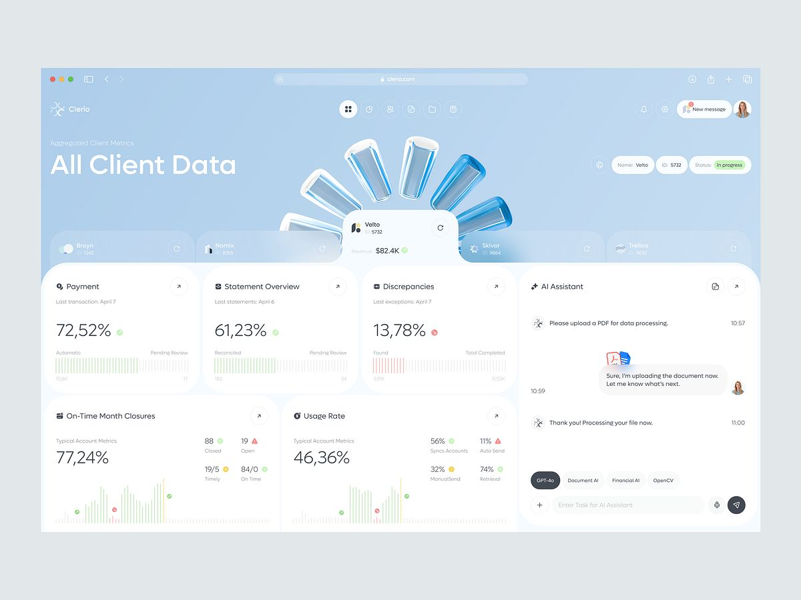

# SKN-003 — Sistema Visual, UI, Acessibilidade e Responsividade do SeekIn

- **Item:** SKN-003
- **Status:** direção aprovada; migração de código pendente no `SKN-032`
- **Tipo:** Contrato canônico de UI
- **Produto:** SeekIn
- **Versão:** 1.3
- **Aprovação de direção:** Product Owner
- **Fontes:** [Brand Guide SeekIn 1.1](nova-logo/ajustes-design-system.md) e prancha aprovados pelo
  Product Owner em 2026-09-13; SKN-002; PRD §§7, 12 e 15; requisitos PWA §§3–6 e 9

---

## 1. Objetivo

Este documento define o sistema visual mínimo do SeekIn e deve ser tratado como **fonte canônica para implementação da interface**.

Ele estabelece:

- direção visual aprovada;
- personalidade da interface;
- paleta e tokens;
- tipografia;
- espaçamento;
- bordas, radius e elevação;
- regras para cards, listas, painéis e tabelas;
- navegação desktop e mobile;
- componentes mínimos;
- estados interativos;
- comportamento responsivo;
- acessibilidade;
- movimento;
- linguagem de interface;
- uso da biblioteca própria de ícones SVG;
- critérios de aceite para implementação.

O objetivo é evitar que telas futuras sejam construídas de forma isolada, genérica ou inconsistentes entre si.

---

## 2. Direção visual aprovada

A linguagem visual aprovada para o SeekIn é:

> **Minimalismo editorial + ferramenta de produtividade de alta precisão**

O conceito interno do sistema visual é:

> **Focused Workspace**

O SeekIn não deve se comportar visualmente como um dashboard composto por dezenas de cards.

A estrutura principal deve seguir:

**Canvas → Contexto → Conteúdo → Ação**

e não:

**Dashboard → Card → Card → Card → Card**

A interface deve parecer:

- inteligente;
- extremamente focada;
- comunicativa;
- séria e parceira;
- profissional;
- calma;
- precisa;
- moderna sem seguir modismos visuais.

A interface não deve parecer:

- um template genérico de SaaS;
- um produto "feito por IA";
- uma coleção de cards coloridos;
- um aplicativo infantil de estudos;
- uma interface carregada de gradientes, glows ou elementos decorativos.

---

## 3. Personalidade da interface

Se o SeekIn fosse uma pessoa, seria:

### Inteligente

Na UI isso significa:

- hierarquia clara;
- informação contextual;
- prioridade visível;
- decisões baseadas em dados;
- antecipação do que merece atenção;
- sugestões integradas ao contexto;
- pouca necessidade de o usuário interpretar a interface.

### Extremamente focada

Na UI isso significa:

- poucas cores;
- baixo ruído visual;
- uma ação principal clara por contexto;
- grandes áreas de respiro;
- conteúdo antes da ornamentação;
- elementos secundários discretos.

### Comunicativa

Na UI isso significa:

- estados compreensíveis;
- microtextos objetivos;
- explicações curtas quando uma decisão do sistema afetar o planejamento;
- erros que expliquem causa e correção;
- feedback de ações sem excesso de mensagens motivacionais.

---

## 4. Regra principal de identidade

A personalidade do SeekIn **não deve depender de ilustrações, gradientes ou efeitos especiais** na
interface operacional.

A identidade deve vir de:

- composição;
- tipografia;
- ritmo;
- espaçamento;
- uso controlado de cor;
- iconografia própria;
- maneira de organizar informação;
- maneira de comunicar decisões do sistema.

Landing e autenticação podem empregar o gradiente oficial, curvas translúcidas e o mascote nos papéis
definidos pelo Brand Guide. Essa exceção institucional não autoriza levar decoração para tabelas,
listas, navegação ou estados rotineiros do produto.

---

## 5. Paleta oficial

A direção aprovada usa exclusivamente a família azul + branco da prancha de marca. Seus seis valores
são imutáveis: `#5B9DE6`, `#8EC5F5`, `#CFE6FF`, `#EAF4FF`, `#F7FBFF` e `#13233F`.
`#FFFFFF` permanece disponível como superfície neutra.

O SeekIn deve parecer:

- leve;
- calmo;
- preciso;
- limpo;
- editorial;
- sofisticado;
- consistentemente azul sem parecer um “dashboard azul”.

A cor principal não deve disputar com o conteúdo. Ela deve aparecer em **camadas**, com intensidade
crescente conforme a importância da ação.

### Leitura da referência visual aprovada

A imagem fornecida pelo Product Owner é referência canônica para **cor, equilíbrio de superfícies e
hierarquia**, não um layout a ser copiado literalmente. Dela, o SeekIn adota:

- canvas frio quase branco e superfícies principais brancas;
- azul-gelo em grandes regiões contextuais, especialmente no Focus Field;
- grafite azulado para títulos, números e estrutura;
- azul primário concentrado na marca, no CTA e no destino ativo;
- navegação selecionada por fundo azul muito claro, ícone azul e uma linha lateral fina;
- conteúdo organizado prioritariamente em linhas, divisores e whitespace;
- cores semânticas restritas a pequenos indicadores, badges e segmentos de progresso;
- painéis contextuais delimitados por borda suave, sem sombra decorativa;
- ilustração abstrata monocromática apenas quando integrar o contexto e permanecer em segundo plano;
- translucidez e transições tonais orientadas pela wordmark da prancha, sempre derivadas das cores
  oficiais.

A referência não autoriza preencher telas com cards, reconstruir funcionalidades ainda inexistentes ou
transformar os azuis em grandes preenchimentos chapados.

### 5.1. Core tokens

| Token | Valor | Uso |
|---|---:|---|
| `--seek-canvas` | `#F7FBFF` | fundo geral da aplicação |
| `--seek-surface` | `#FFFFFF` | superfícies principais |
| `--seek-veil` | `#EAF4FF` | véus, seleção e grandes áreas contextuais |
| `--seek-soft` | `#CFE6FF` | superfícies contextuais mais presentes |
| `--seek-sky` | `#8EC5F5` | transições e apoio visual |
| `--seek-primary` | `#5B9DE6` | símbolo, marca e destaques interativos |
| `--seek-ink` | `#13233F` | texto principal e ações fortes |
| `--seek-text-secondary` | `rgb(19 35 63 / 72%)` | texto secundário derivado do ink |
| `--seek-border` | `rgb(19 35 63 / 8%)` | divisores e contornos derivados do ink |

Camadas translúcidas permitidas derivam somente desses valores:

```css
--seek-primary-a08: rgb(91 157 230 / 8%);
--seek-primary-a16: rgb(91 157 230 / 16%);
--seek-primary-a28: rgb(91 157 230 / 28%);
--seek-sky-a24: rgb(142 197 245 / 24%);
--seek-soft-a56: rgb(207 230 255 / 56%);
--seek-ink-a08: rgb(19 35 63 / 8%);
```

A wordmark e a prancha orientam a proporção entre transparência, branco e cor. Esses tokens não
autorizam novos hexadecimais nem grandes preenchimentos uniformes.

O token removido `--seek-connect` não possui substituto. Recursos sociais pertencem à mesma família
azul da plataforma e não terão uma segunda cor estrutural de marca.

### 5.2. Aliases semânticos

Aliases evitam que componentes dependam de papéis cromáticos incorretos:

```css
--seek-blue: var(--seek-primary);
--seek-link: var(--seek-ink);
--seek-interactive: var(--seek-primary);
--seek-focus-ring: var(--seek-primary);
--seek-selected-bg: var(--seek-veil);
```

`--seek-link` usa `--seek-ink`, sublinhado e estado de foco porque `--seek-primary` mede `2,83:1`
sobre branco e não atende texto comum. O azul primário permanece correto para marca e elementos
gráficos, sem ser forçado a um papel que viola contraste.

### 5.3. Regra de uso

A maior parte da UI deve permanecer em:

**branco + azuis-gelo + grafite azulado**

A distribuição visual desejada é aproximadamente:

- `80–85%` branco e `--seek-canvas`;
- `10–15%` `--seek-veil` e `--seek-soft`;
- `2–4%` `--seek-sky` e `--seek-primary`;
- `1–2%` cores semânticas.

Esses percentuais são uma diretriz de direção visual, não uma fórmula rígida de implementação.

O SeekIn deve parecer predominantemente claro e silencioso. O azul mais forte deve aparecer apenas
quando houver:

- ação principal;
- seleção;
- ação relevante;
- ponto de foco;
- dado importante em gráfico;
- destaque de navegação.

### 5.4. Semântica da família azul

#### `--seek-ink`

É o “preto” do SeekIn, porém levemente azul. Deve ser usado em:

- títulos;
- números;
- labels importantes;
- navegação;
- ícones estruturais.

#### `--seek-primary`

É o azul principal da marca. Usar em:

- símbolo e lockups oficiais;
- fundo de ação com texto em `--seek-ink`;
- ícones ativos e indicadores gráficos;
- foco visível com espessura e afastamento adequados.

Não usar como texto normal sobre branco e não preencher grandes regiões com esse tom chapado.

#### `--seek-sky`

Usar em transições, apoio visual, gráficos e partes claras do gesto institucional. O texto sobre esse
tom usa `--seek-ink`.

#### `--seek-soft` e `--seek-veil`

Usar em:

- Focus Field;
- fundos contextuais;
- seleção discreta;
- painéis informativos suaves;
- camadas translúcidas e superfícies de apoio.

Esses tons nunca devem competir com o conteúdo principal. Sua função é produzir a luminosidade da
prancha, não colorir cada componente.

### 5.5. Aplicação prática nos componentes

#### Botão primário

```css
background: var(--seek-primary);
color: var(--seek-ink);
```

Hover e pressed reforçam contorno, elevação funcional ou deslocamento sem inventar outro azul:

```css
box-shadow: inset 0 0 0 2px rgb(19 35 63 / 16%);
```

Um CTA de contraste máximo pode inverter para fundo `--seek-ink` e texto branco.

#### Botão secundário

Preferir superfície branca com borda azul leve e texto com contraste AA:

```css
background: var(--seek-surface);
color: var(--seek-ink);
border: 1px solid var(--seek-border);
```

#### Navegação selecionada

```css
background: var(--seek-veil);
color: var(--seek-ink);
border-inline-start: 2px solid var(--seek-primary);
```

#### Focus Field

Usar `--seek-veil` ou `--seek-soft`. Quando necessária, a ilustração abstrata deve ser muito clara,
derivada da paleta e subordinada ao conteúdo. O gradiente oficial fica restrito ao gesto de marca.

#### Gráficos

- track quase invisível;
- valor principal em azul;
- pontos semânticos muito leves;
- número principal em `--seek-ink`;
- labels que tornem a leitura independente de cor.

### 5.6. Social e comunidade

A evolução para recursos sociais **não exige uma segunda cor de marca**. Comunidades, perfis, feed e
colaboração continuam pertencendo à família azul + branco.

A diferenciação social deve vir principalmente de:

- conteúdo;
- estrutura;
- iconografia;
- semântica textual;
- pequenos indicadores de status quando necessários.

Presença online, disponibilidade ou atividade coletiva pode usar cor semântica suave, nunca uma nova
cor estrutural de marca.

### 5.7. Regra de sofisticação

Se um componente puder ser resolvido com:

- branco;
- azul muito claro;
- grafite azulado;
- um único ponto de azul principal;

essa deve ser a escolha preferida.

> **Quanto mais importante a ação, mais claro deve ser seu contraste; quanto mais contextual a
> informação, mais próxima do branco deve permanecer.**

### 5.8. Contraste verificado

As combinações abaixo foram medidas segundo contraste relativo WCAG:

| Combinação | Razão | Uso permitido |
|---|---:|---|
| `--seek-ink` sobre branco | `15,67:1` | qualquer texto |
| `--seek-ink` sobre `--seek-canvas` | `15,07:1` | qualquer texto |
| `--seek-ink` sobre `--seek-primary` | `5,53:1` | texto normal e botão |
| `--seek-ink` sobre `--seek-sky` | `8,55:1` | texto normal e botão |
| `--seek-primary` sobre branco | `2,83:1` | não usar em texto normal |
| branco sobre `--seek-primary` | `2,83:1` | não usar em texto normal |

Sobre `--seek-veil`, `--seek-soft`, `--seek-sky` e `--seek-primary`, textos comuns usam
`--seek-ink`. Transparências e `--seek-text-secondary` devem ser medidos sobre o fundo composto final.

---

## 6. Cores semânticas

As referências visuais aprovadas utilizam `success`, `warning`, `danger` e `info` como **cores de sinalização silenciosa**.

A intenção é que essas cores sejam percebidas rapidamente, mas **nunca tomem conta da interface**.

> **Semantic colors are whisper colors, not brand colors.**

Elas comunicam estado. Não constroem a identidade principal da tela.

### 6.1. Princípio de intensidade

O SeekIn deve trabalhar com cores semânticas:

- suaves;
- pouco saturadas;
- levemente acinzentadas;
- aplicadas em áreas pequenas;
- cercadas predominantemente por branco, gelo e grafite.

Evitar verdes, vermelhos e amarelos digitais ou saturados.

Não utilizar como padrão:

```css
#00FF00
#FF0000
#FFD600
```

A presença visual dessas cores deve ser semelhante às referências aprovadas: pequenos pontos, ícones, barras, segmentos de gráfico, labels e badges suaves.

### 6.2. Tokens semânticos

Cada estado deve possuir níveis separados para texto, indicador e superfície.

```css
/* SUCCESS */
--success-fg: #3E7A57;
--success-indicator: #A8D8B1;
--success-bg: #EEF7F0;
--success-border: #DCEDE1;

/* WARNING / ATTENTION */
--warning-fg: #8A681A;
--warning-indicator: #E6D27A;
--warning-bg: #FBF6E8;
--warning-border: #F0E5C5;

/* DANGER / ERROR */
--danger-fg: #A85858;
--danger-indicator: #E8A3A3;
--danger-bg: #FCF1F1;
--danger-border: #F2DADA;

/* INFO */
--info-fg: #4B6F9E;
--info-indicator: #A9C2DE;
--info-bg: #EFF4FA;
--info-border: #DCE7F3;

/* BASE PARA GRÁFICOS / TRACKS */
--semantic-track: #EEF1F4;
```

### 6.3. Função de cada nível

#### `*-fg`

Usar quando houver texto ou ícone semântico que precise manter contraste adequado.

Exemplos:

- texto `Vence amanhã`;
- ícone de erro;
- texto `Concluído`;
- label de status.

#### `*-indicator`

Usar em elementos visuais pequenos e complementares:

- ponto de status;
- pequena barra;
- marcador;
- segmento de gráfico;
- progress indicator;
- ícone auxiliar;
- pequenas métricas visuais.

Esses elementos podem ser propositalmente mais claros porque **não podem ser a única forma de comunicar a informação**.

#### `*-bg`

Usar em superfícies muito leves:

- badges;
- chips;
- pequenas áreas de status;
- destaque contextual curto.

O background semântico deve permanecer muito próximo do branco.

#### `*-border`

Usar apenas quando a superfície precisar de delimitação adicional.

A borda também deve ser suave.

### 6.4. Regra de área ocupada

A cor semântica deve ocupar **a menor área possível capaz de transmitir o estado**.

Como referência visual para revisão das telas:

- `90–95%` da composição: neutros;
- `3–7%`: cor de identidade/interação;
- `1–3%`: cores semânticas.

Esses percentuais não são uma fórmula rígida de implementação. São uma regra de direção visual.

Se success, warning ou danger forem uma das primeiras coisas percebidas ao olhar a tela inteira, provavelmente estão fortes demais.

### 6.5. Status e badges

Preferir:

```text
● Em andamento
```

ou:

```text
[ Em andamento ]
```

com:

- background quase branco;
- texto semântico discreto;
- indicador pequeno;
- borda suave ou nenhuma borda.

Evitar badges totalmente preenchidos com cores fortes.

Exemplo correto:

```css
.status-success {
  color: var(--success-fg);
  background: var(--success-bg);
  border: 1px solid var(--success-border);
}
```

Evitar:

```css
.status-success {
  color: white;
  background: green;
}
```

salvo situações excepcionais em que uma ação ou mensagem crítica realmente exija maior contraste visual.

### 6.6. Gráficos e métricas

A referência aprovada utiliza gráficos nos quais o dado semântico aparece em tons claros e o restante da estrutura praticamente desaparece.

Aplicar o mesmo princípio no SeekIn.

Gráficos devem:

- utilizar `--semantic-track` para linhas ou segmentos neutros;
- utilizar `*-indicator` para dados semânticos;
- evitar grandes áreas preenchidas de verde, vermelho ou amarelo;
- evitar paletas multicoloridas quando não houver necessidade analítica;
- manter labels e números em `--seek-ink` ou `--seek-text-secondary`;
- usar cor para reforçar a leitura, não para substituir labels.

Exemplo conceitual:

```text
||||||||||||||||||||||||||||||||||||
^^^^^^^^^^^^                    ^
success claro             track neutro
```

A métrica principal continua em grafite.

A cor semântica aparece somente no ponto necessário.

### 6.7. Success

`Success` não significa que toda a área deve ficar verde.

Usar principalmente em:

- check pequeno;
- ponto;
- badge suave;
- trecho de progress bar;
- indicador de conclusão;
- pequeno segmento de gráfico.

Exemplo:

```text
72,52%  ●
```

Número em grafite.

Indicador em verde suave.

### 6.8. Warning / Attention

Warning deve comunicar prioridade sem criar sensação constante de alarme.

Preferir amarelo/ocre suave.

Exemplo:

```text
Vence em 3 dias
```

com texto `--warning-fg` e fundo `--warning-bg`.

Não preencher a linha inteira da atividade com amarelo.

### 6.9. Danger / Error

Danger deve ser reservado para:

- erro;
- atraso relevante;
- falha;
- ação destrutiva;
- situação que exige atenção real.

Mesmo nesses casos, a tela não deve automaticamente ganhar grandes superfícies vermelhas.

Preferir:

```text
● Vencida há 2 dias
```

e preservar o restante da linha em neutros.

### 6.10. Acessibilidade

A suavidade visual não pode comprometer a compreensão.

Por isso:

- `*-fg` deve ser utilizado para texto semanticamente relevante;
- `*-indicator` pode ser mais claro apenas quando for redundante;
- nenhum estado depende exclusivamente de cor;
- ícone, label, texto ou estrutura devem acompanhar a cor quando necessário;
- contrastes devem respeitar WCAG 2.2 AA conforme o papel do elemento.

Exemplo correto:

> ⚠ **Vence amanhã**

Exemplo incorreto:

> apenas um ponto vermelho sem texto, ícone ou contexto.

### 6.11. Regra para implementação pelo Codex

Ao criar um novo estado visual, o Codex deve:

1. reutilizar os tokens existentes;
2. utilizar primeiro a versão `bg` ou `indicator`;
3. utilizar `fg` quando houver texto ou necessidade de contraste;
4. evitar preencher grandes superfícies;
5. não criar novas tonalidades sem necessidade;
6. verificar se a informação continua compreensível em escala de cinza;
7. garantir que a cor não se torne mais importante visualmente que o conteúdo.

A intenção final é:

> **o usuário percebe o estado sem sentir que a interface mudou de cor.**

---

## 7. Proibições visuais

A implementação **não deve utilizar como linguagem padrão**:

- gradientes roxos;
- gradientes decorativos;
- glow;
- glassmorphism;
- halos coloridos;
- sombras coloridas;
- estrelas associadas a IA;
- cards excessivamente arredondados;
- ícones 3D;
- animações decorativas;
- fundos com excesso de ilustração;
- múltiplas cores por seção sem significado semântico.

A IA do produto não deve ser representada visualmente como uma entidade separada ou mascote.

---

## 8. Focus Field

O SeekIn terá uma superfície contextual de destaque chamada internamente de:

> **Focus Field**

O Focus Field é uma região da própria arquitetura da página, não um card.

### Uso

Pode aparecer em:

- Início/Hoje;
- Planejamento, incluindo Lista e Gantt quando disponíveis;
- visão de disciplina;
- Explorar e Comunidades quando essas features estiverem disponíveis;
- futuras áreas sociais e de colaboração.

### Características

- fundo `--seek-veil` ou `--seek-soft`;
- baixa saturação;
- grande respiro;
- mensagem contextual;
- uma ação principal;
- pode conter informação resumida de prioridade;
- pode usar formas abstratas monocromáticas em azul muito claro, como na referência visual aprovada;
- não utiliza gradiente chamativo;
- não deve parecer banner promocional.

### Exemplo conceitual

```text
Quinta-feira, 12 de setembro

O que precisa da sua atenção hoje

Você tem 2h40 disponíveis.
A entrega de Engenharia de Software vence amanhã.

[ Começar próximo estudo ]   [ Nova atividade ]
```

---

## 9. Tipografia

A tipografia deve transmitir precisão, inteligência e legibilidade.

### 9.1. Referência visual aprovada

A imagem abaixo é a referência canônica de proporção, contraste tipográfico e distribuição de
pesos. Ela orienta a hierarquia; não autoriza copiar a marca, o conteúdo ou a composição do produto
representado.



Da referência, o SeekIn adota:

- um único título dominante por contexto;
- números e dados importantes grandes, com peso regular ou médio;
- títulos de seção compactos e claramente separados dos metadados;
- texto secundário mais discreto, sem comprometer contraste;
- hierarquia construída por tamanho, espaço e posição antes de recorrer a negrito;
- bastante área neutra ao redor da informação prioritária.

### 9.2. Fonte oficial

**Manrope**

Fallback:

```css
font-family:
  "Manrope",
  system-ui,
  -apple-system,
  BlinkMacSystemFont,
  "Segoe UI",
  sans-serif;
```

### 9.3. Escala tipográfica

| Papel | Tamanho | Altura de linha | Peso | Uso |
|---|---:|---:|---:|---|
| Display | `40–48px` | `48–56px` | `500` | Focus Field ou visão geral; no máximo um por tela |
| H1 | `32px` | `40px` | `600` | título principal da página |
| H2 | `24px` | `32px` | `600` | seção primária |
| H3 | `18–20px` | `26–28px` | `600` | grupo ou painel contextual |
| Métrica | `32–40px` | `40–48px` | `400–500` | duração, saldo ou progresso em destaque |
| Body | `16px` | `24px` | `400` | leitura e formulários |
| Body Small | `14px` | `20px` | `400–500` | apoio e linhas densas |
| Metadata | `13px` | `18px` | `400–500` | data, horário e informação auxiliar |
| Button | `14–15px` | `20px` | `600` | ação curta |

Métricas usam numerais tabulares quando houver comparação vertical ou atualização frequente:

```css
font-variant-numeric: tabular-nums;
```

### 9.4. Uso de peso

- `400` é o peso padrão para leitura e números grandes;
- `500` reforça metadados selecionados, métricas e labels curtos;
- `600` identifica títulos, botões e o trecho essencial de uma mensagem;
- `700` não pertence à hierarquia rotineira e fica reservado a ênfase excepcional e curta;
- uma frase inteira não deve ficar em negrito quando posição ou espaçamento já comunicarem destaque;
- não usar títulos gigantes em todas as telas;
- body padrão deve ser `16px`;
- metadados nunca devem competir com o conteúdo principal.

### 9.5. Comportamento responsivo

- Display pode reduzir de `48px` para `36px` no compacto, mantendo altura de linha proporcional;
- H1 pode reduzir de `32px` para `28px` no compacto;
- Body e campos permanecem em `16px` para legibilidade e para evitar zoom automático em formulários;
- métricas podem quebrar de linha, mas unidade e valor permanecem associados;
- truncamento só é permitido quando o conteúdo completo estiver disponível por nome acessível ou
  detalhe adjacente.

---

## 10. Espaçamento

Adotar escala base de 4px, priorizando múltiplos de 8px.

```css
--space-1: 4px;
--space-2: 8px;
--space-3: 12px;
--space-4: 16px;
--space-5: 24px;
--space-6: 32px;
--space-7: 48px;
--space-8: 64px;
```

Grandes superfícies no desktop podem utilizar 48px ou 64px de separação.

A UI não deve ser comprimida apenas para "mostrar mais coisas".

---

## 11. Radius

```css
--radius-control: 8px;
--radius-panel: 12px;
--radius-large: 16px;
--radius-pill: 999px;
```

### Aplicação

| Elemento | Radius |
|---|---:|
| Input | 8px |
| Button | 8px |
| Select | 8px |
| Controles pequenos | 8px |
| Painéis | 12px |
| Grandes superfícies | 16px |
| Avatar | 50% |
| Chip | 999px |

Evitar radius de 24px–32px em todos os componentes.

---

## 12. Bordas e elevação

### Regra padrão

Preferir estrutura por:

- whitespace;
- linha divisória;
- borda discreta.

```css
border: 1px solid var(--seek-border);
```

### Sombras

Componentes comuns não devem usar sombra.

Sombras ficam reservadas para elementos realmente elevados:

- dialog;
- popover;
- dropdown;
- command palette;
- menu flutuante.

Evitar shadows fortes ou coloridas.

---

## 13. Cards não são o padrão

O SeekIn não deve transformar toda informação em card.

### Preferir

- listas;
- linhas;
- tabelas;
- divisores;
- seções;
- whitespace.

Exemplo:

```text
ATIVIDADES

Arquitetura de Software                 Amanhã
─────────────────────────────────────────────
Trabalho de Banco de Dados              Sexta
─────────────────────────────────────────────
Revisão de Engenharia                   19:30
```

### Card deve existir quando

- há unidade conceitual independente;
- o bloco pode ser movido/isolado;
- existe necessidade clara de agrupamento;
- a superfície precisa ganhar hierarquia.

---

## 14. Estado selecionado

Seleção deve ser discreta.

Preferir:

- pequena linha azul;
- leve alteração de background;
- mudança de peso;
- ícone ativo.

Exemplo:

```css
background: var(--seek-veil);
color: var(--seek-ink);
border-inline-start: 2px solid var(--seek-primary);
```

O ícone e o texto selecionados podem assumir azul, desde que a superfície permaneça clara. Evitar
grandes blocos preenchidos de cor apenas para indicar seleção.

---

## 15. Biblioteca própria de ícones SVG

### 15.1. Diretriz

O SeekIn deve utilizar **biblioteca própria de ícones SVG**.

Não devemos depender visualmente de Lucide, Heroicons, Material Icons ou outra biblioteca genérica como identidade final da interface.

Bibliotecas externas podem ser usadas temporariamente durante scaffolding, mas devem ser substituídas pela biblioteca oficial antes da conclusão visual da feature.

### 15.2. Referência visual aprovada

A referência inicial de linguagem dos ícones é:

https://www.figma.com/design/YXEqWqH9mEs8D43ODQiqS9/16-500-Icons-for-UI--UX--Graphic-Design-%E2%80%93-Free-Ultimate-Regular-Vector-Icons--svg-png---Community-?node-id=1128-1455&p=f&t=4dDrMOqO7l4MYWfA-0

**Observação importante:** o Figma é referência visual e fonte para construção/seleção da nossa iconografia, mas a aplicação deverá consumir os assets a partir do próprio projeto.

O acervo bruto versionado está em [`docs/icons`](./icons/README.md). Ele contém 1.006 arquivos SVG:
1.000 ícones com `viewBox="0 0 24 24"` e seis pranchas/labels que não podem ser usados como ícone.

### 15.3. Objetivo

A biblioteca própria existe para:

- aumentar identidade visual;
- evitar aparência genérica;
- garantir consistência;
- controlar peso e proporção;
- permitir evolução futura sem dependência visual externa.

### 15.4. Organização canônica em runtime

```text
apps/web/app/ui/icons/
  Icon.tsx
  index.ts
  svg/
    today.svg
    list.svg
    calendar.svg
    activities.svg
    planning.svg
    disciplines.svg
    notification.svg
    ...
```

`docs/icons` é acervo de origem e não deve ser importado pelo bundle. Somente o subconjunto aprovado
é copiado e normalizado para a aplicação.

### 15.5. Regras técnicas

Os SVGs devem:

- utilizar `currentColor` quando aplicável;
- não conter cores hardcoded desnecessárias;
- aceitar tamanho via componente;
- manter `viewBox` consistente;
- evitar `width` e `height` rígidos no arquivo quando isso limitar reutilização;
- ser otimizados;
- possuir nomes semânticos;
- não duplicar ícones equivalentes.

O acervo bruto ainda não atende diretamente a esse contrato: 1.001 arquivos usam preto hardcoded,
1.000 fixam `width` e `height` em `24`, e nenhum usa `currentColor`. Antes de entrar em runtime, cada
ícone selecionado deve:

1. preservar o `viewBox` de 24 × 24;
2. remover dimensões rígidas;
3. substituir `stroke="black"` e `fill="black"` aplicáveis por `currentColor`;
4. receber IDs internos únicos quando houver `clipPath`;
5. ser otimizado sem alterar a geometria;
6. ser revisado visualmente em 16, 20 e 24px;
7. receber o alias semântico definido neste contrato.

### 15.6. API recomendada

Exemplo:

```tsx
<Icon name="calendar" size={20} />
<Icon name="planning" size={20} />
<Icon name="add" size={16} />
```

O componente base deve controlar:

- tamanho;
- cor;
- `aria-hidden`;
- `aria-label` quando necessário;
- `className`.

### 15.7. Acessibilidade dos ícones

Ícones puramente decorativos:

```tsx
aria-hidden="true"
```

Botões contendo somente ícone precisam possuir nome acessível:

```tsx
<button aria-label="Criar atividade">
  <Icon name="plus" />
</button>
```

Não usar tooltip como substituto de `aria-label`.

### 15.8. Vocabulário semântico inicial

O código usa o alias da primeira coluna. O nome Streamline só identifica a origem do desenho e não
deve aparecer em componentes, rotas ou copy.

| Alias canônico | Conceito de produto | Arquivo de origem em `docs/icons` |
|---|---|---|
| `today` | Hoje e próxima sessão | `Task List Clock--Streamline-Ultimate.svg` |
| `list` | Lista do plano | `Arrange List Descending 1--Streamline-Ultimate.svg` |
| `calendar` | Calendário | `Calendar 3--Streamline-Ultimate.svg` |
| `activities` | Atividades | `Task List Text--Streamline-Ultimate.svg` |
| `planning` | planejamento, marcos e Gantt | `Workflow Milestones--Streamline-Ultimate.svg` |
| `disciplines` | disciplinas e material acadêmico | `Book Open Bookmark--Streamline-Ultimate.svg` |
| `notification` | notificações e alertas recebidos | `Alert Bell Notification 2 1--Streamline-Ultimate.svg` |
| `search` | busca | `Search--Streamline-Ultimate.svg` |
| `add` | criar ou adicionar | `Add Bold 1--Streamline-Ultimate.svg` |
| `filter` | filtrar resultados | `Filter 3 1--Streamline-Ultimate.svg` |
| `settings` | configurações | `Cog--Streamline-Ultimate.svg` |
| `edit` | editar conteúdo | `Pencil Write 1--Streamline-Ultimate.svg` |
| `archive` | arquivar sem excluir | `Archive--Streamline-Ultimate.svg` |
| `delete` | excluir de forma destrutiva | `Bin 2 Alternate--Streamline-Ultimate.svg` |
| `complete` | concluir tarefa ou sessão | `Check Button--Streamline-Ultimate.svg` |
| `information` | informação contextual | `Information Circle--Streamline-Ultimate.svg` |
| `warning` | risco, conflito ou atenção | `Alert Octagon 1 1--Streamline-Ultimate.svg` |
| `offline` | indisponibilidade de conexão | `Wifi Off--Streamline-Ultimate.svg` |
| `refresh` | atualizar, tentar novamente ou sincronizar | `Button Refresh Arrows--Streamline-Ultimate.svg` |
| `mail` | e-mail | `Envelope--Streamline-Ultimate.svg` |
| `lock` | senha, segurança ou área protegida | `Lock--Streamline-Ultimate.svg` |
| `show-password` | revelar senha | `Open Eyes--Streamline-Ultimate.svg` |
| `pin` | sessão fixada | `Pin 2--Streamline-Ultimate.svg` |
| `duration` | duração de sessão | `Timer--Streamline-Ultimate.svg` |

### 15.9. Regra de escolha

1. identificar primeiro o conceito de produto, não o objeto desenhado;
2. consultar o vocabulário canônico;
3. reutilizar o alias existente quando a intenção for a mesma;
4. selecionar outro arquivo do acervo somente quando a leitura for inequívoca;
5. registrar o novo alias nesta seção antes de disponibilizá-lo no componente `Icon`.

Exemplos:

- notificações usam `notification`, representado pela campainha já existente;
- planejamento usa `planning`, representado por marcos conectados; não há cérebro aprovado no
  acervo e a inteligência do SeekIn não deve ser retratada como personagem;
- atividade usa `activities`, e não um ícone genérico de arquivo;
- prazo usa `calendar` quando o contexto é uma data e `duration` quando o contexto é tempo estimado.

Não reutilizar um desenho apenas por semelhança geométrica. `Navigation Down`, por exemplo,
representa download e não deve virar chevron.

### 15.10. Lacunas conhecidas do acervo

O conjunto atual não possui opções básicas inequívocas para `chevron-left`, `chevron-right`,
`chevron-up`, `chevron-down`, `close`, `more-horizontal`, `menu`, `play`, `user` e `logout`.

Quando uma feature precisar de uma lacuna:

- selecionar ou desenhar o ícone na mesma família visual, com `viewBox` 24 × 24, traço 1.5 e pontas
  arredondadas;
- registrar origem e alias neste contrato;
- não publicar um ícone externo temporário como parte da identidade final;
- não adaptar outro símbolo se isso alterar seu significado.

---

## 16. Navegação desktop

A navegação principal deve ser discreta e permitir amplo espaço de trabalho.

O modelo aprovado visualmente possui navegação lateral, porém ela deve ser:

- fina;
- discreta;
- sem excesso de preenchimentos;
- com ícones da biblioteca própria;
- labels curtos;
- item selecionado com contraste leve.

### Estrutura visual alvo

```text
SeekIn

Início
Planejamento
Atividades
Calendário
Disciplinas
Explorar
Comunidades
Mensagens
```

Essa estrutura expressa a evolução visual do produto, mas não antecipa módulos vazios. Para preservar
os contratos funcionais do PRD e do SKN-002 durante o P0:

- `Início` corresponde à experiência canônica `Hoje`;
- `Planejamento` agrupa `Lista` e, no desktop, `Gantt` quando essa visão estiver disponível;
- `Atividades` e `Calendário` permanecem destinos próprios;
- `Disciplinas` entra na navegação quando possuir módulo e rota reais;
- `Explorar`, `Comunidades` e `Mensagens` são destinos evolutivos e só aparecem quando suas features
  estiverem implementadas;
- Conta permanece no menu de perfil;
- no compacto, a navegação inferior do P0 continua usando Hoje, Lista, Calendário e Atividades; Gantt
  não aparece.

O shell pode evoluir conforme features entrarem no produto, preservando os destinos e fluxos canônicos
do SKN-002.

Não criar itens de navegação para features ainda inexistentes apenas para preencher visualmente a tela.

### Topbar

Pode conter:

- busca global;
- comando rápido;
- notificações;
- ação de criação;
- perfil.

Altura recomendada:

`56px–64px`

---

## 17. Workspace desktop

### Desktop amplo (`>= 1280px`)

A composição pode usar:

```text
┌──────────────────────────────────────────────────────────────┐
│ Topbar                                                       │
├────────────┬─────────────────────────────────────┬───────────┤
│ Navegação  │ Workspace                           │ Contexto  │
│            │                                     │           │
│            │                                     │           │
└────────────┴─────────────────────────────────────┴───────────┘
```

A composição expandida aprovada para Início/Hoje usa três áreas:

1. navegação;
2. workspace principal;
3. coluna contextual.

### Coluna contextual

Pode conter:

- progresso;
- informações complementares;
- comunidade;
- contexto da seleção;
- futuros comentários;
- futuros participantes;
- atividade social.

A coluna contextual não deve virar um depósito de widgets.

---

## 18. Densidade adaptativa

Minimalismo não significa usar componentes gigantes.

A densidade deve seguir a tarefa:

| Área | Densidade |
|---|---|
| Início/Hoje | baixa |
| Lista, Agenda e Calendário | média |
| Atividades | média |
| Planejamento/Gantt | média/alta |
| Tabela avançada | alta |
| Feed social | média |
| Perfil | baixa/média |

A interface deve continuar pertencendo ao mesmo sistema visual.

---

## 19. Componentes mínimos

### Primitives obrigatórios

- `Button`
- `IconButton`
- `Input`
- `SearchInput`
- `Textarea`
- `Select`
- `Checkbox`
- `Radio`
- `Switch`
- `Tabs`
- `Chip`
- `Avatar`
- `Tooltip`
- `Dropdown`
- `Dialog`
- `Drawer`
- `BottomSheet`
- `Toast`
- `Skeleton`
- `Divider`
- `EmptyState`
- `Icon`

### Componentes de domínio iniciais

- `TaskRow`
- `SessionRow`
- `ScheduleRow`
- `StatusBadge`
- `FocusField`
- `ContextPanel`
- `ProgressSummary`
- `Timeline`
- `GlobalSearch`

Não criar componentes duplicados para pequenas variações de estilo.

---

## 20. Botões

### Variantes

#### Primary

Ação principal do contexto.

#### Secondary

Ação relevante, porém não dominante.

#### Ghost

Ação discreta, comum em toolbars.

#### Danger

Ação destrutiva.

### Regra

Uma região não deve possuir vários botões visualmente dominantes competindo entre si.

---

## 21. Estados obrigatórios

Todo componente interativo deve prever:

- `default`
- `hover`
- `focus-visible`
- `active`
- `selected`
- `disabled`
- `loading`
- `error`, quando aplicável.

O design não está completo se apenas o estado default estiver implementado.

---

## 22. Responsividade

### Desktop

`>= 1280px`

- navegação persistente;
- workspace amplo;
- Context Panel pode permanecer visível;
- layouts em múltiplas colunas.

### Notebook

`1024px–1279px`

- reduzir largura da navegação;
- Context Panel pode ser ocultável;
- quando aberto: aproximadamente `320px–360px`.

### Tablet

`768px–1023px`

- conteúdo prioritariamente em uma coluna;
- Context Panel vira drawer;
- ações secundárias podem ser agrupadas em menu;
- evitar tabelas excessivamente largas.

### Mobile

`< 768px`

- composição própria;
- não reduzir literalmente a versão desktop;
- bottom navigation com no máximo 5 destinos;
- drawers contextuais viram Bottom Sheet;
- ações principais próximas da área de toque;
- tabelas devem virar representações adequadas ao conteúdo.

---

## 23. Mobile não é desktop comprimido

Regra obrigatória:

> **Os mesmos dados podem utilizar componentes ou composição diferentes conforme o breakpoint.**

Exemplo:

Desktop:

```text
Atividade | Disciplina | Prazo | Duração | Status
```

Mobile:

```text
Trabalho de Banco de Dados
Banco de Dados

Vence amanhã · 2h
```

---

## 24. Acessibilidade

O SeekIn deve atingir **WCAG 2.2 AA**.

### Requisitos

- contraste mínimo de 4.5:1 para texto comum;
- corpo padrão de 16px;
- foco visível;
- suporte integral a teclado no desktop;
- nenhum estado comunicado exclusivamente por cor;
- ícones sem texto com nome acessível;
- labels reais em campos;
- mensagens de erro claras;
- áreas de toque preferencialmente `44x44px` ou maiores;
- suporte a `prefers-reduced-motion`;
- estrutura semântica de headings;
- landmarks apropriados;
- ordem de tabulação coerente;
- modais com focus trap;
- retorno de foco ao fechar overlay.

---

## 25. Movimento

Movimento deve ser funcional e discreto.

### Microinterações

`120ms–180ms`

Aplicação:

- hover;
- seleção;
- accordion;
- mudança de estado;
- pequenos menus.

### Overlays

`180ms–240ms`

Aplicação:

- dialog;
- drawer;
- bottom sheet.

### Proibido como padrão

- bounce;
- animações contínuas;
- elementos flutuantes;
- movimento decorativo;
- parallax;
- animações chamativas de IA.

---

## 26. Linguagem da interface

SeekIn é comunicativo, mas não infantil.

### Evitar

> ✨ Ótimo trabalho! Você está arrasando!

### Preferir

> **Plano atualizado.**
>
> A revisão foi movida para 19:30 porque sua tarde ficou ocupada.

Outro exemplo:

> **Essa atividade vence amanhã.**
>
> Existem 45 minutos livres hoje às 18:10.

A comunicação deve explicar:

- o que ocorreu;
- por que ocorreu;
- o que o usuário pode fazer.

---

## 27. Inteligência integrada ao produto

A inteligência do SeekIn é uma capacidade da plataforma, e não uma personagem separada.

Evitar:

```text
AI Assistant
✨ Pergunte para a IA
```

Preferir inteligência contextual:

```text
Entrega amanhã

Você ainda precisa de aproximadamente 1h20.

Hoje existem dois períodos livres:
16:10–16:50
19:30–20:20

[ Planejar ]
```

---

## 28. Preparação para futura rede social

O sistema visual deve permitir evoluir naturalmente para:

- perfis;
- seguidores;
- comunidades;
- grupos;
- comentários;
- mensagens;
- sessões coletivas;
- feed;
- descoberta de pessoas;
- compartilhamento de conhecimento.

Não devem existir decisões visuais atuais que obriguem uma reformulação completa quando esses módulos forem implementados.

### Semântica futura

- azul = linguagem principal da plataforma;
- azuis mais profundos = ação e foco;
- azuis claros = contexto e suporte;
- cores semânticas suaves = apenas estado.

A evolução social não cria uma segunda cor estrutural de marca. A diferenciação entre conteúdo,
comunidade e colaboração deve vir de composição, iconografia, texto e pequenos indicadores de estado.

---

## 29. Dark mode

Dark mode **não faz parte obrigatoriamente do P0**, porém o código deve estar preparado.

Regra:

- componentes nunca devem consumir HEX diretamente;
- componentes devem consumir tokens semânticos;
- não criar `background: #FFFFFF` espalhado pelo código;
- usar variáveis/tokens de design.

Exemplo:

```css
background: var(--seek-surface);
color: var(--seek-ink);
border-color: var(--seek-border);
```

---

## 30. Regras para implementação pelo Codex

Ao implementar qualquer tela do SeekIn:

1. consultar este documento antes de criar componentes;
2. verificar se o componente já existe;
3. reutilizar primitives;
4. não introduzir nova cor sem necessidade semântica;
5. não introduzir nova biblioteca visual sem justificativa;
6. não usar ícone genérico externo quando o equivalente existir na biblioteca SVG do SeekIn;
7. não construir UI baseada apenas em screenshot;
8. preservar acessibilidade;
9. implementar estados interativos;
10. validar desktop, notebook, tablet e mobile;
11. não tratar responsividade como ajuste posterior;
12. evitar duplicação de CSS;
13. utilizar tokens;
14. manter separação entre primitive, componente de domínio e página;
15. não utilizar números mágicos quando o valor pertence ao sistema de design.

---

## 31. Estrutura canônica no projeto

```text
apps/web/app/
  ui/
    tokens/
      colors.css
      spacing.css
      typography.css
      radius.css
      motion.css

    icons/
      Icon.tsx
      index.ts
      svg/

    primitives/
      Button/
      IconButton/
      Input/
      Select/
      Checkbox/
      Tabs/
      Chip/
      Avatar/
      Dialog/
      Drawer/
      BottomSheet/
      Tooltip/
      Toast/

    components/
      FocusField/
      TaskRow/
      SessionRow/
      ScheduleRow/
      ContextPanel/
      ProgressSummary/
      Timeline/
      GlobalSearch/

  features/
    today/
    list/
    planning/
    activities/
    calendar/
    disciplines/

  routes/
```

Módulos futuros, como comunidades, só entram em `features` quando possuírem escopo aprovado. Rotas
permanecem em `apps/web/app/routes`, conforme a estrutura atual do React Router.

---

## 32. Contrato de não regressão visual

Após um componente entrar no design system:

- páginas não devem copiar seu CSS localmente;
- variações devem ser resolvidas por API do componente;
- mudanças globais devem ocorrer no componente/tokens;
- novas páginas não devem reinterpretar cores, radius ou tipografia.

Uma mudança intencional no sistema visual deve atualizar este documento.

---

## 33. Checklist obrigatório para PRs de UI

### Visual

- [ ] respeita o schema monocromático azul + branco;
- [ ] usa tokens;
- [ ] não reintroduz `--seek-connect` nem uma segunda cor estrutural de marca;
- [ ] links em texto comum usam `--seek-ink`, sublinhado e foco; `--seek-primary` fica restrito a
  marca, superfícies e usos gráficos com contraste compatível;
- [ ] mantém cores semânticas em áreas pequenas e nunca depende somente delas;
- [ ] não cria nova estética isolada;
- [ ] usa whitespace antes de adicionar cards;
- [ ] evita sombras desnecessárias;
- [ ] mantém hierarquia clara.

### Componentes

- [ ] primitive existente foi reutilizado;
- [ ] iconografia vem da biblioteca oficial;
- [ ] estados interativos estão implementados;
- [ ] loading/empty/error foram considerados.

### Responsividade

- [ ] desktop validado;
- [ ] notebook validado;
- [ ] tablet validado;
- [ ] mobile validado;
- [ ] não há overflow horizontal acidental.

### Acessibilidade

- [ ] teclado;
- [ ] focus-visible;
- [ ] labels;
- [ ] aria quando necessário;
- [ ] contraste;
- [ ] touch targets;
- [ ] reduced motion.

---

## 34. Critérios de aceite do SKN-003

O SKN-003 é uma especificação, conforme o backlog canônico. Ele pode ser verificado quando houver:

- [x] direção visual e proibições explícitas;
- [x] tokens semânticos do schema azul + branco, sem segunda cor estrutural de marca;
- [x] regras de contraste AA para texto e restrição explícita do `--seek-primary` em texto comum;
- [x] escala de tipografia, peso e altura de linha baseada na referência aprovada;
- [x] escalas de espaçamento, radius e movimento;
- [x] catálogo mínimo de primitives e componentes de domínio;
- [x] regras de foco, teclado, toque, redução de movimento e WCAG 2.2 AA;
- [x] comportamento para compacto, intermediário e expandido coerente com o SKN-002;
- [x] acervo SVG inventariado, aliases iniciais escolhidos e processo de normalização definido;
- [x] checklist de não regressão para futuras entregas de UI.

### 34.1. Portão de implementação para futuras telas

Os itens abaixo não são código exigido para verificar o SKN-003. Eles passam a ser obrigatórios nas
entregas que implementarem o shell, o design system e as telas:

- tokens consumidos em vez de valores locais;
- `Icon`, `Button`, `IconButton`, campos, seleção, overlays e feedback implementados conforme o uso;
- `FocusField`, `TaskRow` e `SessionRow` criados somente quando uma tela real exigir;
- estados `default`, `hover`, `focus-visible`, `active`, `selected`, `disabled`, `loading` e `error`
  cobertos quando aplicáveis;
- shell e componentes validados nos quatro intervalos responsivos;
- nenhuma função dependente apenas de cor, hover, arraste ou tooltip;
- dark mode preparado por tokens, sem obrigação de interface escura no P0.

---

## 35. Resultado esperado

O SeekIn deve parecer uma ferramenta séria e refinada para:

- pensar;
- estudar;
- organizar conhecimento;
- planejar tempo;
- executar atividades;
- colaborar;
- futuramente se conectar a outras pessoas.

A interface deve ser reconhecível pela sua:

- clareza;
- precisão;
- calma;
- iconografia;
- hierarquia;
- inteligência contextual.

A meta não é "parecer moderna".

A meta é:

> **parecer inevitavelmente SeekIn.**
